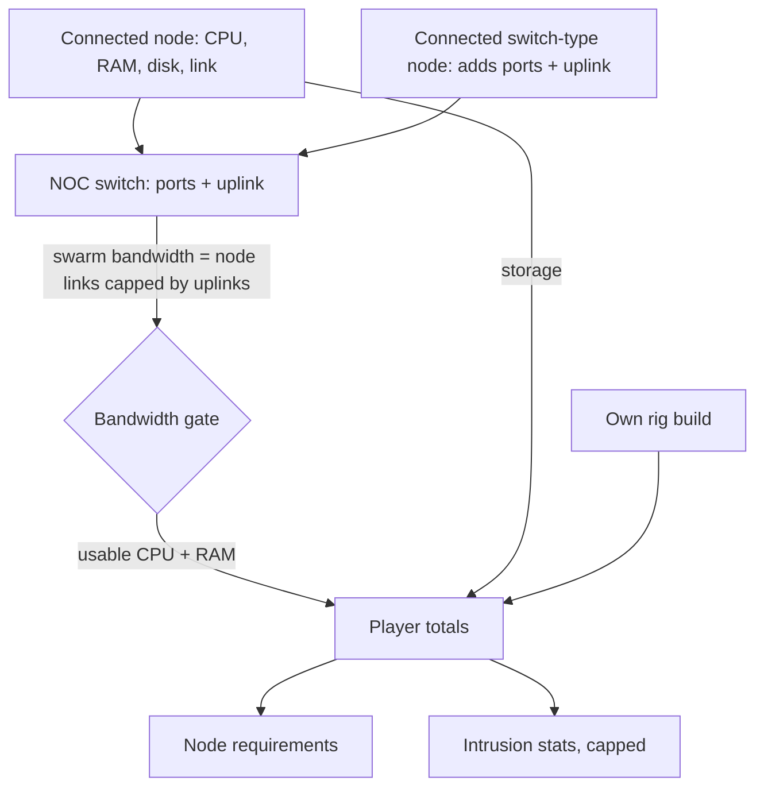
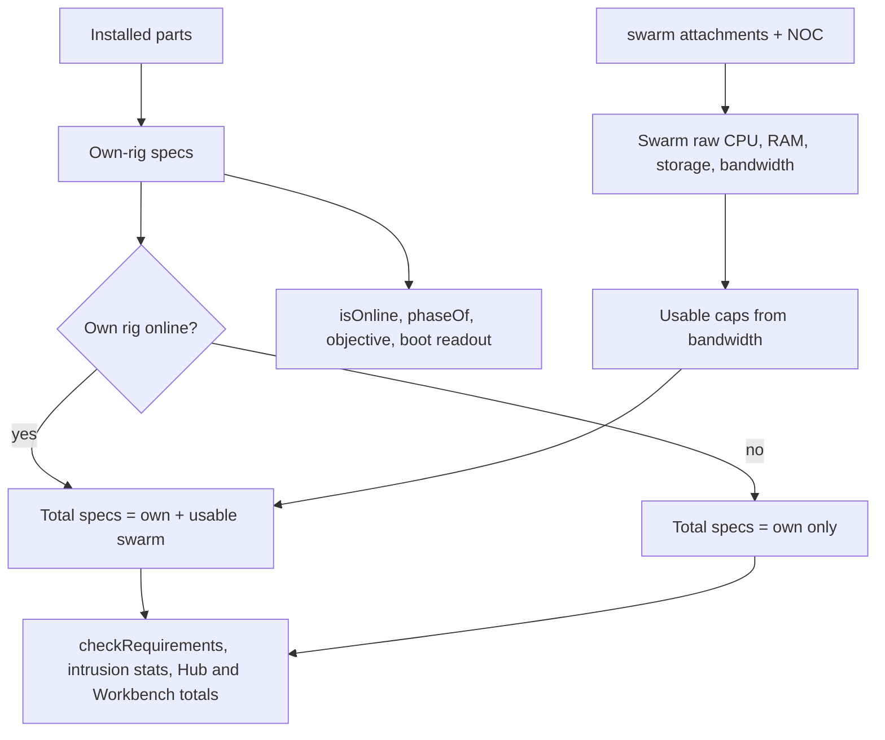
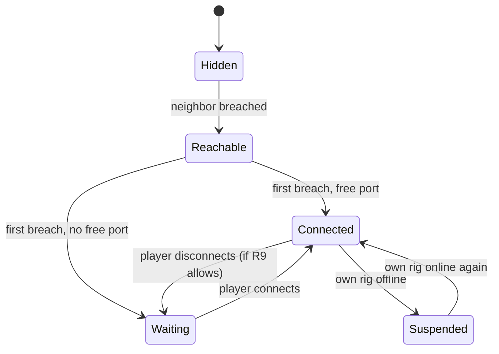
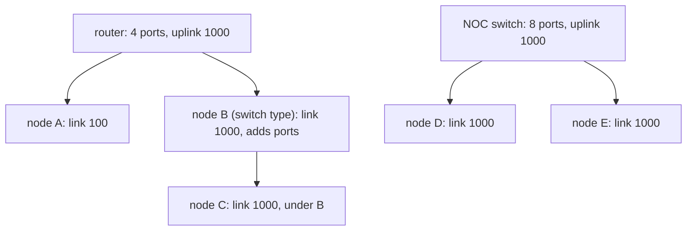

# Swarm and NOC Capacity - Plan

## Goal Capsule

- **Objective:** Breaching a node makes the player's computer stronger for as long as the node stays connected, and growing that swarm requires real network hardware, so ensino médio informática students practice hardware and networking concepts (CPU, RAM, storage, switches, ports, link capacity) through the progression itself.
- **Means:** held nodes become real machines from the parts catalog, attached to port providers in the player's NOC, and a swarm layer adds their usable resources on top of the player's own rig (KTD1, KTD2).
- **Product authority:** the user (project owner) settled the scope in dialogue. The Product Contract wins on behavior; the Planning Contract wins on mechanism within it. Mining, procedural cities, the difficulty dial and the PT-BR conversion of existing text are separate work, not active scope here.
- **Product Contract preservation:** changed: R7 — the player's router contributes built-in LAN ports to the cap (user-approved during planning); R3 follows, so nodes on the router are capped by the router's uplink. Added R19-R21 and AE8-AE10 to fill flow gaps the planning research found. Success Criteria clarified: the Data Center Core's link requirement stays on the player's own rig (R4).
- **Execution profile:** pure game logic in `src/core` is built and tested first; scenes follow and are checked by typecheck, build and a manual run.
- **Stop conditions:** stop and ask if balancing cannot make the Data Center Core reachable through the swarm without a 76.8 CPU rig, or if any settled decision proves unworkable in code.
- **Who finishes:** `ce-work` (or a human) implements U1-U8 in order and ships one branch.
- **Open blockers:** none.

---

## Product Contract

### Summary

Connected nodes extend the Workbench: their CPU power, RAM and storage add to the player's totals wherever those totals count. Swarm bandwidth limits how much of that pooled CPU and RAM is usable, and switch ports in the player's NOC cap how many nodes can be connected. Each node is a real machine defined by a type and tier, and switch-type nodes add ports of their own.

### Problem Frame

Today a breached node pays cash once (and 20% on replays) and then means nothing. `GameState.breached` is a list of ids with no resources, and every stat in the game comes from one installed build. Progression after the first breaches is just collecting cash, which teaches nothing about how real networks of machines work.

The primary players are students of the Técnico em Informática para Internet integrado ao ensino médio (IFRS Campus Veranópolis), entering at about 14-15 years old. Their 1st year covers number systems and computer architecture ("Fundamentos de Tecnologia da Informação"); their 2nd year covers networks, network services and administration ("Servidores e Redes de Computadores"). The game already teaches the 1st-year content through the Workbench and the bottleneck idea through `min(NIC, router)`. The swarm is where 2nd-year content (switches, ports, link capacity) can become gameplay.

### Key Decisions

- **Swarm resources add to the player's own totals everywhere.** The swarm should feel like an extension of the Workbench, not a separate resource pool. Governs R1. (session-settled: user-directed — chosen over keeping the swarm as a separate pool that only feeds mining and node requirements: the user wants combined RAM, processing and bandwidth to compound the Workbench)
- **Swarm bandwidth is a new measure, separate from the player's link.** The player's own link stays the weakest link of NIC and router. Governs R3, R4. (session-settled: user-directed — chosen over summing node links into the player's link: the existing weakest-link rule is correct and stays)
- **Swarm bandwidth gates usable swarm power.** Distributed computing is limited by communication, not only raw power. Governs R2. (session-settled: user-approved — chosen over using swarm bandwidth only as a target requirement or only as a mining input)
- **Swarm bandwidth comes from the nodes' links, capped by switch uplinks.** One upgrade path raises both port count and uplink. Governs R3. (session-settled: user-approved — chosen over using only the NOC uplink or only the sum of node links)
- **Storage adds up like CPU and RAM.** Consistency, and the Data Center Core already requires 1000 GB. Governs R1. (session-settled: user-approved — chosen over keeping storage local to the player's rig)
- **Intrusion stats keep their caps.** Extra power unlocks targets, harder cities and later mining, so intrusions stay about knowledge. Governs R5. (session-settled: user-approved — chosen over diminishing returns without a cap and over scaling target difficulty)
- **Switch ports set the node cap.** Real hardware the students meet in 2nd-year networks. Governs R6, R7. (session-settled: user-approved — chosen over router connection limits and over combining ports with connection limits)
- **Actions that would exceed the cap are blocked with an explanation.** No silent loss, and the message teaches dependency. Governs R9. (session-settled: user-approved — chosen over dropping excess nodes automatically, with or without re-breach)
- **A breach always succeeds; without a free port the node waits disconnected.** Map progress stays separate from capacity. Governs R12, R13, R14. (session-settled: user-approved — chosen over blocking the intrusion and over forcing a swap prompt at breach time)
- **Node hardware comes from node type and tier, revealed after breach.** Reusable by future procedural cities and endless tiers; the reveal makes a breach feel like taking inventory. Governs R10, R11. (session-settled: user-approved — chosen over authoring a build per node, archetypes with no reveal, and a full scan step after each breach)
- **Content depth follows the primary course; IT only.** Swarm bandwidth is explained with 2nd-year networks ideas, not distributed-systems theory, and no administração content is used. Governs R17, R18. (session-settled: user-directed — chosen over drawing on administração and ensino superior content)
- **A node connects automatically when a port is free at breach time.** Keeps the common case free of extra clicks. Governs R14.
- **The player's router has built-in LAN ports.** Breaches can connect from the start, like a real home router, and switches add more. Governs R7. (session-settled: user-approved — chosen over requiring a switch purchase before any node connects and over a free starter switch)
- **The swarm counts only while the player's own rig is online.** Nodes are reached over the network; connections are kept so fixing the rig restores them. Governs R19. (session-settled: user-approved — chosen over dropping connections when the rig goes offline)

### Requirements

**Swarm contribution**

- R1. Each connected node adds its CPU power, RAM and storage to the player's totals wherever those totals are used: node requirements, Workbench and Hub readouts, and intrusion stats.
- R2. Usable swarm CPU and RAM never exceed what swarm bandwidth can carry; contribution beyond that limit does not count toward any total.
- R3. Swarm bandwidth is the sum of connected nodes' link speeds, capped by the uplink of the router, switch or port-providing node they connect through.
- R4. The player's own link speed stays `min(NIC, router)` and keeps governing node link requirements.
- R5. Intrusion time per step and mistakes allowed keep their current caps (30 seconds, 4 mistakes) whatever the combined totals.

**NOC capacity**

- R6. The game adds switch hardware with a port count and an uplink speed, and the player can install more than one switch in the NOC.
- R7. Each connected node uses one port; the node cap is the built-in LAN ports of the player's router plus the ports of installed switches plus any ports contributed under R8.
- R8. A connected switch-type or router-type node contributes its ports and its uplink to capacity while it stays connected.
- R9. Any action that would leave more connected nodes than available ports (removing a switch, disconnecting a port-providing node, swapping or removing the router) is blocked, and the message names the nodes that depend on it.
- R21. A connected port-providing node itself occupies one port of the provider it connects through.

**Node hardware**

- R10. Every node has a type and a tier that determine its hardware build from the existing parts catalog; a handcrafted node may override individual parts.
- R11. Before a breach the player sees the node's type and tier; after the breach the exact parts are revealed.

**Connection lifecycle**

- R12. A breach always succeeds and reveals neighboring nodes, whether or not a port is free.
- R13. Every breached node is either connected (part of the swarm) or disconnected; the player connects and disconnects nodes from the Workbench, within the limits of R7 and R9.
- R14. A node connects automatically at breach time when a port is free; otherwise it stays disconnected and the player is told why.
- R15. Saves from before this change load with every previously breached node disconnected.
- R19. While the player's own rig does not boot or is not online, connected nodes add nothing to any total; they stay connected and count again once the rig is back online.
- R20. Re-breaching an already breached node changes neither its connection state nor its revealed parts.

**Workbench and teaching**

- R16. The Workbench gains a swarm/NOC area next to the case: installed switches, ports used and free, connected nodes with what each contributes, swarm bandwidth, and how much swarm power is usable.
- R17. Every new limit (no free port, bandwidth-limited contribution, blocked removal) shows an explanation in 2nd-year networks terms, in the same plain style as existing hardware issue messages.
- R18. Switch parts are gated behind a lesson, like every other part in the shop.

The diagram restates R1-R8; the requirements are authoritative.

### Key Flows

- F1. Breach and connect
  - **Trigger:** The player wins a node's intrusion mini-game.
  - **Steps:** The breach succeeds and neighbors appear on the map. The node's exact parts are revealed. If a port is free the node connects and its contribution appears in the totals; if not, it stays disconnected with an explanation.
  - **Covered by:** R10-R14, R17
- F2. Grow the swarm
  - **Trigger:** The player wants more nodes than free ports.
  - **Steps:** The player buys and installs a switch, or connects a switch-type node. Free ports increase and the player connects waiting nodes from the Workbench. If swarm bandwidth now limits usable power, the Workbench shows it and explains why.
  - **Covered by:** R2, R3, R6-R8, R13, R16, R17
- F3. Rearrange the NOC
  - **Trigger:** The player tries to remove a switch or disconnect a port-providing node.
  - **Steps:** If enough ports remain, the action proceeds. If not, it is blocked and the message lists the dependent nodes to disconnect first.
  - **Covered by:** R9, R13, R17

### Acceptance Examples

- AE1. **Covers R2, R3, R17.** **Given** three connected nodes with 1 Gbps links behind a switch with a 1 Gbps uplink, **when** the player opens the Workbench, **then** swarm bandwidth shows 1 Gbps, usable swarm power is lower than the nodes' raw total, and an explanation says the uplink is the bottleneck.
- AE2. **Covers R12, R14, R17.** **Given** every port is in use, **when** the player breaches a new node, **then** the breach succeeds, neighbors appear, the node stays disconnected, and a message says no port is free.
- AE3. **Covers R8, R9.** **Given** a connected switch-type node provides 4 ports and 3 other nodes use them, **when** the player tries to disconnect it, **then** the action is blocked and the message names those 3 nodes.
- AE4. **Covers R15.** **Given** an old save with every node breached, **when** it loads, **then** all those nodes are disconnected and the player can connect them up to the available ports.
- AE5. **Covers R1, R5.** **Given** a swarm whose combined CPU power and RAM are far above 88 and 64 GB, **when** an intrusion starts, **then** time per step is 30 seconds and mistakes allowed is 4.
- AE6. **Covers R1, R2.** **Given** the player's own rig has 32 CPU power and connected nodes add enough usable power to pass 70, **when** the player inspects the Data Center Core, **then** its CPU requirement shows as met.
- AE7. **Covers R4.** **Given** connected nodes with fast links but the player's own NIC is 100 Mbps, **when** the player inspects a node that needs a 1000 Mbps link, **then** the link requirement is still unmet.
- AE8. **Covers R7, R9.** **Given** a Gigabit Router with 4 nodes attached to its built-in ports and no free ports elsewhere, **when** the player swaps it for a router with fewer ports, **then** the swap is blocked and the message names the nodes that would lose their port.
- AE9. **Covers R19.** **Given** three connected nodes, **when** the player uninstalls their own NIC, **then** the totals drop to the player's own rig and the nodes still show as connected; reinstalling the NIC restores the totals.
- AE10. **Covers R14, R20.** **Given** a breached node that is disconnected and a port that is now free, **when** the player re-breaches it, **then** it stays disconnected and its parts are not revealed again.

### Success Criteria

- A 2nd-year student can explain from game feedback alone why a node could not connect (no free port) and why a node did not add its full power (not enough swarm bandwidth).
- The Data Center Core's CPU, RAM and storage requirements can be met through the swarm with a mid-tier rig; its link requirement still needs the player's own 10 Gbps NIC and router (R4).

### Scope Boundaries

- Mining and the removal of cash from breaches are separate work; breach cash stays unchanged here.
- Procedural cities, the open-ended difficulty dial, tiered side jobs and new optional lectures are separate work; node types and tiers are built so they can reuse them.
- Converting the existing game text to PT-BR is separate work.
- Administração and ensino superior content, and interaction between the four courses, are out of scope.
- Swarm power does not make intrusions easier beyond the existing caps (R5).

### Dependencies / Assumptions

- Until the mining work lands, breaching both pays cash and adds swarm power, so the economy is more generous for a while.
- New text for this feature is written in Brazilian Portuguese, consistent with the planned PT-BR release, even if older text is still English when this ships.
- The 2nd-year networks discipline is assumed to cover switches, ports and link capacity under "Serviços de rede" and "Administração e Segurança de redes"; its ementa does not list them by name.

### Outstanding Questions

**Deferred to Implementation**

- Exact values for the usable-power constants, switch ports, uplinks and prices, and each node's type and tier, tuned against the balance tests in U8 (KTD6, KTD13).

### Sources / Research

- `src/core/hardware.ts` — `computeSpecs` builds every stat from one installed build; `linkMbps` is `min(nic, router)`; `roundSeconds` and `mistakesAllowed` caps.
- `src/core/state.ts` — `breached: string[]`, `breach()` cash and `REPLAY_RATIO`, `checkRequirements` reading `specsOf(state)`.
- `src/data/parts.ts` — single `nic` and `router` slots; no switch part exists.
- `src/data/nodes.ts` — `NetNode` has no hardware fields; the Data Center Core requires 70 CPU power, 64 GB RAM, 1000 GB storage, 10000 Mbps.
- `src/data/lessons.ts` — Networks 101 explain "A link runs at the speed of its slowest end."
- `src/core/store.ts` — version-1 saves merge over `newGame()` defaults.
- `.references/PPC-medio-informatica.pdf` — course structure and the 1st-year and 2nd-year discipline ementas cited in Problem Frame.
- `docs/ideation/2026-09-27-release-hardening-ideation.html` — idea 1, the origin of this plan.
- `src/scenes/WorkbenchScene.ts` — the case view fills the screen (slot rows to about y=550, diagnostics to about y=650, inventory on the right), so the NOC needs its own tab (KTD11).
- `tests/core.test.ts` — two assertions pin `breach()` returning a number (first breach pays `node.reward`, replay pays less), so connection gets its own helper (KTD9).

---

## Planning Contract

### Key Technical Decisions

- KTD1. **Own-rig specs and total specs are separate.** `computeSpecs(installed)` and `specsOf(state)` keep returning the player's own rig only, so `isOnline`, `phaseOf`, `objective` and the boot readout never depend on the swarm (no recursion through `isOnline`). A new total-specs function returns own specs plus usable swarm contribution and is used by `checkRequirements`, the Minigame intrusion stats, the Hub readout and the Workbench totals. Own `linkMbps`, `boots` and `networkReady` are never changed by the swarm. Governs R1, R4, R5, R19.
- KTD2. **All swarm math lives in a new pure module `src/core/swarm.ts`.** Port providers, attachment, free ports, bandwidth, usable caps, dependents and the total-specs function are pure functions of `GameState`, so every acceptance example is unit-testable without Phaser.
- KTD3. **Two new `GameState` fields with empty defaults.** `noc` holds installed switch instances, each with a stable instance id and part id (the same part can be installed twice). `swarm` maps each connected node id to the provider id it is attached to. Defaults live in `newGame()`, so the existing version-1 shallow merge in `src/core/store.ts` loads old saves with an empty NOC and every node disconnected (R15) and no save version bump. Connection state stays separate from `breached`, so map reveal and `nodeStatus` are untouched (R12).
- KTD4. **Each connected node is attached to one port provider, assigned automatically.** Provider ids are `router`, a NOC instance id, or a connected port-providing node id. A joining or re-homed node goes to the provider with a free port where it adds the most swarm bandwidth; ties fall back to the router, then NOC switches in install order, then port-providing nodes in connect order. A port-providing node can never attach to itself or its own descendants. Attachment is what lets R9 name the exact dependents and lets each provider's uplink cap its own subtree. Governs R7, R9, R21. (session-settled: user-approved — chosen over a single pooled port count: pooling cannot name which nodes depend on which switch)
- KTD5. **Swarm bandwidth is computed as a tree.** A connected node's throughput is its own NIC link. A connected port-providing node counts its own traffic: its throughput is the minimum of its NIC link and its own link plus its attached nodes' throughput, so nodes behind it share its link. A provider's throughput is the minimum of its uplink and the sum of its attached nodes' throughput. The router's uplink is its `mbps`, a NOC switch's uplink is its `uplinkMbps`, and a port-providing node's uplink is its own NIC link. Swarm bandwidth is the sum of the router's and the NOC switches' throughput: NOC switches are modeled as having their own uplink into the swarm, separate from the player's Internet path, so better switches can raise bandwidth as settled. Governs R3, R8.
- KTD6. **Usable power uses absolute caps, so adding a node never lowers a total.** Usable swarm CPU is the smaller of raw swarm CPU and swarm bandwidth (in Gbps) times a CPU-per-Gbps constant; RAM works the same way with its own constant. Storage is not gated. A ratio formula was rejected because connecting a weak node behind a capped uplink could lower total power. Governs R2.
- KTD7. **Switches are a new `switch` slot in the catalog but never a case slot.** The slot gives switches a Shop tab, labels and stat text; `install()` routes switch parts into `noc` instead of the single-slot path, and the slot is excluded from boot checks and the Workbench case rows. Switch parts carry `ports` and `uplinkMbps`, draw no PSU power (like routers), and number at most 4 so the Shop tab fits. Router parts gain a `ports` stat (home router 4). Governs R6, R7.
- KTD8. **Node hardware comes from a type-by-tier table in a new `src/data/nodeBuilds.ts`.** `NetNode` gains a node type, a tier and optional part overrides. Types are estação de trabalho, servidor, roteador de borda, switch de distribuição and datacenter; every build includes a NIC, and only the roteador and switch types include a router or switch part, which makes them port providers. Builds resolve through `getPart`, so a bad part id fails the content-integrity tests. Governs R8, R10.
- KTD9. **`breach()` keeps its signature; connecting has its own mutators.** New mutators join a node to the swarm, remove it, install a switch and remove a switch; like `install`, they return a user-facing PT-BR message string and never throw. The Minigame success path checks whether the breach is a first breach, calls `breach()`, then the join mutator, and shows the revealed parts and connection result; replays skip the join (R20). Names avoid the existing `canConnect`, which means "can attempt a breach". Governs R12, R13, R14, R20.
- KTD10. **Removing a provider re-homes its dependents before blocking.** When a switch, a port-providing node or the router is removed or swapped, only its direct attachments need new ports: each moves to another provider with a free port in KTD4 order and keeps its own subtree intact, and candidate providers exclude the removed provider and its subtree. The action proceeds only if every direct attachment fits; otherwise nothing changes and the message names the direct attachments that did not fit together with their descendants. Uninstalling the player's NIC or PSU never blocks; it only suspends the swarm through R19. Governs R9.
- KTD11. **The NOC is a second tab of the Workbench.** The case view stays as it is; a NOC tab shows the router's ports, installed switches, connected and waiting nodes with their contributions, swarm bandwidth and usable power. `toast` gains word wrap so blocked messages listing several nodes stay readable. Governs R13, R16, R17. (session-settled: user-approved — chosen over a separate NOC scene reached from the Hub: the swarm should feel like part of the Workbench)
- KTD12. **Switches unlock through Networks 101.** Switch parts use `requiresLesson: 'network-basics'`, and that lesson gains a page on switches, ports and uplinks plus one quiz question. A new lesson on the main chain would shift progression and the hub's gating. Governs R18. (session-settled: user-approved — chosen over a new optional lesson)
- KTD13. **Balance is tuned and pinned by tests.** Node requirements in `src/data/nodes.ts`, node tiers and the KTD6 constants are tuned so mid-game nodes become reachable earlier through the swarm and a mid-tier rig plus a realistic swarm meets the Core's CPU, RAM and storage. Tests pin these outcomes so later content changes cannot silently break them. Governs Success Criteria. (session-settled: user-approved — chosen over leaving current requirements unchanged)

### High-Level Technical Design

Own-rig and total specs (KTD1). Only total specs see the swarm, and the swarm only counts when the own rig is online:

Node lifecycle (R12-R14, R19, R20):

Attachment and bandwidth tree example (KTD4, KTD5). Bandwidth here is min(1000, 100 + 1000) from the router plus min(1000, 1000 + 1000) from the switch, so 2000 Mbps:

In this example node B caps its subtree at its own 1000 Mbps link, so C adds nothing beyond B's link; that is the "slowest end" rule applied per segment.

### Assumptions

- The NOC switches' independent uplinks (KTD5) are a teaching simplification; the in-game explanation says swarm bandwidth is traffic between the NOC and the nodes, not the player's Internet access.

### Sequencing

U1 and U2 add data, U3 adds the pure swarm math, U4 adds state and mutators, and U5-U7 wire scenes. U8 tunes values once everything is visible. U6 and U7 can proceed in parallel after U5.

---

## Implementation Units

### U1. Switch catalog, router ports and Networks 101

- **Goal:** Add switch hardware and router ports to the catalog and teach switches in Networks 101.
- **Requirements:** R6, R7, R18; KTD7, KTD12.
- **Dependencies:** none.
- **Files:** `src/data/parts.ts`, `src/data/lessons.ts`, `src/core/hardware.ts`, `tests/core.test.ts`.
- **Approach:**
  1. Add the `switch` slot, PT-BR label and `describeStats` case; add `ports` and `uplinkMbps` to `PartStats`.
  2. Add up to 4 switch parts (draw 0, gated by `network-basics`) and a `ports` value to each router part.
  3. Keep the switch slot out of `BOOT_SLOTS` and give `MISSING_HINT` a switch entry that is never shown as a boot issue.
  4. Add a Networks 101 page on switches, ports and uplinks, and one quiz question.
- **Patterns to follow:** existing NIC and router entries in `src/data/parts.ts`; `explain` style in `src/data/lessons.ts`.
- **Test scenarios:**
  - Every switch part has positive `ports` and `uplinkMbps` and requires an existing lesson.
  - Every router part has positive `ports`.
  - The Networks 101 quiz still has a valid answer index for every question, including the new one.
  - `computeSpecs` for the starter build still boots and ignores switches entirely.
- **Verification:** content-integrity tests pass and typecheck accepts the exhaustive slot records.

### U2. Node types, tiers and builds

- **Goal:** Give every node a hardware build from type and tier.
- **Requirements:** R8, R10, R11; KTD8.
- **Dependencies:** U1.
- **Files:** `src/data/nodeBuilds.ts` (new), `src/data/nodes.ts`, `tests/core.test.ts`.
- **Approach:**
  1. Define the five node types, a tier 1-3 table of part ids per type, and a resolver that applies per-node overrides.
  2. Add type, tier and any overrides to all ten nodes; keep `home` out of the swarm.
  3. Expose helpers for a node's resolved parts and its contribution (CPU power, RAM, storage, link, ports, uplink).
- **Patterns to follow:** `getPart`/`PART_INDEX` lookup in `src/data/parts.ts`; `getNode` in `src/data/nodes.ts`.
- **Test scenarios:**
  - Every node except `home` resolves to a build whose part ids exist and sit in the right slots.
  - Every build includes a NIC.
  - Only roteador and switch types report ports greater than zero.
  - An override replaces only the overridden part.
- **Verification:** content-integrity tests cover all nodes.

### U3. Swarm math module

- **Goal:** Compute ports, attachment, bandwidth, usable power, dependents and total specs as pure functions.
- **Requirements:** R1-R5, R7, R8, R19, R21; KTD1, KTD2, KTD4, KTD5, KTD6.
- **Dependencies:** U2.
- **Files:** `src/core/swarm.ts` (new), `src/core/state.ts`, `tests/core.test.ts`.
- **Approach:**
  1. Add the `noc` and `swarm` fields and their empty defaults to `GameState`/`newGame()` (types only; mutators come in U4).
  2. Implement provider listing, free ports per provider, next-provider assignment, bandwidth tree, usable caps and dependents per KTD4-KTD6.
  3. Implement total specs per KTD1, returning own specs when the own rig is not online.
- **Technical design:** directional, not a specification — total = own + (online ? { cpu: min(rawCpu, bwGbps × CPU_PER_GBPS), ram: min(rawRam, bwGbps × RAM_PER_GBPS), storage: rawStorage } : 0).
- **Patterns to follow:** pure functions and `round1` in `src/core/hardware.ts`; test helpers in `tests/core.test.ts`.
- **Test scenarios:**
  - Covers AE1. Three 1 Gbps nodes behind a 1 Gbps uplink give 1 Gbps swarm bandwidth and usable power below raw.
  - Covers AE5. A swarm far above 88 CPU and 64 GB still yields 30 s and 4 mistakes through `roundSeconds`/`mistakesAllowed`.
  - Covers AE6. A 32 CPU rig plus enough usable swarm power meets the Core's CPU requirement.
  - Covers AE7. Fast node links never change the own link used for link requirements.
  - Covers AE9. With the own NIC removed, total specs equal own specs.
  - Adding any connected node never lowers usable CPU, RAM or storage (property over several node combinations).
  - A port-providing node uses one port of its parent and adds its own ports to the free count.
  - A lone connected switch-type node contributes bandwidth equal to its own link; with attached nodes it is still capped at its own link.
  - Dependents of a provider include nested descendants.
  - With a saturated router and a faster switch that has a free port, a new 1 Gbps node attaches to the switch.
  - Storage adds fully even when bandwidth is zero.
- **Verification:** all swarm-math tests pass and existing hardware tests are unchanged.

### U4. Swarm state mutators

- **Goal:** Let the player join, leave, install switches and remove them, with R9 blocking.
- **Requirements:** R9, R12-R15, R19-R21; KTD3, KTD9, KTD10.
- **Dependencies:** U3.
- **Files:** `src/core/state.ts`, `src/core/swarm.ts`, `tests/core.test.ts`.
- **Approach:**
  1. Add mutators to join a breached node (attach to the next provider with a free port), leave (re-home its dependents first), install a switch from inventory into `noc`, and remove a switch back to inventory (re-home first).
  2. Route `install()` for switch parts into the switch path, and run the KTD10 re-home check when `install()` swaps or `uninstall()` removes the router.
  3. Count NOC switches in Shop "owned" totals through a state helper.
  4. Return PT-BR messages in the plain style of existing hardware issues, naming dependents on a block.
- **Patterns to follow:** `install`, `uninstall`, `sell` message-return convention in `src/core/state.ts`.
- **Test scenarios:**
  - Covers AE2. With all ports used, a first breach succeeds and the node stays disconnected.
  - Covers AE3. Disconnecting a switch-type node with three dependents and no free ports elsewhere is blocked, and the message names all three.
  - Covers AE4. A version-1 save without the new fields loads with an empty NOC and no connected nodes.
  - Covers AE8. Swapping to a router with fewer ports is blocked when dependents cannot re-home; it succeeds when they can.
  - Covers AE10. Re-breaching a disconnected node with a free port leaves it disconnected.
  - Joining a node that is not breached, or already connected, returns a message and changes nothing.
  - Removing a switch whose nodes fit elsewhere moves them and succeeds.
  - Removing a provider whose dependent is a switch-type node with its own attached nodes needs only one free port elsewhere; the subtree moves with it.
  - Uninstalling the player's NIC never blocks.
  - `breach()` still returns `node.reward` on a first breach and less on a replay.
- **Verification:** mutator tests pass; state never holds more connected nodes than ports.

### U5. Wire total specs into requirements and readouts

- **Goal:** Make swarm power count wherever totals count.
- **Requirements:** R1, R4, R5, R19; KTD1.
- **Dependencies:** U4.
- **Files:** `src/core/state.ts`, `src/scenes/MinigameScene.ts`, `src/scenes/HubScene.ts`, `src/scenes/WorkbenchScene.ts`, `tests/core.test.ts`.
- **Approach:**
  1. Switch `checkRequirements` to total specs for CPU, RAM and storage, keeping the own link; label figures as own plus swarm in PT-BR.
  2. Switch Minigame time and mistakes to total specs.
  3. Show own and swarm contribution on the Hub monitor (only when online) and in the Workbench totals line.
- **Patterns to follow:** existing label format in `checkRequirements`; Hub monitor lines in `src/scenes/HubScene.ts`.
- **Test scenarios:**
  - A node requirement unmet by the own rig becomes met once enough swarm power is connected and the rig is online.
  - The same requirement is unmet again when the own rig goes offline (R19).
  - The link requirement ignores the swarm.
  - `isOnline` and `phaseOf` give the same results with and without connected nodes.
- **Verification:** tests pass; a manual run shows the Hub and Minigame stats change after connecting a node.

### U6. Breach result, reveal and Net Map details

- **Goal:** Show the connection outcome and revealed parts after a breach, and node type and tier on the Net Map.
- **Requirements:** R11, R12, R14, R17, R20; KTD9.
- **Dependencies:** U5.
- **Files:** `src/scenes/MinigameScene.ts`, `src/scenes/NetMapScene.ts`.
- **Approach:**
  1. In the Minigame success path, detect a first breach, call `breach()`, then the join mutator, and show the revealed parts and the connection message within the existing result block.
  2. In the Net Map info panel, show type and tier for reachable nodes and the parts for breached nodes; enlarge the panel as needed; mark connected nodes.
- **Patterns to follow:** `finish()` in `src/scenes/MinigameScene.ts`; `showInfo()` in `src/scenes/NetMapScene.ts`.
- **Test scenarios:**
  - Test expectation: none -- scene wiring over core behavior already covered in U4; checked in the manual run.
- **Verification:** manual run: a first breach with a free port shows parts and "conectado"; with no free port it explains why; a replay shows neither.

### U7. Workbench NOC tab, toast wrap and Shop switches

- **Goal:** Give the player a place to manage switches and connected nodes.
- **Requirements:** R13, R16, R17; KTD11.
- **Dependencies:** U5.
- **Files:** `src/scenes/WorkbenchScene.ts`, `src/ui/widgets.ts`, `src/scenes/ShopScene.ts`.
- **Approach:**
  1. Add case and NOC tab buttons to the Workbench; keep the case view unchanged.
  2. Lay out the NOC tab top to bottom: a summary (ports used and free, swarm bandwidth, usable versus raw CPU and RAM, and the explanation when bandwidth limits power); one block per provider (router, each switch, each port-providing node) showing its throughput against its uplink and its attached nodes with their contributions and a disconnect button; then the waiting nodes with a connect button and the free-port count. Paginate the node list when it outgrows the area.
  3. Show owned switches not yet installed with an install button, and a remove button on each installed switch; both call the U4 mutators and show their message.
  4. Keep the connect button enabled when no port is free; pressing it shows the "no free port" message, like blocked removals.
  5. When the own rig is offline (R19), show a banner saying the swarm is suspended and why, and show connected nodes dimmed with no contribution while keeping their buttons.
  6. Add word wrap to `toast`; make the Shop's owned count include NOC switches.
- **Patterns to follow:** `Layer` redraw and `act()` in `src/scenes/WorkbenchScene.ts`; tab buttons in `src/scenes/ShopScene.ts`.
- **Test scenarios:**
  - Test expectation: none -- UI over tested core mutators; checked in the manual run.
- **Verification:** manual run: buy and install a switch from the NOC tab, connect and disconnect nodes, press connect with no free port, trigger a blocked removal and read the full message, and uninstall the NIC to see the suspended banner, all within 1280x720.

### U8. Balance pass and docs

- **Goal:** Tune values so the swarm matters and pin the outcomes.
- **Requirements:** Success Criteria; KTD6, KTD13.
- **Dependencies:** U6, U7.
- **Files:** `src/data/nodes.ts`, `src/data/nodeBuilds.ts`, `src/data/parts.ts`, `src/core/swarm.ts`, `tests/core.test.ts`, `README.md`.
- **Approach:**
  1. Tune node requirements, node tiers, switch values and the usable-power constants.
  2. Add balance tests for the outcomes below.
  3. Document the swarm and NOC in `README.md`.
- **Test scenarios:**
  - A mid-tier rig (for example the 32 CPU octa-core with 32 GB) plus a reachable set of connected nodes behind realistic switches meets the Core's CPU, RAM and storage.
  - The starter rig plus the first two breached nodes meets a mid-game node's CPU or RAM requirement it could not meet alone.
  - AE1's three 1 Gbps nodes behind a 1 Gbps uplink are visibly capped (usable below raw).
  - A 10 Gbps switch setup lets the end-game swarm reach full usable power.
- **Verification:** balance tests pass and a manual playthrough reaches the Core without the 16-core CPU.

---

## Verification Contract

| Check | Command | Applies to |
| --- | --- | --- |
| Unit and content tests | `npm test` | U1-U5, U8 |
| Type check (strict, no unused locals) | `npm run typecheck` | all units |
| Production build | `npm run build` | all units |
| Manual run | `npm run dev`, then the U5-U8 verification steps | U5-U8 |

Tests import only `src/core` and `src/data`; never import `src/core/store.ts` in tests, because it reads localStorage on import.

---

## Definition of Done

- Every requirement and acceptance example in the Product Contract is covered by a passing test or by a manual-run check named in its unit.
- `npm test`, `npm run typecheck` and `npm run build` all pass.
- Existing tests still pass unchanged except where this plan changes behavior on purpose (R7 router ports, balance values).
- All new player-facing text is Brazilian Portuguese.
- No abandoned-attempt code, unused exports or debug output remains in the diff.

---

<!-- ce-section: work-relationships -->
## How This Work Fits Together

This plan covers the swarm and NOC capacity model. The rest of the release-hardening work below is the current understanding, not a committed roadmap.

- Mining that replaces breach cash
  - Depends on this plan for pooled CPU power to mine with.
  - Still to decide: how mining shares CPU with the totals this plan builds.
- Procedural cities and endless tiers
  - Depends on this plan's node types and tiers to generate node hardware.
- Open-ended difficulty dial and tiered side jobs
  - Can proceed independently of this plan.
- PT-BR conversion of existing text
  - Can proceed independently of this plan; shares the PT-BR writing rules with R17.
- Ethical framing and lesson gates for the new systems
  - Shares the lesson-gating rule with R18.
