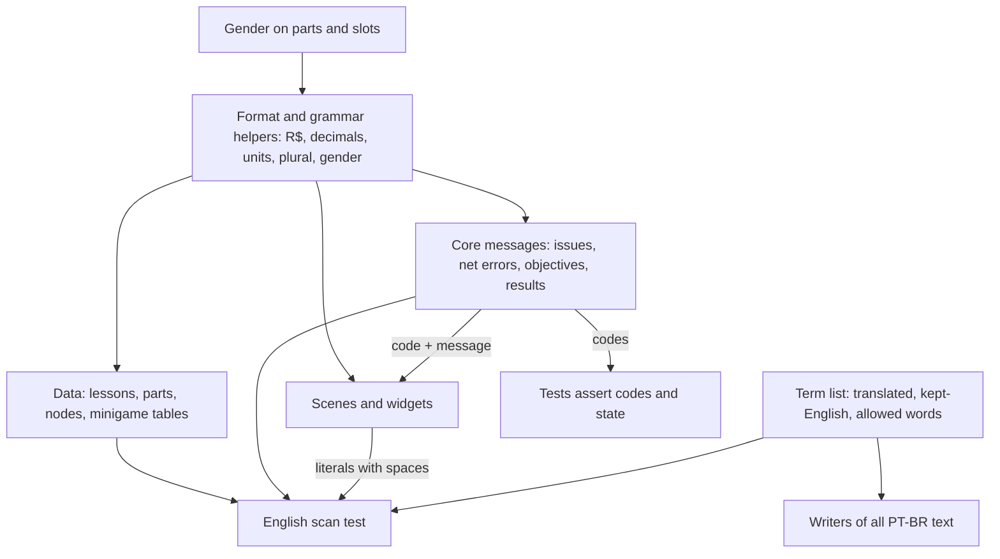

# PT-BR Style System - Plan

## Goal Capsule

- **Objective:** A Brazilian student can play Rootkit Academy from start to ending and read only correct Brazilian Portuguese: no stray English beyond the IT terms Brazilians themselves use in English, no broken plurals or gender agreement, and numbers and money written the Brazilian way.
- **Means:** write the Portuguese directly into the game's content and screens, backed by shared formatting and grammar helpers, one term list, stable problem codes, and an automated English scan (KTD1-KTD6).
- **Product authority:** the user (project owner, native Brazilian Portuguese speaker) settled the scope in dialogue. Price rescaling, ethical framing and new lectures are separate work, not active scope here.
- **Stop conditions:** stop and ask if a translation would need a product choice the Product Contract does not make, such as a new term not covered by the term list rule, or a layout change that removes or moves a screen element.
- **Execution profile:** sequential units U1-U8. The user reviews the term list (U2) before the content units, and does the end-to-end playthrough at the end.
- **Open blockers:** none.

---

## Product Contract

Product Contract preservation: restructured, no scope change. The Outstanding Questions that were deferred to planning are now answered by KTD1-KTD8 and removed from that list.

### Summary

Every word a student sees becomes correct Brazilian Portuguese in an informal "você" voice, with real plural and gender agreement. Shared rules for terms, numbers, money, plurals and gender make that correctness the default for today's text and for text the swarm, mining and lecture work adds later.

### Problem Frame

Rootkit Academy is made by a Brazilian for Brazilian students, and only Brazilians will ever play it. It was meant to be in Portuguese from day one, but all of its text is hardcoded English. That covers lessons, quizzes, part names, issue messages, network-config errors, mini-game prompts and the ending. The players are students of the Técnico em Informática para Internet integrado ao ensino médio (IFRS Campus Veranópolis), about 14-15 years old when they start.

A plain translation pass would not be enough. The game builds sentences from counts ("mistake(s)", "problem" plus a conditional "s"), from part names in messages ("Sold X for $Y"), and from decimals rounded with a dot ("4.8"). Translated one string at a time, these produce "1 erro(s)", wrong gender agreement and "4.8 GHz", which a Brazilian reader sees as sloppy. Tests also match English wording, so every rewording breaks them. The text volume is large: lesson pages, quiz options and explanations, and mini-game prompts built from data tables add up to well over the ~145 strings the ideation estimated.

### Key Decisions

- **Portuguese only, written directly, with no translation layer.** No second language will ever exist, so translation keys and language switching add carrying cost for no value. Governs R1. (session-settled: user-approved — chosen over an i18n layer with language switching: the game is made by Brazilians for Brazilians and will only ever be used by Brazilians)
- **Correct Portuguese is the minimum, including plurals and gender.** Sloppy text in a school game reflects on the extension project. Governs R9, R10. (session-settled: user-directed — chosen over a plain first-pass translation that tolerates "erro(s)" and "4.8 GHz")
- **Terms follow Brazilian IT usage.** Students should meet the words they hear in class and at work. Governs R4. (session-settled: user-directed — chosen over translating every term possible, over pairing each term with its English equivalent in lessons, and over the course PPC's own wording)
- **Informal "você" voice.** Friendly and direct, and it does not date the way slang does. Governs R3. (session-settled: user-directed — chosen over hacker-crew slang and over an impersonal textbook style)
- **"Rootkit Academy" stays as the game's name.** It is a proper name, and "rootkit" is itself a term Brazilian IT keeps in English. Governs R2. (session-settled: user-directed — chosen over translating the title and over a new Portuguese name)
- **Money shows in reais with Brazilian formatting.** Governs R6. (session-settled: user-directed — chosen over whole reais only and over a fictional currency)
- **Amounts keep today's values; only the label and format change.** Balance stays as tested, and realistic Brazilian prices become an input to the mining economy work. Governs R6. (session-settled: user-directed — chosen over rescaling prices and rewards to Brazilian market levels now)
- **Part model names translate generic words and keep model codes.** Governs R5. (session-settled: user-approved — chosen over leaving every part name untouched as a product name)
- **Tests check which problem was reported, not its wording.** Rewording Portuguese text must never break a test. Governs R13. (session-settled: user-approved — chosen over updating text-matching tests to Portuguese wording)

### Requirements

**Coverage and voice**

- R1. Every piece of text a player can see is Brazilian Portuguese: lessons (titles, pages, quiz questions, options, explanations), parts (names, descriptions, slot labels, stat lines), nodes and the Net Map, scene labels and buttons, toasts, hardware issue and hint messages, network-config errors, mini-game prompts and explanations, and the ending; the page also declares its language as pt-BR.
- R2. The game's name stays "Rootkit Academy" everywhere it appears.
- R3. Text addresses the player with informal "você".

**Terms**

- R4. Each technical concept uses one term everywhere in the game, chosen by Brazilian IT usage: translated where Brazilian professionals translate it (roteador, placa de rede, máscara de sub-rede), kept in English where they use English (switch, firewall, DNS, hash, socket). The term choices live in one reference that all new text follows.
- R5. Part names translate their generic words and keep model codes and specs (for example "Placa-mãe Básica B1").

**Numbers and money**

- R6. Money shows as reais with Brazilian grouping and decimal comma (R$ 1.200, R$ 4,50); the amounts themselves do not change.
- R7. Decimal numbers in readable text use a decimal comma (4,8 GHz), and units are written as Brazilian IT writes them (GHz, Mbps, Gbps, GB, MB/s, W).
- R8. Technical notation is never localized: IP addresses, masks, CIDR prefixes, binary and hexadecimal values, port numbers, HTTP status codes and DNS records keep their standard form.

**Grammar**

- R9. Every count uses the correct singular or plural form; no text uses "(s)" or similar shortcuts.
- R10. Messages that name a part, slot or other item agree with that item's grammatical gender.

**Layout**

- R11. No Portuguese text overflows its button or panel or breaks a column's alignment on the game's 1280×720 canvas.

**Keeping it correct**

- R12. An automated check fails when player-visible text contains an English word outside the kept-term list from R4.
- R13. Tests identify which problem a validation reported without depending on its wording.

### Acceptance Examples

- AE1. **Covers R9.** **Given** the player's RAM allows 1 mistake, **when** the Hub shows intrusion stats, **then** the text reads "1 erro" and with 2 allowed it reads "2 erros".
- AE2. **Covers R10.** **Given** the player installs a motherboard, then a CPU, **when** each install message appears, **then** they read in the pattern "Placa-mãe instalada" and "Processador instalado".
- AE3. **Covers R6.** **Given** the player has 1200 in money, **when** the money display updates, **then** it reads "R$ 1.200", and the balance itself is still 1200.
- AE4. **Covers R7, R8.** **Given** a CPU at 4.8 GHz and a router LAN IP of 192.168.0.1/24, **when** both appear on screen, **then** the CPU reads "4,8 GHz" and the address reads exactly "192.168.0.1/24".
- AE5. **Covers R11.** **Given** a shop part locked behind a lesson with a long title, **when** the shop shows the reason it cannot be bought, **then** the full reason is readable inside its button.
- AE6. **Covers R12.** **Given** a new string containing an English word not on the kept-term list, **when** the checks run, **then** they fail and name the string.

### Success Criteria

- The user plays the game end to end and finds no English outside the kept terms, no plural or gender agreement errors, no English-style numbers or "$" money, and no text overflowing its frame.

### Scope Boundaries

- Rescaling prices and rewards to Brazilian market levels is deferred to the mining economy work.
- Ethical framing of cities and mining, and the new optional lectures (ideation idea 4), are separate work; they follow this plan's rules when written.
- No language switch, translation files or English fallback, now or later.
- Loading or bundling a web font is out of scope; the current font stack already renders Portuguese accents.
- Internal ids (part, lesson, node, slot, scene and minigame ids) stay English; they are never shown to the player and saves depend on them.

### Dependencies / Assumptions

- The user, a native speaker, reviews the term list and the lesson text; no other reviewer is planned.
- The swarm plan (`docs/plans/2026-10-03-0339-feat-swarm-noc-capacity-plan.md`, R17 and its Dependencies) already commits its new text to PT-BR. Its text follows R4-R10 here.
- "Fira Code" is named in the font stack but never loaded, so most machines render the fallbacks (Consolas, Courier New, monospace). All of them cover Portuguese accents.

### Sources / Research

- `docs/ideation/2026-09-27-release-hardening-ideation.html`: idea 3, the origin of this plan.
- `src/core/hardware.ts:5-8`: `Issue` carries only `slot` and `message`, with no code. `round1` rounds with a dot.
- `src/core/ip.ts:68`: `validateNetConfig` returns English message strings.
- `tests/core.test.ts:97-100`: assertions match English wording (`/BROADCAST/`, `/not your router/`). Lines 130-133 hold the "every referenced lesson exists" integrity test.
- `src/scenes/HubScene.ts:38` and `src/scenes/MinigameScene.ts:54`: "mistake(s)". `src/scenes/NetSetupScene.ts:84`: a plural built by hand.
- Hardcoded `$` money in these files:
  - `src/ui/widgets.ts:76`
  - `src/core/state.ts:149`
  - `src/scenes/WorkbenchScene.ts:78`
  - `src/scenes/ShopScene.ts:46`
  - `src/scenes/NetMapScene.ts:97`
  - `src/scenes/StudyScene.ts:33`
  - `src/scenes/LessonScene.ts:76`
  - `src/scenes/MinigameScene.ts:176`
  - `src/scenes/HubScene.ts:74`
- `src/ui/widgets.ts:46-52`: fixed-size buttons with no wrapping. `src/scenes/ShopScene.ts:48` shows long lock reasons. Space-padded columns appear at `src/scenes/HubScene.ts:33-38` and `src/scenes/NetSetupScene.ts:68-69`.
- `src/data/parts.ts:13-21,45-55,216-227`: English slot labels, a `Part` type with no gender, and English stat lines.
- `src/core/minigames.ts`: prompts and explanations built from data tables.
- `index.html:2`: `lang="en"`.

---

<!-- ce-section: work-relationships -->
## How This Work Fits Together

This plan covers converting the game to Brazilian Portuguese and the rules that keep its text correct. The rest of the release-hardening work below is the current understanding, not a committed roadmap.

- Swarm and NOC capacity (`docs/plans/2026-10-03-0339-feat-swarm-noc-capacity-plan.md`)
  - Shares this plan's term, number, plural and gender rules for its new messages.
  - Can proceed independently of this plan.
- Mining economy that replaces breach cash
  - Depends on this plan's money format.
  - Still to decide: realistic Brazilian price levels, deferred here.
- Ethical framing and new optional lectures
  - Shares this plan's term list and voice.
- Procedural cities, difficulty dial and the formatura ending
  - Shares this plan's rules for all new text.

---

## Planning Contract

### Key Technical Decisions

- KTD1. **One shared formatting and grammar module in `src/core/`.** It provides money, decimal numbers, link speeds, plurals and gender agreement. Every screen and message uses it instead of building number or count text by hand. Money uses the built-in `Intl` pt-BR formatting with no cents for whole amounts and two decimals otherwise. Its non-breaking space is replaced by a plain space, so output is predictable in tests and in fallback fonts. Governs R6, R7, R9, R10.
- KTD2. **Plurals use the singular only for exactly 1.** "0 erros" and "2 erros", but "1 erro". The `Intl` pt-BR plural rule treats 0 as singular, which Brazilian readers do not expect in game text, so the helper does not use it. Governs R9. (session-settled: user-approved — chosen over `Intl.PluralRules` pt-BR, which yields "0 erro")
- KTD3. **Gender is data, not guesswork.** Each part and each slot carries a grammatical gender. Messages that name an item pick the agreeing word form from it. A content-integrity test fails when a part or slot has no gender. Governs R10.
- KTD4. **Validations and purchase checks return stable problem codes beside their message.** Hardware issues and network-config errors each get a kebab-case code (for example `psu-overload` and `ip-broadcast`). The purchase check returns `needs-lesson` or `no-money`. Tests assert on codes and state changes. The shop's lock display uses the code instead of checking whether the reason starts with "Study". Result messages from buy, sell, install and uninstall stay plain strings; tests check the resulting state, not the text. Format and agreement tests may assert on a helper-produced fragment (a participle, an R$ amount, a decimal), never on a full sentence. Governs R13. Implements the "tests check which problem was reported" Key Decision.
- KTD5. **Internal ids never change; display labels are separate.** Lesson tracks become ids with a label map, because code compares track names today (`state.ts:75`, `StudyScene.ts:19-23`). Part, lesson, node, slot and minigame ids stay as they are, so existing saves keep loading. Governs R1.
- KTD6. **The term list is a data module that the English scan reads.** It records each translated term, each term kept in English, and the English words allowed in player text. The scan collects player-visible text from data exports, from generated mini-game rounds across many seeds, and from all validation messages. It also collects string and template literals that contain a space from scene and widget source. Ids, scene keys and colors have no spaces, so they are skipped. It flags any word on a list of common English words that is not an allowed kept term. Governs R4, R12.
- KTD7. **Buttons shrink their label font to fit, as a safety net.** The shared button reduces font size step by step until the label fits, down to a readable minimum. Single-line labels are measured against the button width, and wrapped labels (such as the shop's lock reason) against the button height. Wrapped text in fixed frames gets the same step-down against a maximum height: quiz questions and explanations, shop descriptions, Net Map flavor text and the Hub monitor text. Hand rewording still fixes the worst cases, such as shortening the lock reason to a "Estude: <lição>" form. Space-padded columns compute their pad width from the longest label instead of a fixed 14. Governs R11. (session-settled: user-approved — chosen over per-screen rewording and resizing only)
- KTD8. **HTTP reason phrases and DNS record type names stay in English as protocol notation.** "404 Not Found" and "Forbidden" are what students see in browsers and logs. Scenarios, record purposes and explanations become Portuguese. Governs R8. (session-settled: user-approved — chosen over translating reason phrases into Portuguese such as "Não encontrado")

### High-Level Technical Design

The shared rules feed every text surface, and the checks read the same sources. The diagram restates KTD1, KTD3, KTD4 and KTD6.

### Assumptions

- Node 20 or later runs the tests, so `Intl` has full ICU data for pt-BR.
- Phaser text measures accented characters correctly in the fallback monospace fonts, so the button auto-fit (KTD7) measures real widths.
- A list of a few hundred common English words is enough for the scan to catch leftover English. Portuguese words that look like English words, such as "a" or "do", go on the allowed list.

### Sequencing

U1 and U3 come first, so tests stay green while text changes. U2 (term list) needs the user's review before U4-U7, since genders and all translated text depend on the approved terms. U8 lands last, once no English is left to flag.

### System-Wide Impact

- Saves: `GameState` stores only ids, numbers and the IP config, so no save migration is needed (KTD5). `src/core/store.ts` is unchanged.
- The swarm plan's new messages must use the U1 helpers and the U2 term list.

### Risks

- Lesson text is the largest piece and the hardest to get right. The user reviews it in the playthrough, and U5 keeps each lesson's meaning, quiz answers and answer order unchanged.
- The English scan can produce false positives on words shared by both languages. The allowed list absorbs them, and each addition is a visible decision in the term list.

---

## Implementation Units

### U1. Formatting and grammar helpers

- **Goal:** One module that formats money, decimals and link speeds and chooses plural and gender word forms.
- **Requirements:** R6, R7, R9, R10. KTD1, KTD2.
- **Dependencies:** none.
- **Files:** `src/core/fmt.ts` (new), `tests/fmt.test.ts` (new).
- **Approach:**
  1. Money helper: whole amounts show without cents and fractional amounts show two decimals, with the non-breaking space normalized (KTD1).
  2. Decimal helper with a decimal comma and a set number of decimals. Integers print unchanged.
  3. Link-speed helper equivalent to today's `formatMbps`, using the decimal helper ("2,5 Gbps").
  4. Plural helper taking a count and singular and plural forms (KTD2).
  5. Agreement helper taking a gender and masculine and feminine forms.
- **Patterns to follow:** pure functions like `src/core/ip.ts`.
- **Test scenarios:**
  - Covers AE3. Money 1200 reads "R$ 1.200". Money 0 reads "R$ 0".
  - Money 4.5 reads "R$ 4,50", and 1234567 reads "R$ 1.234.567".
  - Money output contains no non-breaking space.
  - Covers AE4. Decimal 4.8 reads "4,8". Decimal 76.8 reads "76,8". Decimal 64 reads "64".
  - Link speed 100 reads "100 Mbps", 1000 reads "1 Gbps", 2500 reads "2,5 Gbps" and 10000 reads "10 Gbps".
  - Covers AE1. Plural with count 1 picks the singular. Counts 0, 2 and 4 pick the plural.
  - Agreement picks the feminine form for a feminine gender and the masculine form otherwise.
- **Verification:** helper tests pass, and no existing behavior changes yet.

### U2. Term list

- **Goal:** A single reference of translated terms, kept-English terms and allowed English words, reviewed by the user before content is translated.
- **Requirements:** R4. KTD6, KTD8.
- **Dependencies:** none.
- **Files:** `src/data/termos.ts` (new).
- **Approach:**
  1. List every technical concept used in lessons, parts, nodes, minigames and messages, with its chosen PT-BR term and a short note on why it is translated or kept.
  2. Seed it from the Brazilian IT usage rule (R4): for example roteador, placa de rede, placa-mãe, processador, memória RAM, fonte de alimentação, armazenamento, máscara de sub-rede, gateway, switch, firewall, DNS, socket, hash, rootkit.
  3. Export the kept-English terms and the allowed-word list for the U8 scan, including HTTP reason phrases and DNS record type names (KTD8).
- **Execution note:** stop after this unit and show the term list to the user for review before starting U5.
- **Test expectation:** none here. U8 exercises the list.
- **Verification:** the user approves the term list.

### U3. Stable problem codes

- **Goal:** Hardware issues, network-config errors and purchase checks carry stable codes. Tests and the shop's lock display use codes instead of English wording.
- **Requirements:** R13. KTD4.
- **Dependencies:** none.
- **Files:** `src/core/hardware.ts`, `src/core/ip.ts`, `src/core/state.ts`, `src/scenes/ShopScene.ts`, `src/scenes/NetSetupScene.ts`, `tests/core.test.ts`.
- **Approach:**
  1. Add a code to `Issue`: one per missing slot, plus socket mismatch, RAM mismatch and PSU overload.
  2. Make `validateNetConfig` return code and message pairs, and update the Network Setup screen to show the messages.
  3. Make `canBuy` return a problem code (`needs-lesson` or `no-money`) beside its message, and make the shop decide "locked" from the code.
  4. Rewrite the text-matching assertions to check codes, and check buy and sell results by their state changes.
- **Execution note:** keep the English messages in this unit, so the change is a pure refactor and the existing suite proves nothing else moved.
- **Patterns to follow:** the existing `Issue.slot` field, which tests already assert on (`tests/core.test.ts:18-20`).
- **Test scenarios:**
  - The mismatched socket, DDR5 and weak-PSU build reports the codes for socket mismatch, RAM mismatch and PSU overload.
  - An empty case reports a missing-part code for each of the five boot slots.
  - The four network-config cases report conflict, broadcast, outside-LAN and not-the-router codes as their first problem.
  - Each remaining network-config code has its own case: invalid IP, invalid mask, mask mismatch, network address, invalid gateway, invalid DNS and unknown DNS server.
  - A correct config still returns no problems.
  - Buying before the lesson returns the needs-lesson code and leaves money and inventory unchanged.
  - Buying with too little money returns the no-money code.
  - A successful buy adds the part to inventory and subtracts its price.
- **Verification:** the full suite passes with no regex on message text left in `tests/`.

### U4. Gender and display labels in the data model

- **Goal:** Parts and slots carry grammatical gender, and lesson tracks have ids with separate display labels.
- **Requirements:** R1, R10. KTD3, KTD5.
- **Dependencies:** U2 (approved), because each gender comes from the approved PT-BR term for the part or slot.
- **Files:** `src/data/parts.ts`, `src/data/lessons.ts`, `src/core/state.ts`, `src/scenes/StudyScene.ts`, `src/scenes/LessonScene.ts`, `tests/core.test.ts`.
- **Approach:**
  1. Add a gender to every part (from the head noun of its PT-BR name) and to every slot label.
  2. Turn track names into ids with a label map, and update the comparisons in `state.ts` and `StudyScene.ts` and the track display in `LessonScene.ts`.
- **Test scenarios:**
  - Every part has a gender, and every slot has a label and a gender.
  - Every lesson's track has a display label.
  - The progression test still reaches the "explore" phase, which proves the Hardware-track objective lookup still finds its lessons.
- **Verification:** the suite passes, and the Study screen still groups lessons into three columns.

### U5. Portuguese content data and core messages

- **Goal:** Lessons, parts, nodes, slot and area labels, and every core message are correct Brazilian Portuguese.
- **Requirements:** R1, R2, R3, R4, R5, R6, R7, R8, R9, R10. AE2.
- **Dependencies:** U1, U2 (approved), U3, U4.
- **Files:** `src/data/lessons.ts`, `src/data/parts.ts`, `src/data/nodes.ts`, `src/core/hardware.ts`, `src/core/ip.ts`, `src/core/state.ts`, `tests/core.test.ts`.
- **Approach:**
  1. Translate lesson titles, pages, quiz questions, options and explanations. Keep each quiz's answer index and option order.
  2. Translate part names per R5, plus descriptions, slot labels and stat lines, using the U1 helpers for decimals and units.
  3. Translate node names and flavor text and the minigame area labels. IPs and ids stay unchanged (R8, KTD5).
  4. Translate hardware hints and issues, network-config errors, objectives, requirement labels and purchase, install and sell messages, with agreement from U4 genders and money from U1.
  5. Use the U2 term list for every technical term and "você" for every instruction.
- **Execution note:** translate lesson by lesson, keeping meaning and quiz answers unchanged, and leave lesson-text review to the user's playthrough.
- **Test scenarios:**
  - Covers AE2. Installing the starter motherboard yields a message containing the feminine participle, and installing the starter CPU yields one containing the masculine participle (fragment check per KTD4).
  - Selling a part yields a message containing the sale amount in R$ format (fragment check per KTD4).
  - The starter CPU's stat line shows "2,4 GHz", and the hardware readout's CPU power shows "4,8".
  - Every quiz answer index still points at an existing option (existing integrity test).
  - Every referenced lesson still exists (existing integrity test).
- **Verification:** the suite passes, and the data files hold no English prose outside kept terms.

### U6. Portuguese mini-game rounds

- **Goal:** Every generated mini-game prompt, option and explanation is Portuguese, and technical notation stays standard.
- **Requirements:** R1, R4, R7, R8. KTD8.
- **Dependencies:** U1, U2 (approved).
- **Files:** `src/core/minigames.ts`, `tests/core.test.ts`.
- **Approach:**
  1. Translate the binary, subnet, ports, HTTP and DNS prompt and explanation templates.
  2. Translate the service names that are descriptions ("SMTP (e-mail)", "Área de Trabalho Remota (RDP)"). Keep protocol names, ports, firewall rule lines and zone-file lines unchanged.
  3. Keep HTTP reason phrases in English and translate scenarios. Translate method uses, status class names and DNS record purposes.
- **Test scenarios:**
  - Existing generator tests still produce valid rounds for every area, difficulty and 30 seeds.
  - The HTTP area's correct option for a "meaning" question is still the English reason phrase, for example "Not Found" for 404.
  - Subnet prompts and options contain CIDR and dotted addresses in standard form.
- **Verification:** the suite passes, and a sample of rounds per area reads as Portuguese.

### U7. Portuguese screens, money display and layout fit

- **Goal:** Every scene and widget shows Portuguese, money shows as R$, and no text overflows.
- **Requirements:** R1, R2, R3, R6, R9, R11. AE1, AE3, AE5. KTD7.
- **Dependencies:** U1, U3, U4, U5.
- **Files:** `src/ui/widgets.ts`, `src/scenes/TitleScene.ts`, `src/scenes/HubScene.ts`, `src/scenes/StudyScene.ts`, `src/scenes/LessonScene.ts`, `src/scenes/ShopScene.ts`, `src/scenes/WorkbenchScene.ts`, `src/scenes/NetSetupScene.ts`, `src/scenes/NetMapScene.ts`, `src/scenes/MinigameScene.ts`, `index.html`.
- **Approach:**
  1. Add font-size auto-fit to the shared button and to the fixed-frame text blocks listed in KTD7.
  2. Translate every scene's labels, hints, buttons, toasts, the "Reset save" confirm dialog and the win text. Keep "ROOTKIT ACADEMY" (R2).
  3. Replace every hardcoded `$` (the nine sites in Sources) with the U1 money helper.
  4. Replace "mistake(s)" and the hand-built "problem"/"s" plural with the U1 plural helper.
  5. Make the Hub's and Network Setup's padded columns compute pad width from the longest label.
  6. Set `lang="pt-BR"` in `index.html`.
- **Execution note:** this unit is mostly UI; verify by running the game and visiting every screen, not by new unit tests.
- **Test expectation:** none in Vitest. Scenes need a Phaser runtime, and U8 scans their literals.
- **Verification:** with `npm run dev`, every screen shows Portuguese. The header shows R$. The Hub shows "1 erro" with 4 GB RAM and "2 erros" with 16 GB. A shop part locked behind a long lesson title shows the full reason inside its button. The longest lesson question, quiz explanation, part description and node flavor text each stay inside their frames.

### U8. English scan and final checks

- **Goal:** Tests fail when English outside the kept terms reaches player-visible text.
- **Requirements:** R12. AE6. KTD6.
- **Dependencies:** U2, U5, U6, U7.
- **Files:** `tests/content.test.ts` (new), `src/data/termos.ts`.
- **Approach:**
  1. Collect text from lessons, parts, slot and track labels, nodes, area labels, all hardware issues, all network-config errors, objectives in each phase, and mini-game rounds for every area, difficulty and 30 seeds.
  2. Collect string and template literals that contain a space from `src/scenes/` and `src/ui/`. Load the raw source with Vite's `import.meta.glob` and the `?raw` query, because `node:fs` fails typecheck without `@types/node`. Extract only the literal text segments of template literals, not the `${…}` expressions, so code identifiers never reach the scan (the `typescript` devDependency can parse them).
  3. Flag words on the common-English list that are not allowed by the term list, and report the offending string.
- **Test scenarios:**
  - Covers AE6. The current game text passes the scan.
  - A probe string containing a common English word such as "the" or "your" is flagged and named in the failure.
  - A probe string containing a kept term ("firewall", "Not Found", "DNS") passes.
  - IP addresses, CIDR and binary strings pass.
- **Verification:** the full suite passes, typecheck passes, and the scan catches a probe of injected English.

---

## Verification Contract

| Gate | Command | Applies to |
|---|---|---|
| Unit and content tests | `npm test` | U1, U3, U4, U5, U6, U8 |
| Type safety | `npm run typecheck` | every unit |
| Production build | `npm run build` | after U7 |
| Screen walkthrough | `npm run dev`, then visit every scene | U7 |
| End-to-end playthrough by the user | `npm run dev`, then play from an empty case to the Data Center Core | Success Criteria |

## Definition of Done

- Every unit's verification holds, and `npm test`, `npm run typecheck` and `npm run build` pass.
- The user approved the term list (U2) and completed the end-to-end playthrough with no findings left against the Success Criteria.
- No test asserts on full message wording, only on codes, state or helper-produced fragments (KTD4), and no code branches on message text.
- No player-visible "$", "(s)" or dotted decimal in readable text remains.
- Abandoned attempts and dead code from the change are removed from the diff.
