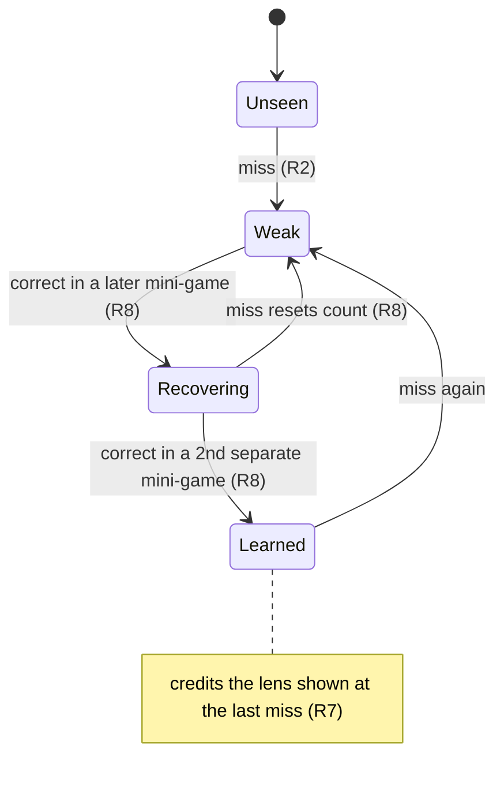
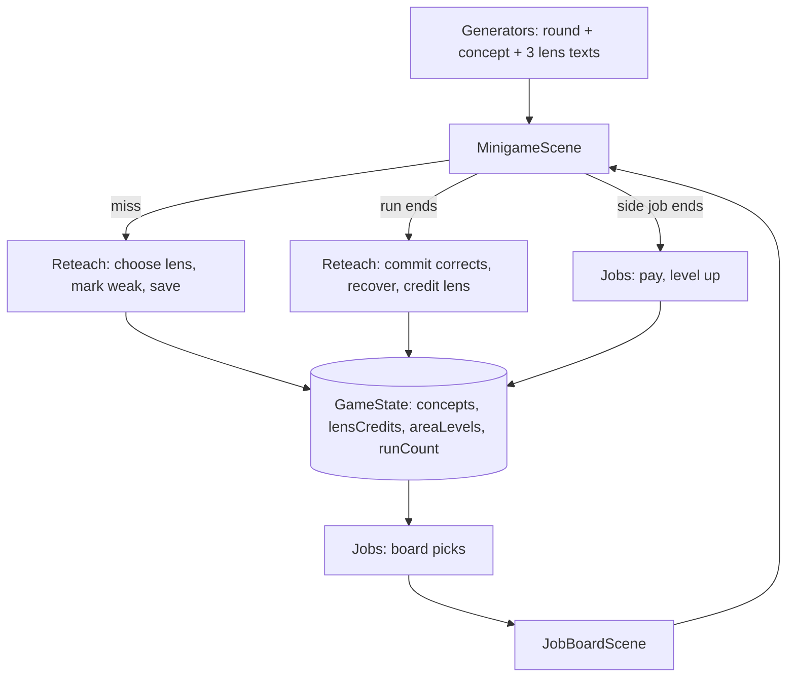

# Reteaching Explanations and Side-Job Board - Plan

## Goal Capsule

- **Objective:** A student who misses a concept gets it explained again from a different angle, using the exact problem they got wrong. They can go back and practice what they keep missing until they get it right in later games.
- **Means:** concept-tagged rounds that carry three lens explanations (KTD1, KTD2), a pure reteach module over new save fields (KTD3, KTD4), and a board computed from state on each visit (KTD7).
- **Product authority:** the user (project owner) settled the scope in dialogue. This plan covers the reteaching explanations, the side-job board and a numeric difficulty level, from ideation idea 5. Proof-of-work mining, procedural cities and the other reteach forms (round formats, reteach cards, worked examples) are not active scope here. The Product Contract wins on behavior; the Planning Contract wins on mechanism within it.
- **Product Contract preservation:** Product Contract unchanged. The questions it deferred to planning are now answered by KTD1-KTD10, so its Outstanding Questions section was removed.
- **Execution profile:** game logic in `src/core` and `src/data` is built and tested first. Scenes follow and are checked by typecheck, build and a manual playthrough.
- **Stop conditions:** stop and ask if the PT-BR conversion of mini-game text (`docs/plans/2026-10-03-0358-feat-ptbr-style-system-plan.md`, U6) has not landed when U2 starts. Also stop if the project owner's review of the explanations asks for a lens or concept outside R1 and R3.
- **Who finishes:** `ce-work` (or a human) implements U1-U5 in order on one branch. The project owner reviews the explanation text before the work is declared done.
- **Open blockers:** none.

---

## Product Contract

### Summary

The game remembers which concepts each student misses. On a repeat miss in any mini-game, it explains the concept through a lens the student has not seen yet for that concept: analogy, step by step, or real-world. Each explanation is filled in with the numbers of the round the student missed. Over time, the game learns which lens tends to help each student and offers it first.

The single side-job button becomes a short board. It mostly offers practice on weak concepts, plus one fresh job at the student's level. A numeric difficulty level lets binary and subnet jobs grow past today's level 3.

### Problem Frame

Every mini-game round has one fixed explanation. A student who did not understand it the first time sees the same sentence on every later miss. The project owner's view is that students often fail because of how a concept is taught, not because they cannot learn it, and different students learn differently. Restating the same lesson in other words, or from another perspective, is where the teaching value lies.

The game also has no memory of mistakes. Nothing records which concept a student missed, so nothing can send them back to it. The only repeatable practice is one hardcoded side job: binary at difficulty 1 for $25 (`src/scenes/HubScene.ts:74-76`). It is open from the start and ignores what the student struggles with. Difficulty is closed at `1 | 2 | 3` (`src/core/minigames.ts:33`), so even this drill cannot grow. One example is binary beyond 8 bits.

### Key Decisions

- **Reteaching is the core; the difficulty dial stays small.** The dial only becomes numeric so levels can rise past 3. No full design of teaching ceilings for every area. Governs R14, R15. (session-settled: user-directed — chosen over designing the dial and reteaching equally, and over dropping the dial: varied teaching beats harder drills for learning)
- **The board exists for targeted review.** Endless progression and income are secondary. Governs R9-R11. (session-settled: user-directed — chosen over endless play, steady income, and endlessly scaling review as the main goal)
- **Alternate explanations ship first; other reteach forms follow.** The user wants all four forms: alternate explanations, different round formats, a reteach card before a review job, and a worked example first. Alternate explanations are the most valuable and ship first. Governs R4. (session-settled: user-directed — chosen over different round formats, reteach cards and worked examples as the first form)
- **Misses are tracked per concept.** A concept is one idea a round tests, such as "broadcast address of a CIDR". This is finer than an area and coarser than a single fact. Governs R1, R2. (session-settled: user-directed — chosen over per-area buckets, which cannot tell broadcast from host count, and per-fact tracking, which needs dozens of explanation sets)
- **Explanations rotate in every mini-game, not only on the board.** Intrusions on map nodes reteach too. Governs R5. (session-settled: user-directed — chosen over review jobs only and over also tagging lesson-quiz questions)
- **The game learns each student's lens.** It credits the lens that was showing when a student recovers a concept, and favors that lens for later misses. Governs R6, R7. (session-settled: user-directed — chosen over data-filled styles without learning, which the agent recommended, and over a fixed hand-written set per concept)
- **Lens favoring only reorders; it never hides a lens.** Per-student learning styles are poorly supported as fixed labels. Varying the lens is what helps, so every concept keeps cycling through every lens. Governs R6. (session-settled: user-approved — proposed with the labeling risk shown; the user confirmed the synthesis)
- **Explanations are filled with the missed round's data.** Today's explanations already use the round's values. Each lens extends that, so a miss on `10110100` is explained with `10110100`. Governs R3.
- **The board is a short list, weak concepts first.** Governs R9. (session-settled: user-directed — chosen over a single auto-pick button and over free choice with hints)
- **A concept is learned again after correct answers in 2 separate later mini-games.** This spaces practice without a clock, since the save holds no timestamp. Governs R8. (session-settled: user-directed — chosen over 3 correct in a row and over a decaying score that never clears)
- **Pay depends on level; review pays the same as fresh.** Missing on purpose earns nothing extra. Governs R13. (session-settled: user-directed — chosen over a review bonus and flat pay)
- **Levels rise by accuracy, per area.** Governs R12. (session-settled: user-directed — chosen over the student picking any level and over levels following map progress)
- **Board areas follow completed lessons.** Side jobs never test content the student has not been taught. Governs R10. (session-settled: user-approved — proposed in the synthesis, noting that today's binary job, open from the start, moves behind the binary lesson)

### Requirements

**Concept memory**

- R1. Every mini-game round belongs to exactly one concept. The concept set covers all five areas: about 15-20 concepts, one per distinct idea a round can test.
- R2. The game records, per student, each concept missed: a wrong answer or a timeout. This history persists in the save.

**Reteaching explanations**

- R3. Every concept has an explanation in each of three lenses: analogy, step by step, and real-world. Each is filled in with the values of the round that was missed.
- R4. All explanation text is Brazilian Portuguese and follows the PT-BR style system (`docs/plans/2026-10-03-0358-feat-ptbr-style-system-plan.md`).
- R5. When a student misses a concept in any mini-game, the explanation shown uses a lens the student has not yet seen for that concept. When every lens has been seen, the cycle restarts.
- R6. Among the lenses eligible under R5, the student's favored lens comes first. Favoring changes only the order; every lens still appears in each cycle.
- R7. When a concept counts as learned again (R8), the game credits the lens shown at that concept's most recent miss. A student's favored lens is the one with the most credits across all concepts.

**Recovery**

- R8. A missed concept stays weak until the student answers it correctly in 2 separate mini-games played after the miss. A new miss before that resets the count.

**Side-job board**

- R9. The side-job button opens a board of about 3 jobs. Jobs for weak concepts come first, and at least one fresh job at the student's current level always appears in an unlocked area. Each job names the concept or area it trains.
- R10. The board only offers areas whose lesson the student has completed. Before any such lesson, the board explains which lesson opens side jobs.
- R11. A review job runs at the level where its concept was missed, and most of its rounds test that concept.

**Levels and pay**

- R12. Each area has its own level per student, starting at 1. Finishing a fresh job at the current level with at most 1 mistake opens the next level in that area.
- R13. Side-job pay grows with level. Level 1 pays today's amount. A review job pays the same as a fresh job at its level.
- R14. Difficulty is a number, not a fixed 1-3 set. Levels above 3 exist only where content can get harder: binary (more bits, up to 16) and subnets (harder prefixes). Ports, HTTP and DNS stop at level 3.
- R15. Levels 1-3 in every area keep today's content, so map nodes and their difficulty play as they do now.

**Saves**

- R16. Existing saves keep working. They start with no miss history, no lens credits and level 1 in every area.



The diagram shows one concept's life for one student. The prose in R2, R7 and R8 is the authority.

### Key Flows

- F1. Repeat miss during an intrusion
  - **Trigger:** A student misses a subnet broadcast round while attacking a map node, after seeing the step-by-step lens for that concept once before.
  - **Steps:** The round resolves as today. The explanation uses a lens not yet seen for this concept, favored lens first, filled with this round's address and prefix. The concept is marked weak.
  - **Outcome:** The next board visit offers a review job for broadcast addresses.
  - **Covered by:** R2, R3, R5, R6, R9
- F2. Review job to recovery
  - **Trigger:** The student opens the board and picks the broadcast review job.
  - **Steps:** The job runs at the level of the miss, with most rounds on broadcast addresses. A correct answer counts as one of the two required games. Later, a correct broadcast answer in any other mini-game counts as the second.
  - **Outcome:** The concept is learned again, leaves the board, and the lens shown at its last miss gains a credit.
  - **Covered by:** R7, R8, R11, R13
- F3. Climbing a level
  - **Trigger:** A student at binary level 3 picks the fresh binary job.
  - **Steps:** They finish it with 1 mistake.
  - **Outcome:** Binary level 4 opens, with more bits. Pay for binary jobs rises.
  - **Covered by:** R12, R13, R14

### Acceptance Examples

- AE1. **Covers R5, R6.** Given a concept with all three lenses unseen and a student whose favored lens is analogy, when they miss it three times, then they see analogy, then the other two lenses in some order. On the fourth miss the cycle restarts with analogy.
- AE2. **Covers R6, R7.** Given a student with no lens credits, when they miss a concept, then a default lens order applies and no lens is hidden.
- AE3. **Covers R8.** Given a weak concept, when the student answers it correctly twice inside the same mini-game, then it counts once and the concept is still weak.
- AE4. **Covers R8.** Given a concept with one correct later game counted, when the student misses it again, then the count resets to zero.
- AE5. **Covers R10.** Given a new save with only `computer-basics` done, when the student opens the board, then no job is offered and the board names the binary lesson as the way to open side jobs.
- AE6. **Covers R12.** Given a student at subnet level 2, when they finish a fresh subnet job at level 2 with 2 mistakes, then the level stays at 2.
- AE7. **Covers R12, R11.** Given a student at binary level 4, when they finish a level 2 review job with no mistakes, then the binary level stays at 4.
- AE8. **Covers R14.** Given a student at ports level 3 who finishes a fresh ports job with no mistakes, then no level 4 opens and the board keeps offering level 3 ports jobs.

### Success Criteria

- A student who misses the same concept three times sees three different explanations, each using the numbers of the round they missed.
- Every concept has all three lenses for every level it appears at, and content-integrity tests fail when one is missing.
- The project owner, a native Brazilian Portuguese speaker, reads the explanations and judges each lens a real other angle on the concept, not a reworded copy.

### Scope Boundaries

- Different round formats for the same concept, reteach cards before a review job, and worked examples are deferred. They follow this plan as separate work.
- Proof-of-work mining driven by the difficulty level waits for the mining design (ideation idea 2).
- A teacher view of which students struggle with which concepts, or which lens helps them, is deferred.
- Lesson quiz misses are not tracked and quiz explanations do not rotate.
- Harder content for ports, HTTP and DNS beyond level 3 is deferred.
- Map nodes, their difficulty and the campaign are unchanged.

<!-- ce-section: work-relationships -->
### How This Work Fits Together

This plan covers reteaching explanations, the side-job board and the numeric difficulty level. The breakdown below is the current understanding of idea 5 and nearby work, not a committed roadmap.

- Other reteach forms: different round formats, reteach cards, worked examples
  - Depends on the concept memory (R1, R2) and the board (R9) built here.
- Proof-of-work mining retarget
  - Depends on the mining economy design (ideation idea 2), which has no plan yet.
  - Shares the numeric difficulty level (R14).
- PT-BR style system (`docs/plans/2026-10-03-0358-feat-ptbr-style-system-plan.md`)
  - This plan depends on it for every new string (R4).
- Swarm and NOC capacity (`docs/plans/2026-10-03-0339-feat-swarm-noc-capacity-plan.md`)
  - Can proceed independently of this plan. It lists the difficulty dial and tiered side jobs as separate work, which this plan now covers.
- Teacher view of concept and lens data
  - Still to decide: whether it is wanted.

### Dependencies / Assumptions

- The PT-BR style system lands before this work or alongside it (R4).
- Gating the board behind lessons (R10) removes the $25 binary job that is open from the very start. The assumption is that the starting money (300) and lesson rewards are enough for early play.
- Lens credits are a weak signal when a student has few misses. The assumption is that reordering alone (R6) keeps this harmless when the signal is wrong.

### Sources / Research

- `src/core/minigames.ts:33-37` — `Difficulty = 1 | 2 | 3` and `roundCount` `[5, 7, 9]`; binary bits `[4, 6, 8]` at line 76.
- `src/core/minigames.ts` — each generator already has 2-4 round types, which are candidate concepts. Ports, HTTP and DNS content pools are tagged `level: 1 | 2 | 3`.
- `src/scenes/HubScene.ts:74-76` — the single hardcoded side job.
- `src/scenes/MinigameScene.ts:49` — side jobs allow one extra mistake over node intrusions.
- `src/core/state.ts:7-16` — `GameState` is version 1 and holds no miss history or timestamp.
- `src/data/nodes.ts:34`, `src/scenes/NetMapScene.ts:87` — nodes carry difficulty 1-3, shown as stars.
- `tests/core.test.ts:107` — the generator test loops over difficulties 1-3.
- `docs/ideation/2026-09-27-release-hardening-ideation.html` — idea 5, the source of this work.

---

## Planning Contract

### Key Technical Decisions

- KTD1. **Every round carries one of 15 concept ids, mapped from today's round types.** A round type that asks the same idea in both directions (port to service and service to port) is one concept. The "from level" column is the lowest level whose generator can produce that concept, which is also the lowest level a review job for it can run at. Governs R1.

  | Area | Concept | Today's round type | From level |
  | --- | --- | --- | --- |
  | binary | `binary.toBinary` | flip the bits to make N | 1 |
  | binary | `binary.toDecimal` | binary to decimal | 1 |
  | binary | `binary.combinations` | values n bits can represent | 2 |
  | subnet | `subnet.sameNetwork` | host in the same network | 1 |
  | subnet | `subnet.networkAddress` | network address of a CIDR | 1 |
  | subnet | `subnet.usableHosts` | usable hosts in a /p | 2 |
  | subnet | `subnet.broadcast` | broadcast address of a CIDR | 2 |
  | ports | `ports.servicePort` | port of a service, service on a port | 1 |
  | ports | `ports.firewall` | which connection passes the rules | 2 |
  | ports | `ports.transport` | TCP or UDP | 3 |
  | http | `http.statusCode` | meaning of a code, code for a scenario | 1 |
  | http | `http.method` | method for an action | 1 |
  | http | `http.statusClass` | class of a code | 1 |
  | dns | `dns.recordType` | purpose of a record, record for a purpose | 1 |
  | dns | `dns.resolve` | resolve a name from a zone file | 1 |

- KTD2. **Generators build all three lens explanations when they build a round.** A round's single `explain` string becomes one text per lens: `steps`, `analogy` and `realWorld`. Each is filled with the round's own values (R3). The lens text builders live in a new module next to the generators, so `src/core/minigames.ts` keeps only round logic. A correct answer shows the `steps` text and does not count as a seen lens. Only miss explanations rotate (R5). Governs R3, R5.
- KTD3. **The reteach rules are pure functions over four new `GameState` fields, with no save version bump.** The fields are per-concept records, lens credits, per-area levels and a finished-run counter. Their defaults live in `newGame()`, so the existing version-1 shallow merge in `src/core/store.ts` loads old saves with empty history and level 1 everywhere (R16). This is the same pattern the swarm plan uses (`docs/plans/2026-10-03-0339-feat-swarm-noc-capacity-plan.md`, KTD3). Governs R2, R16.
- KTD4. **A miss is recorded and saved at once. Correct answers are committed once per finished mini-game.** The scene collects the concepts answered correctly and the concepts missed during a run. When the run ends, by success or crash, one commit advances recovery once per concept (AE3), skipping concepts also missed in that run. Leaving a run halfway commits nothing. Saving at the miss keeps the explanation rotation intact if the tab closes. Governs R2, R8.
- KTD5. **Difficulty becomes a number, with a maximum level per area.** Binary goes up to level 7 and subnets up to level 5. Ports, HTTP and DNS stay at 3, because their content pools are tagged 1-3. Levels 1-3 keep today's tables exactly (R15). Above level 3, a job stays at 9 rounds. Map nodes keep their `1 | 2 | 3` type. Governs R14, R15.

  | Area | Level 4 | Level 5 | Level 6 | Level 7 |
  | --- | --- | --- | --- | --- |
  | binary | 10 bits | 12 bits | 14 bits | 16 bits |
  | subnet | /17, /18, /19, /21, /23, /29, /30 | /9 to /15: /9 to /11 on 10.0.0.0/8 only, /12 to /15 on 10.0.0.0/8 or 172.16.0.0/12 | — | — |

  The level 5 bases keep every generated network inside a private range. `subnet.usableHosts` widens its prefix range to /16-/30 from level 4.
- KTD6. **Review jobs ask the generator for one concept.** Building a set of rounds accepts an optional focus concept. About two thirds of the rounds, rounded up, are forced to that concept and the rest are random rounds from the area. When the focus concept runs out of unique prompts on a small content pool, such as the 4 HTTP methods, focused rounds may repeat a prompt with reshuffled options, so the two-thirds share always holds. Governs R11.
- KTD7. **The board is computed from state on every visit and never stored.** Picking rules:
  1. Only areas whose lesson is done are offered (R10). The area-to-lesson map is binary to `binary`, subnet to `ip-addressing`, ports to `ports`, HTTP to `http` and DNS to `dns`. Map nodes already gate each area on the same lessons.
  2. Up to 2 review jobs, for weak concepts in the order they became weak, oldest first.
  3. Fresh jobs fill the board up to 3, always at least 1, one per area. Areas with the lowest level come first, with ties broken by the fixed area order. An area at its maximum level is still offered (AE8).

  Governs R9, R10, R11. (session-settled: user-approved — chosen over showing the most-missed or most recent concepts first: longest-waiting first means no weak concept gets stuck off the board)
- KTD8. **Pay is $25 × 1.5^(level − 1), rounded to the nearest 5.** That gives 25, 40, 55, 85, 125, 190 and 285 for levels 1-7. Money text comes from the PT-BR money helper. Governs R13. (session-settled: user-approved — proposed in the plan synthesis with the curve shown)
- KTD9. **A miss explanation shows its lens name before the text, with a length cap.** The labels are "Passo a passo", "Analogia" and "Na vida real", so the student can see the angle changed. Every lens text is at most 220 characters, so it fits the result panel next to the verdict. Governs R5.
- KTD10. **Lens order and ties.** Before any credits, and to break ties, the order is `steps`, then `analogy`, then `realWorld`. Step-by-step comes first because it is closest to today's explanations. Governs R6, R7, AE2. (session-settled: user-approved — proposed in the plan synthesis)

### High-Level Technical Design

Data flow from a round to the board:



Lens choice on a miss, as directional pseudo-code:

```text
record  = concept record (create if missing)
eligible = DEFAULT_ORDER minus record.seen
if eligible is empty: record.seen = []; eligible = DEFAULT_ORDER
favored = lens with most credits (ties: DEFAULT_ORDER)
lens = favored if favored in eligible else first of eligible
record.seen += lens; record.lastMissLens = lens; record.missLevel = level
if not record.weak: record.weak = true; record.weakSince = runCount
record.recoveries = 0
```

Run commit, as directional pseudo-code:

```text
for concept in correctThisRun minus missedThisRun:
  if record.weak:
    record.recoveries += 1
    if record.recoveries == 2: record.weak = false; record.recoveries = 0; credits[record.lastMissLens] += 1
runCount += 1
```

### Assumptions

- The PT-BR style system lands first, with its money and plural helpers in `src/core/fmt.ts` and Portuguese mini-game text. U2 writes new text in Portuguese only.
- The PT-BR plan's English scan (`tests/content.test.ts`) collects mini-game text for every area and level. U2 extends it to cover every lens and the new levels.
- The swarm plan also adds fields to `GameState`. Both plans use defaults in `newGame()`, so they only conflict as text merges, not in save format.

### Sequencing

U1 then U2 change the generators. U3 and U4 add the rules on top. U5 wires the screens last.

---

## Implementation Units

### U1. Numeric levels and concept tags in the generators

- **Goal:** Every round names its concept, difficulty is a number with per-area maximums, and generators can focus on one concept.
- **Requirements:** R1, R11, R14, R15. KTD1, KTD5, KTD6.
- **Dependencies:** none.
- **Files:** `src/core/minigames.ts`, `src/scenes/MinigameScene.ts`, `tests/core.test.ts`.
- **Approach:**
  1. Replace the `1 | 2 | 3` difficulty union with a number, and add the per-area maximum level table (KTD5).
  2. Make the round count and the binary bits read levels above 3 per KTD5, keeping levels 1-3 unchanged.
  3. Add the level 4 and 5 subnet prefix sets and the private-base rule for level 5 (KTD5).
  4. Add a concept id to both round kinds and set it in every generator branch (KTD1).
  5. Accept an optional focus concept in the round builder and in each generator, and apply the two-thirds rule with random fill (KTD6).
  6. Widen the scene's difficulty field type to a number. Map nodes keep `1 | 2 | 3`.
- **Patterns to follow:** the existing `GENERATORS` table and the duplicate-prompt guard in `buildRounds`.
- **Test scenarios:**
  - Every area produces valid rounds at every level from 1 to its maximum, for 30 seeds, using the existing validity checks.
  - Levels 1-3 produce the same round counts as today: 5, 7 and 9.
  - Binary level 7 bits rounds use 16 bits and targets below 2^16.
  - Every subnet level 5 round's network address lies inside 10.0.0.0/8 or 172.16.0.0/12.
  - Every round's concept belongs to its area, and every concept in KTD1 appears at its "from level" across 30 seeds.
  - A focused build for each concept, at every level from its "from level" to its area maximum, has at least two thirds of its rounds, rounded up, on that concept, and still has the full round count. This includes `http.method` at level 3.
  - Covers AE8. The ports, HTTP and DNS maximum level is 3.
- **Verification:** the suite and typecheck pass, and the game plays as before.

### U2. Three-lens explanations

- **Goal:** Every round carries a step-by-step, an analogy and a real-world explanation in Brazilian Portuguese, filled with its own values.
- **Requirements:** R3, R4. KTD2, KTD9. Success Criteria.
- **Dependencies:** U1. PT-BR mini-game text landed (Stop conditions).
- **Files:** `src/core/explanations.ts` (new), `src/core/minigames.ts`, `src/scenes/MinigameScene.ts`, `tests/core.test.ts`, `tests/content.test.ts`.
- **Approach:**
  1. Write one builder per concept in the new module. Each returns the three lens texts from the round's values.
  2. Today's Portuguese `explain` text becomes the starting point for the `steps` lens.
  3. Replace each round's single explanation with the per-lens texts.
  4. Point the scene's three existing explanation reads (timeout, choice, bits) at the `steps` text, so typecheck passes until U5 wires lens rotation.
  4. Follow the PT-BR term list and helpers for numbers, plurals and gender (R4). Keep IPs, masks, CIDR and binary strings in standard notation.
  5. Extend the English scan to collect all three lenses at every level.
- **Execution note:** draft all 45 texts, then hand them to the project owner for review before U5 is declared done.
- **Patterns to follow:** today's `explain` templates in `src/core/minigames.ts` (for example `placeBreakdown`), and pure helpers like `src/core/ip.ts`.
- **Test scenarios:**
  - For every area, level and 30 seeds, each round has three non-empty lens texts of at most 220 characters.
  - The three lens texts of a round are pairwise different.
  - A `binary.toDecimal` round's three texts all contain the round's binary string.
  - A `subnet.broadcast` round's texts contain its CIDR in standard dotted form.
  - The English scan passes on all lens texts at every level.
- **Verification:** the suite passes, and the project owner signs off on a printed sample of every concept's three lenses.

### U3. Concept memory, lens choice and recovery

- **Goal:** The game records misses per concept, picks the lens for each miss, and clears concepts after two later correct mini-games.
- **Requirements:** R2, R5, R6, R7, R8, R16. AE1-AE4. KTD3, KTD4, KTD10.
- **Dependencies:** U1, U2.
- **Files:** `src/core/reteach.ts` (new), `src/core/state.ts`, `tests/reteach.test.ts` (new).
- **Approach:**
  1. Add the four fields and their defaults to `GameState` and `newGame()` (KTD3).
  2. Add the miss function and the run-commit function from the High-Level Technical Design.
  3. Add a query for a student's favored lens (KTD10).
- **Patterns to follow:** mutation functions in `src/core/state.ts` that change state in place and return a result.
- **Test scenarios:**
  - Covers AE1. With analogy favored, three misses of one concept give analogy, steps and realWorld in that order. The fourth miss gives analogy again.
  - Covers AE2. With no credits, the first miss gives steps.
  - Covers AE3. One run with two correct answers on a weak concept leaves recoveries at 1.
  - Covers AE4. A miss after one counted run resets recoveries to 0.
  - A concept missed and answered correctly in the same run gains no recovery from that run.
  - Two later runs with correct answers clear the concept and add one credit to the lens shown at its last miss.
  - A repeat miss on an already weak concept keeps its original weak-since value and updates its miss level.
  - Covers R16. Merging a version-1 save without the new fields over `newGame()` yields empty concept records, zero credits and level 1 in every area.
- **Verification:** the suite and typecheck pass.

### U4. Side-job board, levels and pay

- **Goal:** Pure functions decide which jobs the board offers, what a job pays, and when an area levels up.
- **Requirements:** R9, R10, R11, R12, R13, R14. AE5-AE8. KTD7, KTD8.
- **Dependencies:** U1, U3.
- **Files:** `src/core/jobs.ts` (new), `src/data/nodes.ts`, `tests/reteach.test.ts`.
- **Approach:**
  1. Add the area-to-lesson map next to `MINIGAME_AREAS` (KTD7).
  2. Add the board function per KTD7. Each job holds its kind, area, level and, for review jobs, its concept. A review job's level is its concept's miss level.
  3. Add the pay function (KTD8).
  4. Add a job-completion function that pays on success and raises the area level per R12.
- **Patterns to follow:** `checkRequirements` and `nodeStatus` in `src/core/state.ts` as pure queries.
- **Test scenarios:**
  - Covers AE5. A new save with only `computer-basics` gets an empty board.
  - With the binary lesson only and no weak concepts, the board offers one fresh binary job at level 1.
  - With four weak concepts, the board shows the two that became weak first, plus one fresh job.
  - With all five lessons done and no weak concepts, the board offers three fresh jobs in the three lowest-level areas.
  - A weak concept in an area whose lesson is not done is not offered.
  - A review job's level equals its concept's miss level.
  - Covers AE6. A fresh subnet job at level 2 finished with 2 mistakes leaves the level at 2. With 1 mistake it rises to 3.
  - Covers AE7. A level 2 review job finished with no mistakes leaves binary at level 4.
  - Covers AE8. Ports at level 3 stays at 3 after a perfect fresh job.
  - A crashed job pays nothing and raises nothing.
  - Pay for levels 1-7 is 25, 40, 55, 85, 125, 190 and 285, and a review job pays the same as a fresh one at its level.
- **Verification:** the suite and typecheck pass.

### U5. Board screen and mini-game wiring

- **Goal:** Students reach the board from the Hub, and the mini-game reteaches on a miss, commits runs, and pays and levels side jobs.
- **Requirements:** R5, R9, R10, R12, R13, R14. F1-F3. KTD4, KTD9.
- **Dependencies:** U1-U4.
- **Files:** `src/scenes/JobBoardScene.ts` (new), `src/scenes/MinigameScene.ts`, `src/scenes/HubScene.ts`, `src/main.ts`.
- **Approach:**
  1. The Hub's side-job button opens the new board scene. Register the scene in `src/main.ts`.
  2. The board lists each job with its area, level, the concept it trains when it is a review job, and its pay. An empty board names the lesson that opens side jobs (R10).
  3. The mini-game takes the job in its scene data. A side job returns to the board, and a node intrusion returns to the Net Map as today.
  4. On a miss or timeout, call the miss function, show the lens label and text (KTD9), and save.
  5. On a correct answer, show the `steps` text and note the concept.
  6. When the run ends, by success or crash, commit the run, complete the job when it is a side job, and save in both cases. The finish screen announces a level-up when one happened.
  7. Above 8 bits, lay the bit buttons out in two rows of equal length, highest place values on the top row. Keep today's 90 px buttons, so a 16-bit round has two rows of 8 and place values up to 32768 fit their labels. Move the readout and tip below the second row, above the result panel.
  8. All new text is Portuguese and uses the PT-BR money and plural helpers.
- **Execution note:** this unit is UI; verify by playing, not by new unit tests.
- **Test expectation:** none in Vitest. Scenes need a Phaser runtime. U3 and U4 test the rules they call.
- **Verification:** with `npm run dev`:
  - Missing the same subnet concept three times shows three differently labeled explanations using that round's addresses (F1).
  - The miss then appears as a review job on the board. Clearing it in two separate games removes it (F2).
  - A fresh binary job at level 3 finished with at most 1 mistake opens level 4, with 10 bits in two rows of 5 (F3). Rounds of 12, 14 and 16 bits also fit, without overlapping the result panel.
  - Reloading the page after a miss keeps the weak concept on the board.

---

## Verification Contract

| Check | Command | Applies to |
| --- | --- | --- |
| Unit and content tests | `npm test` | U1-U4, U2 scan |
| Type check | `npm run typecheck` | all units |
| Production build | `npm run build` | all units |
| Manual run | `npm run dev`, then the U5 verification steps | U5 |

Tests import only `src/core` and `src/data`. Never import `src/core/store.ts` in tests, because it reads localStorage on import.

---

## Definition of Done

- U1-U5 are done, and each unit's verification holds.
- `npm test`, `npm run typecheck` and `npm run build` pass.
- The project owner has reviewed the 45 explanations and confirmed each lens reads as a real other angle (Success Criteria).
- A manual playthrough from a fresh save reaches the board after the binary lesson, and an old save loads with level 1 everywhere.
- No dead code from abandoned attempts is left in the diff.
