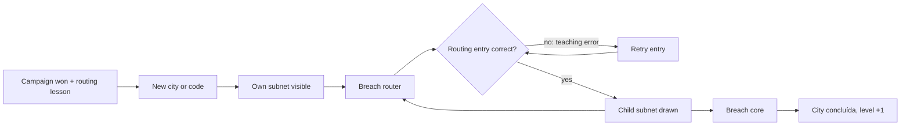
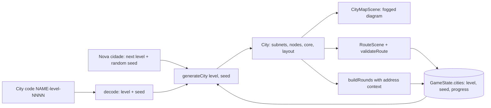
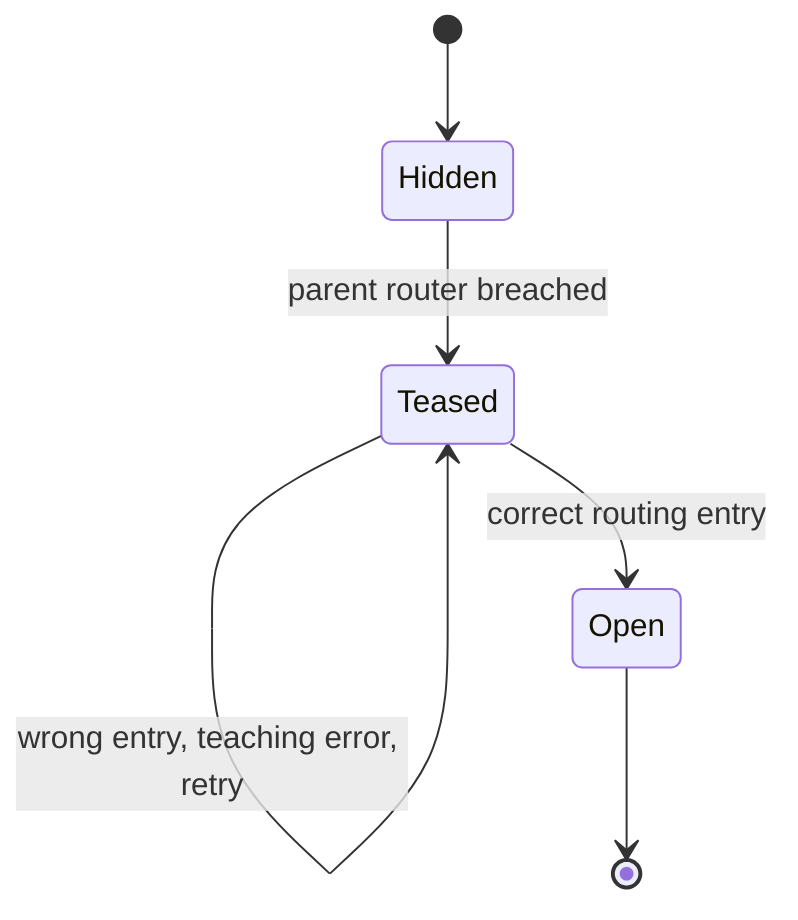

# Seeded IP-Plan Cities - Plan

## Goal Capsule

- **Objective:** After finishing the campaign, a student can keep practicing IP addressing and routing in new cities whose maps are real, correct address plans. They open each city by writing routing entries, and they can share a city with a short code so someone else gets the same network.
- **Means:** a pure city generator rebuilt from level and seed (KTD1, KTD2), a separate city progress record in the save (KTD6), and three new screens (city list, city map, routing entry) built on the existing pick-with-arrows field pattern (KTD5, KTD8).
- **Product authority:** the user (project owner) settled the scope in dialogue. This plan covers generated cities and the shareable city code from ideation idea 6. City types unlocked by new lectures (NAT, VLAN, IPv6, VPN), teacher tooling, and the formatura ending (idea 7) are not active scope here. The Product Contract wins on behavior; the Planning Contract wins on mechanism within it.
- **Product Contract preservation:** Product Contract unchanged except its Outstanding Questions, all deferred to planning, which are removed because KTD2, KTD4, KTD7, KTD9, KTD10, KTD11 and Scope Boundaries now answer them.
- **Execution profile:** pure logic in `src/core` and lesson data in `src/data` are built test-first and land before any scene; scenes follow and are checked by typecheck, build and a manual playthrough.
- **Stop conditions:** stop and ask if a generated city cannot satisfy R6 and R8 at the same time for some level (for example, a branching rule that cannot fit addresses into the /16), or if the swarm plan has landed and city breaches would collide with its held-node model.
- **Who finishes:** `ce-work` (or a human) implements U1-U9 in dependency order on one branch.
- **Open blockers:** none.

---

## Product Contract

### Summary

Breaching the Data Center Core unlocks generated cities. Each city is a tree of subnets joined by routers, built from a level and a seed, and drawn as a network diagram that the player reveals one subnet at a time. Breaching a router asks for a routing entry, and a correct entry opens the subnet behind it. A city code (level + seed) rebuilds the same city for anyone who has won the campaign.

### Problem Frame

The campaign is ten handwritten nodes (`src/data/nodes.ts`), and once the Data Center Core falls the game offers only replay cash and the text "Keep exploring!" (`src/core/state.ts`). The node addresses are labels taken from documentation ranges, not an address plan, so the map never exercises what the IP lesson teaches. Mini-game rounds ignore the node they run on: `buildRounds` takes only area, difficulty and a random generator (`src/core/minigames.ts:39`). Routing (which network is reached through which next hop) is not taught anywhere, even though it is the step after host configuration that the game already teaches in Network Setup.

The students are 2nd-year Técnico em Informática para Internet students at IFRS Campus Veranópolis, whose networks discipline is where addressing and routing practice belongs. Classroom use of a shared city is speculative: no teacher session is planned yet.

### Key Decisions

- **Scope is generated cities plus a shareable code.** City types via new lectures depend on cities existing first. (session-settled: user-directed — chosen over cities only, lecture-gated city types, and a code for the campaign alone)
- **The address plan drives both movement and questions.** Routing entries gate movement, and rounds are built from the city's addresses. Governs R12-R16. (session-settled: user-directed — chosen over the plan driving only puzzles, only movement, or staying decorative)
- **Movement is gated at routers, not at every host.** Writing a route teaches routing tables. Repeating host configuration per hop would repeat Network Setup. Governs R12-R14. (session-settled: user-directed — chosen over host configuration once per subnet and over configuration on every connect)
- **Cities unlock after the campaign win.** The handwritten campaign stays the teaching path. Governs R1, R21, R22. (session-settled: user-approved — chosen over unlocking cities once online and over opening code cities anytime)
- **The rig carries over, and a save holds many cities.** Cities are a continuation, not a separate run. Governs R2, R3. (session-settled: user-directed — chosen over one active city at a time and over a fresh rig per city)
- **Each city has one core, and breaching it finishes the city.** This mirrors the Data Center Core and gives a clear "done". Governs R7, R17. (session-settled: user-approved — chosen over mapping the whole plan and over no completion state)
- **Difficulty grows with cities finished.** Governs R8, R18. (session-settled: user-directed — chosen over a size picked by the player and over one fixed size)
- **A code fixes the city, not the questions.** Mini-game questions stay random for each player. Governs R16, R20. (session-settled: user-directed — chosen over identical rounds for everyone and over a code that also sets difficulty with random rounds)
- **The code carries the level.** Growth differs per player, so a seed alone would build different cities. Governs R20, R21. (session-settled: user-approved — chosen over codes always at level 1 and over code cities not counting toward growth)
- **A wrong routing entry is retried freely with a teaching error.** This matches Network Setup's style. Governs R14. (session-settled: user-approved — chosen over limited attempts and over revealing fields after N errors)
- **The map is a network diagram with fog of war.** Subnets are drawn in depth columns and appear only once opened. The layout is mechanical, so it avoids free graph layout on 1280×720, and the route the player writes becomes the line that is drawn. Governs R9-R11. (session-settled: user-directed — chosen over a fully visible diagram and over handwritten topology templates)
- **The code stays minimal.** Classroom use is speculative, so there is no teacher dashboard, report or roster (YAGNI).

### Actors

- A1. Player: a student who has breached the Data Center Core.
- A2. Code sharer: any player (a classmate or a teacher with a winning save) who reads a city's code aloud or writes it down. There is no server; the code is the only channel.

### Requirements

**Access and persistence**

- R1. A "new city" action becomes available once the Data Center Core is breached, and not before.
- R2. A save keeps every city the player has started, each with its own progress. A city list shows each city's code, level and status ("em andamento" or "concluída"), and the player can switch between cities.
- R3. Hardware, inventory, money and completed lessons are shared between the campaign and every city.
- R4. City progress is kept apart from campaign progress. Existing saves load unchanged, and their campaign state is untouched.

**City generation**

- R5. A city is fully determined by its level and seed. The same pair always produces the same subnets, addresses, nodes, links, requirements and core.
- R6. Every city is a correct IPv4 plan. Each subnet has a valid network address and prefix. Every host address lies inside its subnet and is neither the network nor the broadcast address. No address repeats. Each router has one address in its parent subnet and one in each child subnet it serves.
- R7. Each city has exactly one core node, placed in a subnet at the greatest depth.
- R8. Higher levels make cities harder through more depth, more branching, less obvious prefixes and higher node requirements. Level 1 must be finishable by a rig that could breach the Data Center Core.

**Map and routing**

- R9. The city map is drawn as a network diagram. Each subnet is a box labeled with its network and prefix (e.g. `10.4.2.0/24`) holding its hosts. Routers sit on the lines between boxes, and subnets are placed in columns by depth from the player's subnet.
- R10. When a city starts, only the player's own subnet is drawn.
- R11. A breached router shows that it leads somewhere, but the subnet behind it stays hidden until R14 is satisfied.
- R12. After a router is breached, the player is asked for a routing entry for the subnet behind it: destination network, prefix, and next hop.
- R13. The routing entry can be closed and reopened later from the breached router without losing the breach.
- R14. A correct entry draws the subnet behind the router and makes its nodes reachable. A wrong entry names the specific mistake (for example, an address that is not a network address, a wrong prefix, or a next hop outside the reachable subnet) and can be retried with no limit or cost.
- R15. Nodes in a city use the same areas, difficulty, requirement checks and breach flow as campaign nodes.
- R16. A city node's mini-game rounds use that city's addresses wherever the area works with addresses. Subnet rounds use the node's own subnet. Which round is asked stays random for each player.

**Completion and growth**

- R17. Breaching a city's core marks that city "concluída". The city stays playable afterwards.
- R18. A new city's level is 1 plus the number of cities the player has finished, counting cities opened from a code.

**City code**

- R19. Every city shows its code, which can be read aloud and typed by hand (shape like `RIO-3-4821`) and encodes the level and the seed.
- R20. Entering a valid code builds exactly that city at the code's level, whatever the receiver's own progress. If the city is already in the save, the code opens it instead of making a copy.
- R21. An invalid code says it is invalid, and nothing is created. Code entry is available only under the same unlock as R1.

**Teaching and text**

- R22. A routing lesson (rotas e tabela de roteamento: destination network, prefix, next hop), run through the existing lesson → quiz gate, must be passed before the first city can be created.
- R23. All new player text follows the PT-BR style plan. Cities are presented as cyber range exercises, consistent with the cyber range framing plan.

### Key Flows

- F1. Start a city
  - **Trigger:** A1 has breached the Data Center Core and passed the routing lesson.
  - **Steps:** A1 chooses "nova cidade" (or types a code). The game builds the city from level and seed. The map shows only A1's subnet.
  - **Covered by:** R1, R5, R10, R18, R20, R22
- F2. Open a subnet
  - **Trigger:** A breached router leads to a hidden subnet.
  - **Steps:** A1 opens the routing entry and writes destination, prefix and next hop. On a mistake, A1 reads the error and retries. On success, the child subnet box and its nodes appear.
  - **Covered by:** R11-R14
- F3. Finish a city
  - **Trigger:** The core's subnet is open and A1 meets its requirements.
  - **Steps:** A1 breaches the core. The city becomes "concluída", and the next new city's level rises by one.
  - **Covered by:** R7, R17, R18



### Acceptance Examples

- AE1. Same code, same city
  - **Covers R5, R20.**
  - **Given** player P (2 cities finished) and player Q (0 finished). **When** both enter `RIO-3-4821`. **Then** both get a level 3 city with identical subnets, addresses and core, though their mini-game questions differ.
- AE2. Wrong route
  - **Covers R14.**
  - **Given** a breached router whose child subnet is `10.4.2.0/24`, reached through `10.4.1.1`. **When** the player writes `10.4.2.7/24` as the destination. **Then** the error says `10.4.2.7` is not a network address. The subnet stays hidden, and the player can retry at once.
- AE3. Code city counts toward growth
  - **Covers R18.**
  - **Given** a player with 1 finished city. **When** they finish a level 5 city opened from a code. **Then** their next new city is level 3.
- AE4. Old save
  - **Covers R4.**
  - **Given** a save from before this feature that has already breached the Data Center Core. **When** it loads. **Then** campaign progress is unchanged, there are no cities, and "nova cidade" is offered once the routing lesson is passed.
- AE5. Code before the win
  - **Covers R21.**
  - **Given** a player who has not breached the Data Center Core. **When** they look for code entry. **Then** it is not offered.

### Success Criteria

- Across many seeds and levels, every generated city passes the R6 rules, and its core is reachable through routing entries alone.
- A student can explain a routing entry they wrote (destination network, prefix, next hop) in the same terms the routing lesson uses.

### Scope Boundaries

- City types unlocked by new lectures (NAT, VLAN, IPv6, VPN) are deferred.
- Teacher tooling is out: no class results, rosters, reports or server.
- Identical mini-game questions for every holder of a code are out (per R16).
- Changes to the campaign map, its nodes or its addresses are out.
- Income balance for endless cities is not solved here.
- Host configuration at each hop is out (routing entries only).
- City breaches do not create swarm held nodes or use NOC capacity. Whichever of this plan and the swarm plan lands second decides how they combine.

#### Deferred to Follow-Up Work

- Deleting or archiving cities from the city list.
- City data for ports, HTTP and DNS rounds (host names, services per node).

### Dependencies / Assumptions

- The PT-BR style plan (`docs/plans/2026-10-03-0358-feat-ptbr-style-system-plan.md`) and the cyber range framing plan (`docs/plans/2026-10-03-0424-feat-cyber-range-ethics-plan.md`) govern wording and framing (R23).
- The numeric difficulty level from the reteach plan (`docs/plans/2026-10-03-1446-feat-reteach-side-jobs-plan.md`, R14) is expected to be available for city node difficulty above 3. If it has not landed, city nodes use difficulty 1-3.
- Assumption: routing tables fit the 2nd-year networks discipline. Its ementa covers networks and network services but does not name routing explicitly.
- Assumption: class-code use is speculative. No classroom session is planned.

---

<!-- ce-section: work-relationships -->
## How This Work Fits Together

This plan covers generated cities and the shareable city code. The breakdown below is the current understanding, not a committed roadmap.

- City types via new lectures (NAT, VLAN, IPv6, VPN)
  - Depends on this plan's generated cities.
- Formatura ending and pós-graduação tiers (idea 7)
  - Still to decide: whether finishing cities becomes the post-graduation ladder that idea 7 describes.
- Mining economy (idea 2)
  - Shares the open question of endless income from city breaches.
- Swarm and NOC capacity (`docs/plans/2026-10-03-0339-feat-swarm-noc-capacity-plan.md`)
  - Shares node type and tier, which that plan built to be reused by procedural cities.
- Reteaching and side-job board (`docs/plans/2026-10-03-1446-feat-reteach-side-jobs-plan.md`)
  - Shares the numeric difficulty level.

### Sources / Research

- `src/data/nodes.ts:44-104`: ten campaign nodes with literal x/y and documentation-range IPs.
- `src/core/state.ts:15` (`breached: string[]`), `:64` (`phaseOf` 'won'), `:89-90` (post-win objective text only).
- `src/core/store.ts:17`: v1 saves load with merged defaults.
- `src/scenes/MinigameScene.ts:50`: `buildRounds(data.minigame, data.difficulty, createRng(Date.now()))`.
- `src/core/minigames.ts:33,39`: `Difficulty = 1 | 2 | 3`; `buildRounds` receives no node context.
- `src/core/ip.ts:68-110`: `validateNetConfig`, the style model for routing-entry errors.
- `src/core/random.ts:5`: `createRng(seed)`.
- Ideation: `docs/ideation/2026-09-27-release-hardening-ideation.html`, idea 6.
- `src/scenes/NetSetupScene.ts`: pick-with-arrows fields, the only input pattern in the game (no text input).
- `src/scenes/HubScene.ts`: menu items at `y = 100 + i * 88`; the side-job row sits at `y = 560`.
- `tests/core.test.ts`: the area-by-difficulty-by-seed round validity loop and the end-game rig test reused by U1 and U5.

---

## Planning Contract

### Key Technical Decisions

- KTD1. **A city is a pure function of level and seed, rebuilt on demand and never saved.** The generator lives in `src/core/city.ts`, takes `(level, seed)`, seeds its own generator from both values together, and returns subnets, NetNode-shaped nodes with map positions, links and the core id. The save keeps only the level, the seed and progress (KTD6), so R5 holds by construction and saves stay small. Governs R5. (session-settled: user-approved — chosen over saving the generated map: the code must rebuild the same city anyway)
- KTD2. **All cities use one /16 inside `10.0.0.0/8`, picked from the seed.** Child subnets are carved from it as aligned, non-overlapping blocks, and hosts take free offsets that are neither network nor broadcast. Each router serves exactly one child subnet, so it holds one address in its parent subnet and one in its child; branching comes from several routers in the same parent subnet. Mixing in `172.16.0.0/12` and `192.168.0.0/16` would add variety without teaching anything new. Governs R6. (session-settled: user-approved — chosen over mixing private ranges)
- KTD3. **Level shapes the tree, and node requirements are capped at the Data Center Core's.** Depth, branching and prefix variety grow with level. Requirements scale toward `getNode('core').requires` and never exceed it, so the end-game rig from the existing test can always finish level 1 and every later level. Past the cap, difficulty grows only through structure and prefixes, and structural growth itself stops at level 12, so every level a code can carry (1-99) produces a city that fits. Governs R8. (session-settled: user-approved — chosen over requirements that keep growing past the strongest buyable rig)
- KTD4. **At most three subnets share a depth, and deep cities scroll sideways.** Columns are a fixed width, and the city map camera scrolls horizontally while the header and objective bar stay put. There is no zoom. The three-per-column cap is a generator rule, so every column fits in 720 px. Governs R9. (session-settled: user-approved — chosen over zoom and over a hard cap on depth)
- KTD5. **Routing entry and code entry use Network Setup's pick-with-arrows fields.** The game has no text input today. Route fields offer the correct value among plausible wrong ones, and the code form cycles a city name, a level and four digits. Governs R12, R19, R20. (session-settled: user-approved — chosen over adding keyboard text input)
- KTD6. **City progress lives in a new `cities` list in `GameState`, separate from `breached`.** Each entry holds level, seed, breached city node ids, opened subnet ids and a finished flag. The field defaults to empty through the existing merge-defaults load (`src/core/store.ts:17`), so `version` stays 1 and old saves load unchanged. Node ids are only unique within a city, which keeps them apart from campaign ids. Governs R2, R4.
- KTD7. **The correct next hop is the breached router's address in the parent subnet.** A route reads "to reach network N/P, send to router R". This is the static route any host in the parent subnet would use, and it extends the default-gateway idea the IP lesson already teaches. Governs R12, R14.
- KTD8. **Route validation is a pure function in `src/core/routing.ts`, modeled on `validateNetConfig`.** It returns a list of teaching errors, empty when the route is correct. Route choices are seeded from the city and the router id, so they stay the same across visits. Governs R12, R14.
- KTD9. **City rounds receive an optional address context, and only subnet and 8-bit binary rounds use it.** `buildRounds` gains an optional context with the node's network, prefix and host address. Subnet rounds draw a fresh host inside that subnet for each round, so the existing prompt de-duplication still yields a full round count. Binary rounds at 8 bits convert a nonzero octet of the node's address other than the leading `10`, and fall back to today's random value when none is left. Without a context, generation is identical to today, so the campaign and existing tests are untouched. Question selection still uses `createRng(Date.now())`. Governs R16. (session-settled: user-approved — chosen over also wiring ports, HTTP and DNS to city data)
- KTD10. **City nodes use difficulty 1-3 through one clamp helper.** If the reteach plan's numeric difficulty has landed, the helper lets subnet and binary nodes go above 3. Otherwise everything stays in 1-3. Governs R8, R15.
- KTD11. **The routing lesson sits after `ip-addressing` in the Networking track.** It opens well before the campaign ends, so the R22 gate never strands a player who has won. Its text is written directly in PT-BR. Governs R22, R23. (session-settled: user-approved — chosen over waiting for the PT-BR conversion)
- KTD12. **City breaches pay cash and do not touch the swarm.** The reward scales with level and depth, and a re-breach pays `REPLAY_RATIO` as in the campaign. How city income fits the economy belongs to the mining plan. Governs R15. (session-settled: user-approved — chosen over defining city held nodes here)
- KTD13. **A code is `NAME-level-NNNN`, with NAME from a fixed list of 32 three-letter city abbreviations.** The seed is `nameIndex * 10000 + NNNN`, which gives 320,000 seeds per level. The level range is 1-99, and `nextCityLevel` is clamped to 99 so every new city can be encoded. Parsing ignores case and surrounding spaces. Governs R19-R21.

### High-Level Technical Design

Data flow from a code to every consumer:



A subnet's visibility lifecycle (the depth-0 subnet starts Open):



City node status, as directional guidance:

```text
node in an Open subnet  -> reachable if not breached, breached otherwise
node in any other subnet -> hidden
core breached            -> city finished (R17); nodes stay re-breachable
```

### Assumptions

- The three-per-column cap (KTD4) leaves enough room for the growth R8 asks for, because growth continues through depth.
- One /16 holds the largest city shape KTD3 allows. Because growth stops at level 12, U1's property test covering levels 1-99 checks this for every level a code can carry.

### Sequencing

U1, U2, U5 and U6 are pure and independent. U3 needs U1's types. U4 needs U1 and U3. U7 needs U2 and U4. U8 needs U1, U4 and U5. U9 needs U3, U4 and U8.

---

## Implementation Units

### U1. City generator and address plan

**Goal:** produce a deterministic city that is a correct IPv4 plan with a column layout.

**Requirements:** R5, R6, R7, R8, R9, R15. KTD1, KTD2, KTD3, KTD4, KTD10, KTD12.

**Dependencies:** none.

**Files:** create `src/core/city.ts`; create `tests/city.test.ts`.

**Approach:**
1. Seed the generator from level and seed combined, so the same seed at two levels gives two different cities.
2. Build the subnet tree breadth-first from depth 0, with at most three subnets per depth (KTD4) and depth and branching growing with level (KTD3).
3. Pick prefixes per level: only /24 at level 1, a wider spread at higher levels. Carve aligned blocks from the city's /16 (KTD2).
4. Place hosts and routers. Each router is a node in the parent subnet with its child-side address recorded. Give every node an area, a clamped difficulty (KTD10), requirements capped at the core's (KTD3) and a reward (KTD12).
5. Pick one node in a subnet at the greatest depth as the core (R7).
6. Compute x/y from depth column and row. Links follow subnet membership and router connections.
7. Stop structural growth (depth, branching, prefix spread) at level 12 (KTD3). Each router serves exactly one child subnet (KTD2).

**Patterns to follow:** `NetNode` and `NodeRequirements` in `src/data/nodes.ts`; `createRng`, `randInt`, `pick` and `shuffle` in `src/core/random.ts`; IP helpers in `src/core/ip.ts`.

**Execution note:** write the property tests first; they are the main proof of R6.

**Test scenarios:**
- Covers AE1. The same level and seed produce deep-equal cities on two calls.
- The same seed at levels 2 and 3 produces different cities.
- For levels 1-30 with seeds 1-50, and levels 31-99 with seeds 1-5: every subnet's network address equals `networkAddress(network, prefix)`, and no two subnets overlap.
- Same range: every host address is inside its subnet, is neither network nor broadcast, and is unique across the city.
- Same range: every router has a parent-side address in its parent subnet and a child-side address in its single child subnet.
- Same range: there is exactly one core, and its subnet's depth equals the city's maximum depth.
- Same range: no depth holds more than three subnets, and every node's y stays inside the 720 px canvas below the header.
- Same range: no requirement exceeds the matching value in `getNode('core').requires`.
- Same range: every subnet is reachable from depth 0 through router links.
- Level 1 cities use only /24 subnets.
- Average depth across seeds 1-50 is higher at level 10 than at level 1.

**Verification:** the property tests pass across the full level and seed range.

### U2. City code encode and decode

**Goal:** turn level and seed into a readable code and back.

**Requirements:** R19, R20, R21. KTD13.

**Dependencies:** none.

**Files:** create `src/core/cityCode.ts`; create `tests/cityCode.test.ts`.

**Approach:** a fixed list of 32 three-letter names, an encoder from level and seed, a decoder that returns level and seed or null, and a random-seed helper for "nova cidade".

**Patterns to follow:** `parseIp` and `formatIp` in `src/core/ip.ts` (null on invalid input).

**Test scenarios:**
- Decoding the encoding gives back level and seed for 1,000 random pairs.
- `rio-3-4821` and ` RIO-3-4821 ` decode the same as `RIO-3-4821`.
- An unknown name, level 0, level 100, three digits, five digits or a missing dash returns null.

**Verification:** tests pass, and no encoded code fails to decode.

### U3. Route validation and choices

**Goal:** check a routing entry and explain each mistake.

**Requirements:** R12, R14. KTD7, KTD8.

**Dependencies:** U1 (city types).

**Files:** create `src/core/routing.ts`; create `tests/routing.test.ts`.

**Approach:**
1. `validateRoute(entry, city, routerId)` returns PT-BR teaching errors for these cases: the destination is a host or broadcast address and not a network address, the prefix does not match the child subnet, the next hop is outside the parent subnet, the destination is a valid network address but not the network behind this router (for example a sibling or the parent network), and the next hop is in the parent subnet but is not this router. Errors name the concept to recheck and never print the correct value.
2. `routeChoices(city, routerId)` returns the field choices, seeded from the city and router id. It always includes the correct value plus distractors that trigger each error above.

**Patterns to follow:** `validateNetConfig` in `src/core/ip.ts` (error list, one message per concept).

**Test scenarios:**
- The correct destination, prefix and next hop return no errors.
- Covers AE2. Destination `10.4.2.7` for child `10.4.2.0/24` returns an error saying it is not a network address.
- The child's broadcast address as the destination returns a broadcast error.
- A /25 prefix for a /24 child returns a prefix error that explains the mismatch without printing the correct network.
- A sibling's or the parent's network address, with the correct prefix and next hop, returns a wrong-network error.
- The router's child-side address as the next hop returns an error saying it is outside the reachable subnet.
- Another host in the parent subnet as the next hop returns an error saying it is not the router for that network.
- The choices for one router are identical across calls, and each field contains its correct value.
- Every distractor from `routeChoices` triggers at least one error.

**Verification:** route tests pass for routers sampled from many generated cities.

### U4. City progress in game state

**Goal:** start, track and finish cities in the save.

**Requirements:** R1, R2, R3, R4, R13, R14, R15, R17, R18, R20, R22. KTD6, KTD12.

**Dependencies:** U1, U3.

**Files:** modify `src/core/state.ts`; modify `src/core/store.ts` only if merge-defaults is not enough; create `tests/cityState.test.ts`.

**Approach:** add `cities: []` to `newGame()` and these functions:
1. `canStartCities(state)`: phase is `won` and the routing lesson is passed.
2. `nextCityLevel(state)`: 1 plus the number of finished cities, clamped to 99 (KTD13).
3. `startCity(state, level, seed)`: returns the index, reusing an existing entry with the same level and seed (R20).
4. `cityNodeStatus`, plus a city version of `canConnect` that reuses `checkRequirements` and `isOnline`.
5. `submitRoute`: runs `validateRoute` and, when there are no errors, records the child subnet as opened.
6. `breachCityNode`: pays per KTD12 and sets the finished flag when the node is the core.

**Patterns to follow:** the query and mutation sections of `src/core/state.ts` (mutations change state in place and return a result).

**Test scenarios:**
- Covers AE4. A v1 save object with no `cities` field, loaded through merge-defaults, keeps campaign fields and gets `cities: []`.
- Covers AE5. `canStartCities` is false before the core is breached, even with the routing lesson passed.
- `canStartCities` is false after the win without the routing lesson, and true with it.
- `startCity` twice with the same level and seed gives one entry and the same index.
- At the start, only depth-0 subnet nodes are reachable, and a router's child subnet nodes are hidden.
- After a router is breached and a wrong route is submitted, the child stays hidden, errors are returned, and the router stays breached.
- After a correct route, the child subnet's nodes become reachable.
- Breaching the core sets the finished flag, and the city's nodes can still be re-breached for the replay reward.
- Covers AE3. With one finished city, finishing a level 5 city entered by code makes `nextCityLevel` return 3.
- A city breach leaves campaign `breached` unchanged, and a campaign breach leaves city progress unchanged.

**Verification:** state tests pass, and the existing progression tests in `tests/core.test.ts` still pass.

### U5. City address context for rounds

**Goal:** build subnet and 8-bit binary rounds from a city node's addresses.

**Requirements:** R16. KTD9.

**Dependencies:** none.

**Files:** modify `src/core/minigames.ts`; modify `tests/core.test.ts`.

**Approach:** add an optional context parameter to `buildRounds` and pass it to the subnet and binary generators. The subnet generator draws a fresh host inside the context's network and prefix for each round, in place of `randomPrivateIp` and its prefix pick, for every question type except usable hosts. The binary generator uses a nonzero octet of the host address other than the first when it draws an 8-bit value, falling back to today's random value (KTD9).

**Execution note:** first add a characterization test that pins today's rounds for fixed seeds without a context, then make the change.

**Patterns to follow:** the existing generators and the area-by-difficulty loop in `tests/core.test.ts`.

**Test scenarios:**
- Without a context, rounds for seeds 1-30 in every area and difficulty equal the pinned rounds.
- With a context of `10.4.2.0/24`, every same-subnet, network-address and broadcast round names an address inside `10.4.2.0/24` with prefix 24.
- With a context, the existing validity checks still hold: distinct options, an answer index in range, and the right round count.
- With a context at binary difficulty 3, every decimal-to-binary value comes from a nonzero, non-first octet of the host address.
- With a context host of `10.7.0.5`, every bits target is greater than 0.
- With a /24 context at subnet difficulty 1, `rounds.length` equals `roundCount(1)`.

**Verification:** all existing minigame tests pass unchanged.

### U6. Routing lesson

**Goal:** teach destination network, prefix and next hop before cities open.

**Requirements:** R22, R23. KTD11.

**Dependencies:** none.

**Files:** modify `src/data/lessons.ts`; modify `tests/core.test.ts`.

**Approach:** add lesson `routing` (track Networking, `requires: ['ip-addressing']`) with about four PT-BR pages: what a route is, network plus prefix, the next hop as the router on your side, and reading a small routing table. Add a four-question quiz whose explanations use the same terms as the U3 errors.

**Patterns to follow:** the `ip-addressing` lesson in `src/data/lessons.ts`.

**Test scenarios:**
- The existing content-integrity tests (lesson references, quiz answers) pass with the new lesson.
- `isLessonOpen(state, 'routing')` is true once `ip-addressing` is passed and false before.

**Verification:** the lesson appears in Study after IP addressing, and its quiz can be passed.

### U7. Hub entry and city list

**Goal:** let a winning player see their cities, start a new one or enter a code.

**Requirements:** R1, R2, R18, R19, R20, R21, R22. KTD5, KTD13.

**Dependencies:** U2, U4.

**Files:** modify `src/scenes/HubScene.ts`; create `src/scenes/CityListScene.ts`; modify `src/main.ts`.

**Approach:**
1. Add a "Cidades" item to the Hub menu, enabled only when `canStartCities` is true, with a hint naming what is missing. Tighten the menu spacing so six items fit above the side-job row.
2. The city list shows each city's code, level and "em andamento" or "concluída", newest first, with in-progress rows visually distinct. Clicking a city opens its map. The list pages with Anterior/Próxima when rows exceed one screen. With no cities, it shows a short empty state pointing at the two buttons below.
3. "Nova cidade" starts a city at `nextCityLevel` with a random seed.
4. "Entrar código" shows a pick-with-arrows form with six fields: name, level, and four single-digit fields, each wrapping around at its ends. The assembled code is shown live above the confirm button. On confirm it decodes and calls `startCity`; when the city already exists, a toast says it is opening the existing city. An invalid code shows an error where Network Setup shows its errors, and creates nothing.

**Patterns to follow:** the menu list in `src/scenes/HubScene.ts`; field cycling in `src/scenes/NetSetupScene.ts`; `button`, `panel`, `Layer` and `textStyle` in `src/ui/widgets.ts`.

**Test scenarios:** Test expectation: none -- scene wiring; its rules are covered by U2 and U4 and checked in the manual playthrough.

**Verification:** in a playthrough, the Hub item is disabled before the win, a new city appears in the list at the expected level, and entering the same code twice opens the existing city.

### U8. City map with fog of war

**Goal:** draw the city as a network diagram that reveals subnets as routes are written.

**Requirements:** R9, R10, R11, R15, R16, R17. KTD4, KTD9.

**Dependencies:** U1, U4, U5.

**Files:** create `src/scenes/CityMapScene.ts`; modify `src/scenes/MinigameScene.ts`; modify `src/main.ts`.

**Approach:**
1. Draw open subnets as labeled boxes in depth columns, holding their hosts. Draw routers on the links between boxes. A breached router whose child is not open shows a "?" stub. The header shows the city's code, level and status (R19).
2. Draw the diagram in a second camera whose viewport sits between the header and the objective bar and scrolls horizontally (arrow buttons and drag). The main camera stays fixed for the header, objective bar and info panel, because the shared `header()` and `objectiveBar()` helpers return no objects to pin. Arrow buttons are disabled when no columns lie in that direction. On return from the routing screen, the map camera scrolls to the newly opened column.
3. The node info panel reuses the Net Map's requirement list. "Conectar" starts the mini-game with a city reference. A breached router with a closed child shows "Escrever rota".
4. A breached router's info panel shows its discovered child-side interface (address and prefix, as an `ip addr`-style line), which is the clue the routing entry is derived from. The subnet itself stays hidden (R11).
5. Breaching the core shows a short "cidade concluída" banner that states the next new city's level and links to the city list.
6. In `MinigameScene`, accept an optional city reference: pass the address context to `buildRounds`, call `breachCityNode` instead of `breach` on success, and return to the city map on leave.

**Patterns to follow:** `src/scenes/NetMapScene.ts` (status colors, legend, info panel).

**Test scenarios:** Test expectation: none -- rendering and scene wiring; reachability, breach and round rules are covered by U4 and U5 and checked in the manual playthrough.

**Verification:** in a playthrough, a new city shows only the home subnet, a breached router shows a stub, a deep city scrolls sideways, and breaching the core marks the city "concluída".

### U9. Routing entry screen

**Goal:** let the player write a route for a breached router and learn from mistakes.

**Requirements:** R12, R13, R14. KTD5, KTD7, KTD8.

**Dependencies:** U3, U4, U8.

**Files:** create `src/scenes/RouteScene.ts`; modify `src/main.ts`.

**Approach:** three pick-with-arrows fields (destination, prefix, next hop) from `routeChoices`, plus a reference panel with the parent subnet, the router's parent-side address and its discovered child-side interface (address and prefix), like Network Setup's sticky note. "Aplicar rota" calls `submitRoute` and shows any errors in place, keeping the chosen values. On success it returns to the city map, where the new subnet is drawn. "Voltar" leaves without changes.

**Patterns to follow:** `src/scenes/NetSetupScene.ts` (fields, apply button, error list).

**Test scenarios:** Test expectation: none -- UI over `submitRoute`, whose behavior U4 tests.

**Verification:** in a playthrough, a wrong route shows its specific error and allows a retry, leaving and returning keeps the router breached, and a correct route reveals the subnet.

---

## Verification Contract

- `npm test` passes, including the new `tests/city.test.ts`, `tests/cityCode.test.ts`, `tests/routing.test.ts` and `tests/cityState.test.ts`, with the existing suites unchanged in intent.
- `npm run typecheck` and `npm run build` succeed.
- Manual playthrough with `npm run dev`, from a save that has breached the Data Center Core:
  1. Pass the routing lesson.
  2. Start a city and open two subnets, submitting one wrong route first.
  3. Breach the core and confirm the city shows "concluída" and the next new city is one level higher.
  4. Enter the finished city's code and confirm it opens the existing city.
  5. Enter a code at a different level and confirm the city builds at that level.
  6. Reload the page and confirm all progress survived.

## Definition of Done

- U1-U9 are implemented, and every listed test scenario exists and passes.
- The Verification Contract's commands succeed, and the playthrough steps behave as described.
- Saves from before this change load with campaign progress intact (AE4).
- All new player-facing text is in PT-BR (R23).
- No dead code or abandoned experiments from discarded approaches remain in the diff.
