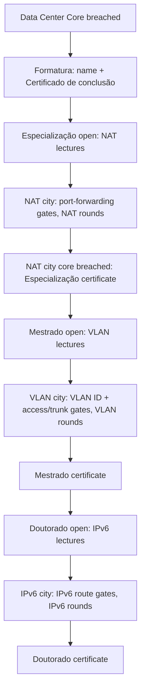
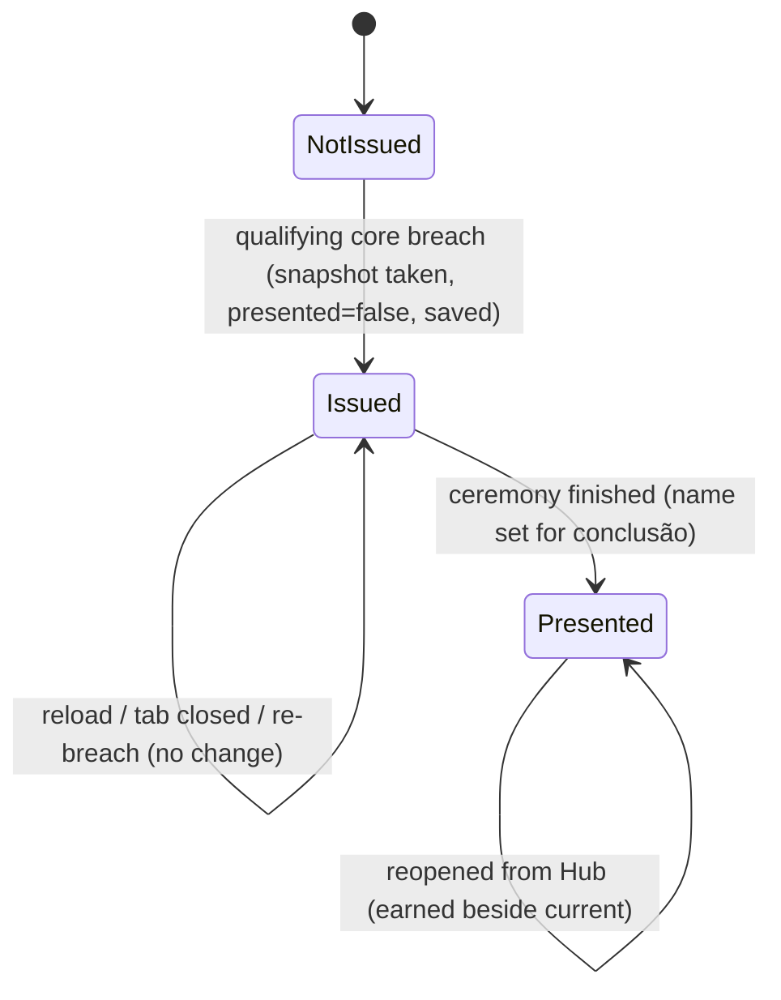
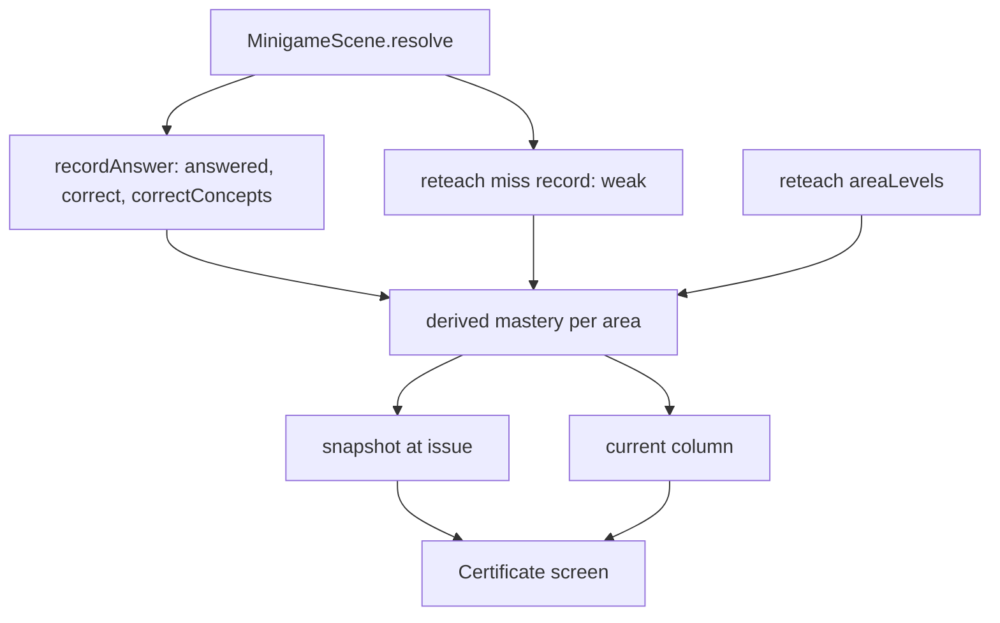

# Formatura and Pós-Graduação - Plan

## Goal Capsule

- **Objective:** A student who finishes the campaign receives a certificate that records what they mastered. A student who wants more can keep learning new networking content (NAT, VLAN, IPv6), practicing each topic in play and earning a certificate for it.
- **Means:** a formatura certificate at the end of the campaign opens an optional three-tier ladder. Each tier pairs a lecture pack with a new city type and a new mini-game area (KTD4).
- **Product authority:** the user (project owner) settled the scope in dialogue. This plan covers the formatura certificate and the pós-graduação tiers from ideation idea 7. Teacher-facing evidence (class codes, reports) is not active scope. Endless play is already covered by the seeded cities plan, and the campaign ending already exists. The Product Contract wins on behavior; the Planning Contract wins on mechanism within it.
- **Product Contract preservation:** changed: R14 restated for pick-with-arrows gates (user-approved during planning); AE7's error now names the tier the code needs, because R8 hides that tier's lectures; R20 labels the area level as the side-job level. Added R25-R27 and AE8-AE9: everything this plan adds is disclosed one step at a time (user-directed, 2026-10-06); "Nova cidade" now lists only unlocked types, and the Hub hint carries the next goal. No other scope change.
- **Execution profile:** pure logic in `src/core` and content in `src/data` are built test-first (U1-U7). Scenes follow (U8, U9) and are checked by typecheck, build and a manual playthrough.
- **Stop conditions:** the seeded cities, reteach, PT-BR and cyber range plans have landed on `main`. Before U1, check that the modules and names this plan cites (Assumptions, unit file lists) match the landed code, and correct the plan's references where only a name differs. Stop and ask if any of them landed with a different design for city generation, codes, gates, concept records or area levels than the one this plan extends, or if a gate type cannot produce distractors that each trigger a distinct teaching error.
- **Who finishes:** `ce-work` (or a human) implements U1-U9 in order on one branch.
- **Open blockers:** none for planning. Implementation is gated by the stop conditions above.

---

## Product Contract

### Summary

Finishing the campaign opens a formatura: the student types their name and receives a Certificado de conclusão. It lists the lessons they completed, plus mastery and accuracy for each area. The formatura then opens an optional pós-graduação ladder: Especialização (NAT), Mestrado (VLAN) and Doutorado (IPv6). Each tier teaches its topic through a lecture pack, a city type whose router gates ask for that topic, and a new mini-game area. Breaching the core of a city of that type earns the tier's certificate.

### Problem Frame

Rootkit Academy serves two kinds of students. Some want a clear start and end, and the feeling of having finished. Others want harder challenges and should not hit a dead end. The campaign ends when the Data Center Core falls. Today that ending is one line of text in the Hub (`src/scenes/HubScene.ts:48`) plus a hint (`src/core/state.ts:90`). Nothing records what the student achieved. The game also does not save accuracy: the mistake counter in `src/scenes/MinigameScene.ts:27` lives only inside the scene.

The seeded cities plan (`docs/plans/2026-10-03-1513-feat-seeded-ip-plan-cities-plan.md`) gives continuing students endless cities after the Core. Every one of those cities practices the same IPv4 routing, though. That plan defers the city types that new lectures would unlock (NAT, VLAN, IPv6, VPN). None of those topics is taught anywhere in the game: NAT and VLAN do not appear in `src/`, and IPv6 appears only as the DNS `AAAA` record type (`src/data/lessons.ts:313`, `src/core/minigames.ts:303`).

The players are students of the Técnico em Informática para Internet integrado ao ensino médio (IFRS Campus Veranópolis), about 14-15 years old when they start. NAT, VLAN and IPv6 extend the addressing and networks content of their 2nd year.

### Key Decisions

- **The plan covers the formatura and the pós-graduação tiers. Teacher evidence is not included.** (session-settled: user-directed — chosen over formatura only, teacher evidence, and pós-graduação only: the ending and the optional content beyond it belong together)
- **The tiers exist to add optional educational content, not endless play.** Cities already provide endless play, and the Core already ends the campaign. Governs R7-R22. (session-settled: user-directed — chosen over treating the tiers as a fix for running out of content after the ending: the user stated the focus is new optional content)
- **A tier is a lecture pack plus a city type.** Governs R7-R14. (session-settled: user-approved — chosen over milestones earned by city count, tiers that cap city levels until studied, and lectures with no cities)
- **The tiers' new content is new lectures.** Re-hardened campaign nodes and a rising side-job board are not tier content. (session-settled: user-directed — chosen over re-hardened campaign nodes, a rising side-job board and procedural cities as the content source; procedural cities were already planned by another session)
- **Especialização teaches NAT, Mestrado teaches VLAN, Doutorado teaches IPv6.** Each builds on the IPv4 subnetting already taught. Governs R7, R8. (session-settled: user-approved — chosen over IPv6 plus VPN in Doutorado and over an IPv6 / NAT / VPN order)
- **A city type changes the router gate, and a new mini-game area backs it up.** The tier's concept is what opens the map, and rounds give practice inside reteach tracking. Governs R12-R18. (session-settled: user-approved — chosen over gate-only, area-only, and lectures with a board capstone and no city types)
- **Certificates show both mastery and accuracy per area.** Governs R20, R21. (session-settled: user-directed — chosen over mastery only, which the agent recommended, accuracy only, and lessons only)
- **A certificate shows the numbers it was earned with, and current numbers beside them.** Governs R22. (session-settled: user-directed — chosen over frozen-only, which the agent recommended, and always-live numbers)
- **The student types their name at the formatura.** Governs R2. (session-settled: user-approved — chosen over a name at new game and over an anonymous certificate)
- **No old-save migration.** No saves exist anywhere yet. (session-settled: user-directed — chosen over replaying the formatura or hiding stats for old winning saves)
- **One more thing at a time.** Each step should feel as simple as the first screen, because it adds only one new thing to learn. This plan applies that to everything it adds; the same pass over the shipped Hub, Study, Shop, Net Map and Cities is separate work. Governs R25-R27. (session-settled: user-directed — chosen over folding the game-wide pass into this plan and over deferring the whole principle: the game-wide pass would touch every shipped scene before any pós-graduação work)
- **A tier certificate is earned by finishing the first city of that tier's type.** This mirrors the Core ending the campaign. Governs R11.
- **The new areas stop at level 3, like ports, HTTP and DNS.** No teaching ceilings are designed for them. Governs R17.

### Actors

- A1. Student: a player who has breached the Data Center Core, or is about to.

### Requirements

**Formatura**

- R1. Breaching the Data Center Core starts the formatura once, right after the existing ending.
- R2. The formatura asks the student for the name to print on their certificates. The name is saved and reused for every later certificate.
- R3. The formatura shows the Certificado de conclusão (content per R20) and then returns the student to the Hub, where pós-graduação is now offered.
- R4. Formatura text follows the cyber range framing: it presents the end as completing the cyber range's final exercise and never says "breached" or "you win".

**Tier ladder**

- R5. Pós-graduação has three tiers in a fixed order: Especialização, Mestrado, Doutorado.
- R6. The formatura opens Especialização. Each later tier opens when the previous tier's certificate is earned.
- R7. Each tier has a lecture pack: one or more lessons with quizzes, run through the existing lesson-to-quiz gate. Especialização covers NAT, Mestrado covers VLAN, and Doutorado covers IPv6.
- R8. A tier's lectures appear in Study only once the tier is open.
- R9. Every tier is optional. The student can keep playing plain cities, side jobs and the campaign map without starting any tier.

**Typed cities**

- R10. Once a tier's lecture pack is passed, creating a new city offers that tier's city type alongside plain cities.
- R11. Breaching the core of a city of a tier's type earns that tier's certificate the first time it happens. Later cities of that type earn nothing extra.
- R12. In a NAT city, the subnet behind a router is private and hidden behind the router's public address. To open it, the student writes a port-forwarding entry: public address and port, mapped to a private address and port.
- R13. In a VLAN city, subnets are VLANs that share switching hardware. To open the subnet behind a gate, the student gives its VLAN ID and says whether the link is an access or trunk port.
- R14. In an IPv6 city, every address is IPv6. To open a subnet, the student picks an IPv6 route (destination prefix, prefix length and next hop), and an option counts as correct whether it shows the right value in compressed or full notation.
- R15. A wrong gate entry in a typed city behaves like a wrong routing entry in a plain city: it names the specific mistake and can be retried with no limit or cost.
- R16. Typed cities follow the plain cities' rules for level, growth, saving and codes. A city code also records its type. Entering it rebuilds a city of the same type, but only for a student who meets R10 for that type.

**New mini-game areas**

- R17. Each tier adds one mini-game area (NAT, VLAN, IPv6). Each area has its own concepts, three reteach lenses per concept, and levels 1-3, following the reteach plan's rules for existing areas.
- R18. Nodes in a typed city use that tier's area, with rounds built from the city's own addresses where the area works with addresses. A new area also appears on the side-job board once its lecture pack is passed.

**Certificates and stats**

- R19. The game counts, per area, the mini-game rounds answered and the rounds answered correctly, across every kind of mini-game (campaign nodes, side jobs and cities). Lesson quizzes do not count.
- R20. A certificate shows the student's name, the certificate's title (Certificado de conclusão, Especialização, Mestrado or Doutorado), the lessons completed, and for each area the student has played: accuracy (correct out of answered), concepts learned against concepts still weak, and the area's side-job level.
- R21. Areas with no rounds answered are left off a certificate instead of showing an empty percentage.
- R22. A certificate keeps the numbers from the moment it was earned. When reopened, it shows the current numbers beside them.
- R23. Every earned certificate can be reopened from the Hub at any time.
- R24. All new text follows the PT-BR style plan.

**Incremental disclosure**

- R25. Nothing this plan adds is shown, not even disabled, until it is available or is the student's next goal. Before the formatura, no pós-graduação, certificate or typed-city element appears anywhere. After it, only the next tier's step is shown as a goal; tiers beyond it stay hidden.
- R26. The formatura presents finishing the campaign as completing the game. Nothing on it implies the student must continue.
- R27. After the formatura, pós-graduação is introduced as an optional new chapter, showing only its first step (the Especialização lectures), not the whole ladder.

### Key Flows

- F1. Formatura
  - **Trigger:** A1 breaches the Data Center Core.
  - **Steps:** The existing ending shows. The formatura asks for A1's name, then shows the Certificado de conclusão. A1 returns to the Hub, where Especialização is now offered and the certificate can be reopened.
  - **Covered by:** R1-R4, R6, R20, R23
- F2. Earning a tier
  - **Trigger:** A tier is open.
  - **Steps:** A1 studies the tier's lectures and passes their quizzes. A1 creates a city of the tier's type, opens subnets by writing the tier's gate entries, and plays the new area's rounds on its nodes. A1 breaches the city's core and receives the tier's certificate. The next tier opens.
  - **Covered by:** R6-R8, R10-R18, R20, R22

### Acceptance Examples

- AE1. Snapshot and current
  - **Covers R22.**
  - **Given** a student who earned the Certificado de conclusão with 80% subnet accuracy, **when** they later raise subnet accuracy to 90% and reopen it, **then** it shows 80% as earned and 90% as current.
- AE2. Tier order
  - **Covers R6, R8.**
  - **Given** a student who has the Certificado de conclusão but no Especialização certificate, **when** they open Study, **then** NAT lectures are available and no VLAN or IPv6 lectures appear.
- AE3. City type needs the lectures
  - **Covers R10.**
  - **Given** a student with Especialização open who has not passed the NAT lectures, **when** they create a new city, **then** only plain cities are offered.
- AE4. Wrong NAT entry
  - **Covers R12, R15.**
  - **Given** a breached NAT router whose private subnet holds `192.168.10.20`, **when** the student maps the public port to `192.168.10.255`, **then** the error says that is the subnet's broadcast address and not a host. The subnet stays hidden, and the student can retry immediately.
- AE5. Only the first typed city earns a certificate
  - **Covers R11.**
  - **Given** a student who already holds Especialização, **when** they finish a second NAT city, **then** no new certificate is issued, and the city counts toward city growth as usual.
- AE6. Unplayed area
  - **Covers R21.**
  - **Given** a student who never played a DNS round, **when** they receive the Certificado de conclusão, **then** the DNS area does not appear on it.
- AE7. Shared code keeps the type
  - **Covers R10, R16.**
  - **Given** a student who shares the code of a level 4 VLAN city, **when** a classmate who passed the VLAN lectures enters it, **then** the classmate gets the same VLAN city at level 4. A classmate who has not reached Mestrado is told the code needs Mestrado, and no city is created.
- AE8. Nothing early
  - **Covers R25.**
  - **Given** a student who has not breached the Data Center Core, **when** they look at the Hub, Study and the city screens, **then** no certificate, pós-graduação or typed-city element appears, disabled or otherwise.
- AE9. Only the next tier
  - **Covers R25, R27.**
  - **Given** a student who has the Certificado de conclusão and has just passed both NAT lessons, **when** they open "Nova cidade", **then** they see plain cities and NAT, and no VLAN or IPv6 option, locked or otherwise.

### Success Criteria

- After a tier, a student can explain its gate entry in the lecture's terms: a port-forwarding mapping for NAT, a VLAN ID and access versus trunk for VLAN, and an IPv6 route for IPv6.
- A student who reads their Certificado de conclusão can name the areas where they are strongest and weakest.

### Scope Boundaries

- Teacher-facing evidence is out: no class codes, rosters, reports, exports or server.
- VPN is deferred. It is the hardest topic to turn into a gate or round.
- Old-save migration and compatibility are out, since no saves exist.
- Re-hardening campaign nodes and changing the campaign map are out.
- Teaching ceilings above level 3 for the new areas are out.
- Mixed-type cities (for example NAT and VLAN in one city) are out.
- Printing or exporting a certificate outside the game is out.

#### Deferred to Follow-Up Work

- Applying the one-step-at-a-time principle to the shipped Hub, Study, Shop, Net Map and Cities, which today show locked items greyed out with hints. It needs its own brainstorm.

<!-- ce-section: work-relationships -->
### How This Work Fits Together

This plan covers the formatura certificate and the pós-graduação tiers from ideation idea 7. The breakdown below is the current understanding, not a committed roadmap.

- Teacher evidence (class codes and per-student reports from idea 7): Still to decide. It could later read the certificates this plan stores.
- Game-wide incremental disclosure: Still to decide, in its own brainstorm. Shares this plan's rule (R25): hidden until available or the next goal. This plan can proceed independently of it.
- Seeded cities (`docs/plans/2026-10-03-1513-feat-seeded-ip-plan-cities-plan.md`): this plan depends on it. Typed cities extend its generator, gates and codes, and they fill its deferred "city types unlocked by new lectures" item.
- Reteach and side-job board (`docs/plans/2026-10-03-1446-feat-reteach-side-jobs-plan.md`): this plan depends on it. Mastery per area reads its miss history, and the new areas join its concepts, lenses, levels and board.
- Cyber range framing (`docs/plans/2026-10-03-0424-feat-cyber-range-ethics-plan.md`): shares the ending. Its R3 rewords the ending, and the formatura follows that wording (R4).
- PT-BR style system (`docs/plans/2026-10-03-0358-feat-ptbr-style-system-plan.md`): this plan depends on it for all new text (R24).

### Dependencies / Assumptions

- The seeded cities plan must land first. If its router-gate or city-code design changes, R12-R16 must follow it.
- The reteach plan must land first for mastery (concepts learned against weak), area levels, lenses and the board. R19's answer counts are new and are not provided by it.
- The reteach plan (R16) and the seeded cities plan (R4) still require old-save compatibility. With no saves in existence, the owner may drop those requirements there too.
- Assumption: NAT, VLAN and IPv6 at this depth fit 2nd-year students as optional enrichment. The networks discipline's ementa does not name them explicitly.

### Outstanding Questions

**Deferred to Implementation**

- Exact lecture page text, quiz questions and lens texts for the nine new concepts. The owner reviews them in PT-BR, as with the other plans' content.
- Pixel layout of the certificate screen and of the IPv6 city columns. Both rely on the PT-BR plan's font fitting (KTD7 there).

---

## Planning Contract

### Key Technical Decisions

- KTD1. **A certificate is issued inside the same mutation that records the qualifying core breach, and shown later.** Issuing stores the title, the snapshot (R20, R22) and `presented: false`. The formatura or tier ceremony is presentation of an already-issued record and sets `presented: true`. So a reload mid-ceremony resumes it, a Core re-breach finds a certificate already issued and does nothing, and later rounds cannot leak into the earned numbers. Governs R1, R11, R22.
- KTD2. **Answer stats live in `GameState` and are recorded per answer from `MinigameScene.resolve`.** A pure `recordAnswer(state, area, concept, correct)` raises per-area `answered`/`correct` and adds the concept to a `correctConcepts` list on a correct answer. A timeout is a wrong answer. `MinigameScene` also saves on `leave()`, so rounds answered before quitting count. This deliberately differs from reteach's run commit, which governs recovery only. Governs R19.
- KTD3. **Mastery is derived, never stored twice.** For an area, learned concepts are those in `correctConcepts` whose reteach record is not `weak`; weak concepts are those with `weak: true`. The side-job level is reteach's `areaLevels`. The snapshot copies these derived numbers at issue time. Governs R20, R21.
- KTD4. **One tier table drives everything tier-shaped.** A new `src/data/tiers.ts` lists, in order, each tier's id (`especializacao`, `mestrado`, `doutorado`), certificate title, city type (`nat`, `vlan`, `ipv6`), mini-game area and lesson ids. Tier state is derived from certificates: a tier is open when the previous certificate (or the conclusão one) exists, and its type is unlocked when every lesson in its pack is complete. There is no separate tier field. Governs R5-R10, R16.
- KTD5. **Tier lessons carry a `tier` field and live on a "Pós-graduação" tab in Study.** A lesson with a tier is hidden, not locked, until that tier is open. Its `requires` chains only within the pack. Study's three columns are full, so the tab appears only once the formatura is presented. Governs R7, R8.
- KTD6. **The name is the game's first keyboard field: a real DOM `<input>` through Phaser's DOM container.** This keeps accents and phone keyboards working. Names are trimmed, 2-30 characters, and accents are allowed. After a valid entry, the name is shown as it will print with "Confirmar" and "Corrigir", and it is saved only on "Confirmar". The name is stored on the state, copied into each certificate when it is presented, and cannot be edited. (session-settled: user-approved — chosen over typed gates plus a typed name, and over arrows everywhere including the name: gates keep the cities plan's pick-with-arrows model and only the name needs typing) Governs R2.
- KTD7. **Typed gates reuse the cities plan's pick-with-arrows route form.** Each type has a validator returning coded teaching errors and a seeded choice builder. Choices always include the correct value, and every distractor triggers a specific error. Same shape as `validateRoute` and `routeChoices`. (session-settled: user-approved — chosen over free-text gates: distractors carry the teaching and no parser is needed) Governs R12-R15.
- KTD8. **NAT cities: only routers out of the student's subnet translate.** A NAT city's depth-0 (student) subnet is a public /24 picked from the documentation ranges `203.0.113.0/24` and `198.51.100.0/24`, already used in the game. Each depth-1 router's parent-side address in that subnet is its public address, so the cities plan's one-parent-address rule holds. Behind it, the router leads into a private site in `192.168.0.0/16` (/24 subnets). Deeper gates are ordinary routing entries inside the site. The router panel names the published service (for example "servidor web, porta 80, host .20"). The gate has four fields: public address, public port, private address, private port. Distractors include the private network and broadcast addresses, swapped public and private values, and a wrong port. Governs R12.
- KTD9. **VLAN cities keep the cities tree, and each subnet behind a gate is a VLAN.** An opened subnet box is labeled with its VLAN ID and name. While the gate is closed, its panel shows the switch's VLAN table (ID to name) and the VLANs carried on the link, by name only and without addresses: the hidden segment's VLAN plus every VLAN behind it. The student matches the hidden segment's name to its ID in the table. The port mode is trunk when the link carries more than one VLAN and access when it carries exactly one, so the answer varies with topology and is visible despite the fog. Valid IDs are 2-4094 excluding 1002-1005. Distractors include 1, 4095, a reserved ID and a neighboring segment's ID. VLAN gates do not also ask for an IPv4 route. Governs R13.
- KTD10. **IPv6 uses a separate bigint module, and cities use `2001:db8::/32`.** Each city is a /48 with /64 subnets, and the next hop is the router's global address in the parent /64. Display follows RFC 5952 (lowercase, longest zero run compressed). Choice lists mix compressed and full forms, and the validator compares parsed values, so either form of the right value passes. Growth comes from depth and requirements only, since IPv6 subnets are all /64. Governs R14.
- KTD11. **A typed city's code adds a type prefix: `NAT-`, `VLAN-` or `IP6-` before the cities plan's `NAME-level-NNNN`.** Plain codes are unchanged. The decoder returns the type, the dedupe key becomes type + level + seed, and the code form gains a type field. Entering a code for a type the student has not unlocked returns an error naming the tier, and no city is created. Governs R16, AE7.
- KTD12. **In a typed city, the core and at least half the other nodes use the tier's area. The rest keep the cities generator's normal area choice.** This keeps earlier skills in play. Rounds get a typed context (NAT public/private pair, VLAN ID, IPv6 prefix) next to the cities plan's IPv4 context. Governs R18.
- KTD13. **Ceremonies are routed from saved state.** The Hub's `create` and Title's "Continuar" send the student to the formatura when the conclusão certificate is unpresented. `MinigameScene.leave` goes there directly after the first Core breach. After a typed city's core breach, the city map opens the tier certificate when it is unpresented. Governs R1, R3, R11, R23.
- KTD14. **The three new areas follow reteach's area rules exactly.** Each has three concepts: `nat.privateRange`, `nat.portForward`, `nat.outsideAddress`; `vlan.membership`, `vlan.portMode`, `vlan.validId`; `ipv6.compress`, `ipv6.prefix`, `ipv6.addressType`. Each concept has three lenses, the area's maximum level is 3, and the area-to-lesson map points at the pack's second lesson. Since that lesson requires the first, the whole pack must be complete. Governs R17, R18.
- KTD15. **Title "Novo jogo" asks for confirmation when the save holds any certificate.** Today it erases the save with one click. With certificates, that loss would not be noticed until too late. It uses `window.confirm`, like the Hub's reset.

- KTD16. **Visibility comes from one next-goal query, and hidden means not drawn.** `certificates.ts` exposes the student's next pós-graduação goal (none before the formatura, then the open tier's lectures, then its city type, then the next tier) beside the existing tier queries. Scenes draw an element this plan adds only when its query is true or it is that next goal; nothing is drawn disabled. Governs R25, R27.

### High-Level Technical Design

Certificate lifecycle (KTD1, KTD13). The same states apply to the conclusão certificate and to each tier certificate.

Data flow from an answer to a certificate screen (KTD2, KTD3).

Gate types (KTD7-KTD10). Every gate is a pick-with-arrows form with coded errors.

| City type | Fields | Correct value comes from | Typical distractors |
|---|---|---|---|
| Plain (cities plan) | destination, prefix, next hop | child subnet, router's parent-side address | host address, wrong prefix, sibling network |
| NAT | public address, public port, private address, private port | router's public address and the published service | network/broadcast address, swapped public/private, wrong port |
| VLAN | VLAN ID, port mode | switch VLAN table and whether the child has children | VLAN 1, 4095, reserved ID, neighbor's ID, the other mode |
| IPv6 | destination prefix, prefix length, next hop | child /64, router's address in the parent /64 | host address as prefix, /48 or /56, next hop outside the parent |

### Assumptions

- The upstream plans land with the modules they propose: `src/core/city.ts`, `cityCode.ts`, `routing.ts`, `reteach.ts`, `jobs.ts`, `explanations.ts`, `fmt.ts`, `src/data/termos.ts`, and the scenes `CityListScene`, `CityMapScene`, `RouteScene`, `JobBoardScene`. Unit file lists below name them on that basis.
- The cities plan's "each router serves exactly one child subnet" rule still holds. KTD8 and KTD9 fit inside it.
- No saves exist, so new `GameState` fields get defaults from `newGame()` with no version bump. Owner playtest saves pick up new top-level fields through `store.ts`'s shallow merge.

### Sequencing

U1 → U2 come first, because every certificate needs stats. U3 (IPv6 module) is independent and can go in parallel with U1-U2. U4 needs U3. U5 needs U2 (tier openness). U6 needs U3 and U4. U7 needs U2 and U6. U8 needs U2 and U5. U9 needs U6, U7 and U8.

---

## Implementation Units

### U1. Answer stats and correct-concept record

**Goal:** count every answered mini-game round per area and remember concepts ever answered correctly.

**Requirements:** R19; KTD2.

**Dependencies:** none within this plan (reteach U3 and U5 landed).

**Files:**
- `src/core/stats.ts` (new)
- `src/core/state.ts`
- `src/scenes/MinigameScene.ts`
- `tests/stats.test.ts` (new)

**Approach:**
1. Add `stats` (per-area `answered` and `correct`) and `correctConcepts` to `GameState` and `newGame()`.
2. Add the pure `recordAnswer` in `src/core/stats.ts`, beside query helpers for accuracy per area.
3. Call it from `MinigameScene.resolve` for every resolution, including timeouts, next to reteach's miss recording.
4. Make `leave()` save, so an abandoned run keeps its counted rounds.

**Patterns to follow:** mutation style in `src/core/state.ts` (change in place, no return value needed); reteach's `src/core/reteach.ts` for a pure module driven from `resolve`.

**Test scenarios:**
- A correct subnet answer raises subnet `answered` and `correct` by 1 and adds its concept to `correctConcepts` once.
- A wrong answer raises `answered` only.
- A timeout counts as a wrong answer.
- Answering the same concept correctly twice keeps one entry in `correctConcepts`.
- Accuracy for an area with no answers is reported as absent, not 0%.

**Verification:** stats tests pass, and a manual intrusion abandoned halfway still shows its answered rounds after reload.

### U2. Certificates and tier progression

**Goal:** issue, snapshot and present certificates, and derive tier state from them.

**Requirements:** R1, R5, R6, R9, R10, R11, R20-R23, R25, R27; KTD1, KTD3, KTD4, KTD16.

**Dependencies:** U1.

**Files:**
- `src/data/tiers.ts` (new)
- `src/core/certificates.ts` (new)
- `src/core/state.ts`
- `src/scenes/MinigameScene.ts`
- `tests/certificate.test.ts` (new)

**Approach:**
1. Define the tier table in `src/data/tiers.ts` (KTD4).
2. In `certificates.ts`, add the snapshot builder (lessons completed plus, per played area, accuracy, learned, weak and side-job level), `issueCertificate`, `presentCertificate(name?)`, the queries `pendingCertificate`, `isTierOpen`, `isCityTypeUnlocked`, the next-goal query (KTD16), and a union-of-rows helper for the earned and current columns (R21, R22).
3. Add `certificates` and `studentName` to `GameState`.
4. Issue the conclusão certificate in `MinigameScene.finish` when the Core is breached for the first time (check `breached` before calling `breach`), in the same save. The typed-city tier issuance is wired in U7, inside the cities plan's `breachCityNode`.

**Patterns to follow:** `getLesson`-style lookups that throw on unknown ids in `src/data`; content-integrity checks in `tests/core.test.ts`.

**Test scenarios:**
- Covers AE1. A conclusão certificate issued at 80% subnet accuracy still shows 80% as earned after later answers raise current accuracy to 90%.
- Re-breaching the Core after the conclusão certificate exists issues nothing new.
- Covers AE6. An area with no answered rounds is absent from the snapshot.
- An area first played after issue appears in the row union with "—" on the earned side.
- Covers AE2. With only the conclusão certificate, Especialização is open and Mestrado is not.
- Covers AE5. A second NAT city core breach issues no second Especialização certificate.
- A tier type is unlocked only when both of its pack lessons are complete.
- The next goal is none before the formatura, the NAT lectures right after it, the NAT city once both NAT lessons are complete, the VLAN lectures after Especialização, and none after Doutorado.
- Content integrity: every tier's lesson ids exist and every tier's area exists in `MINIGAME_AREAS`.

**Verification:** certificate tests pass, and a manual Core breach followed by a reload still routes to the formatura (checked again in U8).

### U3. IPv6 address module

**Goal:** parse, format and compare IPv6 addresses and prefixes as bigints.

**Requirements:** R14; KTD10.

**Dependencies:** none.

**Files:**
- `src/core/ipv6.ts` (new)
- `tests/ipv6.test.ts` (new)

**Approach:** mirror `src/core/ip.ts`: pure functions for parse (one `::` at most, 1-4 hex digits per group, case-insensitive), compressed RFC 5952 formatting, full expanded formatting, prefix network, and "inside prefix" checks.

**Patterns to follow:** `parseIp`, `formatIp`, `networkAddress` in `src/core/ip.ts`.

**Test scenarios:**
- `2001:db8::1` and `2001:0db8:0000:0000:0000:0000:0000:0001` parse to the same value.
- Formatting compresses the longest zero run, and the leftmost one on a tie.
- `2001:db8::1::2`, a group with five hex digits, and nine groups are rejected.
- Uppercase input parses and formats as lowercase.
- The /64 network of `2001:db8:4:2::5` is `2001:db8:4:2::`.
- An address outside a prefix is reported as outside.

**Verification:** ipv6 tests pass with no use of `number` for full addresses.

### U4. NAT, VLAN and IPv6 mini-game areas

**Goal:** add three playable areas with concepts, lenses, levels 1-3 and board membership.

**Requirements:** R17, R18 (board part), R24; KTD12 (context shape), KTD14.

**Dependencies:** U3.

**Files:**
- `src/data/nodes.ts`
- `src/core/minigames.ts`
- `src/core/explanations.ts`
- `src/core/jobs.ts`
- `src/data/termos.ts`
- `src/core/fmt.ts`
- `tests/core.test.ts`
- `tests/areas.test.ts` (new)

**Approach:**
1. Extend `MinigameId` and `MINIGAME_AREAS` with `nat`, `vlan`, `ipv6`. The type checker then flags every per-area map: generators, maximum levels, area-to-lesson map and labels.
2. Write one generator per area for the nine concepts in KTD14, gated by level like the existing pools. Each takes an optional typed context (KTD12).
3. Add three lenses per concept in `explanations.ts`, filled with the round's values.
4. Add terms (NAT, VLAN, IPv6, redirecionamento de porta, porta de acesso, tronco, prefixo) to `termos.ts`, and a `percent` helper with decimal comma to `fmt.ts`.

**Patterns to follow:** existing generators in `src/core/minigames.ts` and their `choice` helper; reteach's lens structure in `explanations.ts`; PT-BR plan code-based assertions.

**Test scenarios:**
- The exhaustive generator test covers the new areas at levels 1-3 for seeds 1-30: the right round count, distinct options and an in-range answer.
- Each new round carries one of its area's three concept ids.
- With a NAT context, a `nat.portForward` round's correct option uses the context's private host.
- `ipv6.compress` rounds have exactly one correct option, even when a full form of the same value is also present elsewhere.
- Every concept has three non-empty lens texts within 220 characters.
- The board offers no NAT job before both NAT lessons are complete.
- The English scan passes on new rounds and lenses.

**Verification:** tests and typecheck pass, and the new areas appear on the board after their lessons in a manual run.

### U5. Tier lecture packs and the Pós-graduação tab

**Goal:** six tier lessons, hidden until their tier opens, on a new Study tab.

**Requirements:** R7, R8, R24; KTD5.

**Dependencies:** U2.

**Files:**
- `src/data/lessons.ts`
- `src/core/state.ts`
- `src/scenes/StudyScene.ts`
- `tests/core.test.ts`

**Approach:**
1. Add an optional `tier` to `Lesson`, and six lessons: `nat-basics` and `port-forwarding` (Especialização), `vlan-basics` and `vlan-trunks` (Mestrado), `ipv6-basics` and `ipv6-routing` (Doutorado). Each pack's second lesson requires its first.
2. Add `isLessonVisible` (tier open, or no tier) and make `isLessonOpen` require visibility.
3. Add a tab switch to `StudyScene` that appears once the conclusão certificate is presented. The tab lists tier lessons, grouped by tier, with the existing row style.

**Patterns to follow:** existing lesson entries and the `StudyScene` row layout.

**Test scenarios:**
- Covers AE2. With only the conclusão certificate, the NAT lessons are visible and the VLAN and IPv6 lessons are not.
- A tier lesson is never open while its tier is closed, even when its `requires` are met.
- Content integrity: every tier lesson's quiz answers point at real options, and its `requires` stay within its pack.

**Verification:** tests pass, and in a manual run the tab appears only after the formatura.

### U6. Typed city generation and codes

**Goal:** generate NAT, VLAN and IPv6 cities and give them typed codes.

**Requirements:** R10, R16, R18; KTD8-KTD12.

**Dependencies:** U3, U4.

**Files:**
- `src/core/city.ts`
- `src/core/cityCode.ts`
- `src/core/state.ts`
- `tests/city.test.ts`
- `tests/cityCode.test.ts`

**Approach:**
1. Give the generator a city type. NAT adds public addresses and private sites (KTD8). VLAN labels subnets with IDs and names and builds each switch's VLAN table (KTD9). IPv6 builds the /48 plan with /64 subnets (KTD10). Node areas follow KTD12.
2. Extend the code format and decoder with the type prefix (KTD11).
3. Store the type on each city, make `startCity` dedupe on type + level + seed, and add a check that the type is unlocked (U2) for both "nova cidade" and code entry.

**Patterns to follow:** the cities plan's generator and its property tests over many seeds.

**Test scenarios:**
- The same type, level and seed always produce the same city.
- Across 200 seeds per type, every NAT private address lies in `192.168.0.0/16`, every NAT router's public address lies in the city's depth-0 documentation-range subnet, and the cities plan's router-address property test passes for NAT cities.
- Across 200 seeds, VLAN IDs in a city are unique, valid and not reserved.
- Across 200 seeds, every IPv6 subnet is a /64 inside its city's /48.
- Across 200 seeds per type, the core uses the tier area, and at least half of the other nodes do.
- `NAT-RIO-3-4821` round-trips through encode and decode, and `RIO-3-4821` still decodes as a plain city.
- Covers AE7. A VLAN code entered by a student without Mestrado returns the tier-needed error and creates no city.
- A code matching a city already in the save, same type included, opens it. The same name, level and seed with a different type create a new city.

**Verification:** city and code tests pass for all four types.

### U7. Typed gate validators and submission

**Goal:** check NAT, VLAN and IPv6 gate entries with teaching errors, and issue tier certificates at typed cores.

**Requirements:** R11-R15; KTD1, KTD7-KTD10.

**Dependencies:** U2, U6.

**Files:**
- `src/core/gates.ts` (new)
- `src/core/state.ts`
- `tests/gates.test.ts` (new)

**Approach:**
1. In `gates.ts`, add one validator and one seeded choice builder per type, returning coded errors (`nat-broadcast`, `nat-swapped`, `nat-wrong-port`, `vlan-reserved`, `vlan-wrong-mode`, `ipv6-not-prefix`, `ipv6-next-hop-outside`, and similar).
2. Route the cities plan's `submitRoute` to the right validator by city type.
3. Issue the tier certificate inside `breachCityNode` when a typed city's core falls and that tier has no certificate yet.

**Patterns to follow:** `validateRoute` and `routeChoices` in `src/core/routing.ts`; error codes per the PT-BR plan's KTD4.

**Test scenarios:**
- Covers AE4. A NAT entry mapping to the private subnet's broadcast address returns `nat-broadcast`, and the subnet stays closed.
- A NAT entry with public and private addresses swapped returns `nat-swapped`.
- A VLAN entry choosing access for a link that carries more than one VLAN returns `vlan-wrong-mode`.
- For 50 seeds, every VLAN gate's carried-VLAN list has more than one entry exactly when the correct mode is trunk.
- VLAN ID 1002 returns `vlan-reserved`.
- An IPv6 entry using a host address as the destination returns `ipv6-not-prefix`.
- The compressed and full forms of the correct IPv6 next hop are both accepted.
- For 50 seeds per type, every choice builder includes the correct value, and every distractor fails with at least one error.
- Breaching a NAT city's core issues Especialização once, and only when the conclusão certificate exists.

**Verification:** gate tests pass, and no validator message contains the correct value.

### U8. Formatura and certificate screens, Hub and Title

**Goal:** the name entry, the ceremony, reopenable certificates and the safe New Game.

**Requirements:** R1-R4, R20-R27; KTD1, KTD6, KTD13, KTD15, KTD16.

**Dependencies:** U2, U5.

**Files:**
- `src/main.ts`
- `src/ui/widgets.ts`
- `src/scenes/FormaturaScene.ts` (new)
- `src/scenes/CertificateScene.ts` (new)
- `src/scenes/HubScene.ts`
- `src/scenes/TitleScene.ts`
- `src/scenes/MinigameScene.ts`
- `src/core/state.ts`

**Approach:**
1. Enable Phaser's DOM container in `src/main.ts`, and add a text-input widget in `widgets.ts` that applies KTD6's rules and shows its error inline.
2. `FormaturaScene` follows the cyber range wording (R4) and presents the end of the campaign as the end of the game (R26). It asks for the name, shows it for "Confirmar" or "Corrigir" (KTD6), and presents the conclusão certificate. Only after that does it introduce pós-graduação as an optional new chapter, naming just its first step (R27), then return to the Hub.
3. `CertificateScene` shows one certificate. The name and title come first. The area table with earned and current columns (the union rows from U2) is the main block. The lessons completed follow as a compact list that scrolls when it overflows. It uses PT-BR font fitting, and doubles as the tier ceremony when opened on an unpresented certificate.
4. The Hub gets a "Certificados" entry (a list of earned certificates), drawn only once a certificate is presented (R25), and routes pending ceremonies per KTD13. The `objective()` text gets a state per tier step (study the open tier's lectures, then create that tier's city) and a final post-Doutorado state. A tier ceremony returns to the Hub and names the tier it opened.
5. Title "Continuar" routes pending ceremonies, and "Novo jogo" confirms when certificates exist (KTD15).

**Patterns to follow:** `header`, `button`, `Layer` and `objectiveBar` in `src/ui/widgets.ts`; the `NetSetupScene` layout for form screens.

**Test scenarios:**
- Test expectation: scene code is covered by the manual checks below, and the behavior it routes on is tested in U2 (pending certificate, union rows) and U1.
- Manual: breach the Core, close the tab during name entry, reopen and choose "Continuar". The formatura resumes, and the certificate shows the numbers from the breach.
- Manual: a name with "ç" and "ã" is accepted, and a one-character name shows an inline error.
- Manual: "Corrigir" returns to the input with the typed name kept, and nothing is saved until "Confirmar".
- Manual: after passing both NAT lessons, the Hub hint points to creating a NAT city. After the Especialização ceremony, the Hub names Mestrado as open.
- Manual: re-breaching the Core does not replay the formatura.
- Covers AE8. Manual: before the Core is breached, the Hub, Study and the city screens show no certificate, pós-graduação or typed-city element.
- Manual: the formatura reads as the end of the game, and pós-graduação appears only after the certificate, naming only the Especialização lectures.
- Manual: "Novo jogo" with a certificate asks for confirmation, and cancelling keeps the save.
- Manual: a Doutorado certificate with all nine areas played and every lesson complete shows the area table in full, and the lesson list scrolls without clipping.

**Verification:** typecheck and build pass, and the manual checks above hold at 1280×720 and on a phone-width browser.

### U9. Typed city screens and tier ceremonies

**Goal:** create, enter, play and finish typed cities in the existing city screens.

**Requirements:** R10-R16, R18, R24, R25; KTD7-KTD11, KTD13, KTD16.

**Dependencies:** U6, U7, U8.

**Files:**
- `src/scenes/CityListScene.ts`
- `src/scenes/CityMapScene.ts`
- `src/scenes/RouteScene.ts`

**Approach:**
1. "Nova cidade" lists only unlocked types beside plain; locked types are not listed at all (R25). The Hub hint carries the next goal (KTD16). The code form gains the type field and shows the tier-needed error (KTD11).
2. `CityMapScene` shows each type's panel info: the published service for NAT, the VLAN table, the carried VLANs and the labels of opened VLANs for VLAN (KTD9), and IPv6 labels with font fitting. After a typed core breach it opens the unpresented tier certificate (KTD13).
3. `RouteScene` renders the field set for the city's type from U7's choice builder.

**Patterns to follow:** the cities plan's `RouteScene` fields and `CityListScene` forms; the `NetSetupScene` pick-with-arrows fields.

**Test scenarios:**
- Test expectation: scene code is covered by manual checks, and gate and code behavior is tested in U6 and U7.
- Manual: with both NAT lessons passed, create a NAT city, open its first private site with a port-forward, breach the core, and receive Especialização with the ceremony.
- Manual: a VLAN city's gate to a leaf segment needs access, and one to a segment with children needs trunk.
- Manual: IPv6 subnet labels fit their columns without overlap.
- Manual: a typed code entered without the tier shows the tier-needed message.
- Covers AE9. Manual: right after the formatura, "Nova cidade" shows only plain cities. After both NAT lessons, it adds NAT, and no VLAN or IPv6 option appears.

**Verification:** typecheck and build pass, and a full playthrough reaches the Doutorado certificate.

---

## Verification Contract

| Check | Command or method | Applies to |
|---|---|---|
| Unit tests | `npm test` | U1-U7 |
| Types | `npm run typecheck` | all units |
| Build | `npm run build` | all units |
| English scan | `tests/content.test.ts` (from the PT-BR plan) | U4, U5, U8, U9 text |
| Manual playthrough | run the dev server, play from a new game to the Doutorado certificate, including the reload and re-breach checks in U8 | U8, U9 |

Tests import only `src/core` and `src/data`, never `store.ts` or scenes.

## Definition of Done

- U1-U9 are implemented and each unit's Verification holds.
- `npm test`, `npm run typecheck` and `npm run build` pass with no skipped tests.
- Every Acceptance Example (AE1-AE9) is covered by a passing test or a manual check named in its unit.
- No English player text remains in new code outside the term list's allowed words.
- No abandoned-attempt code, unused helpers or debug output remain in the diff.
