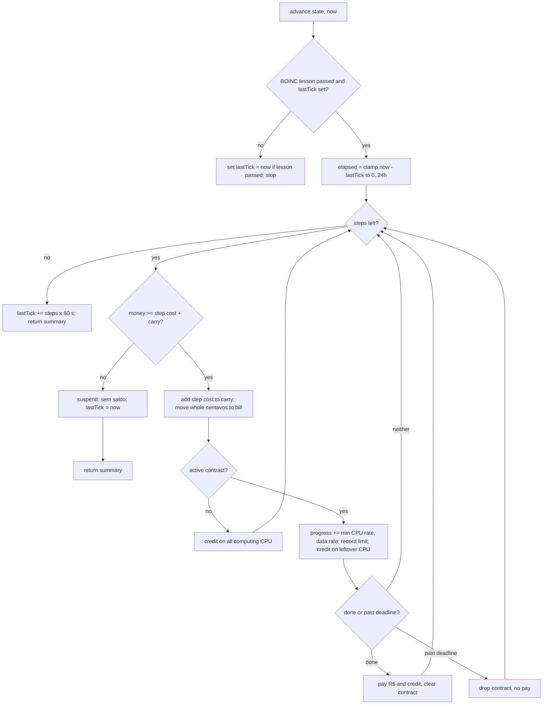
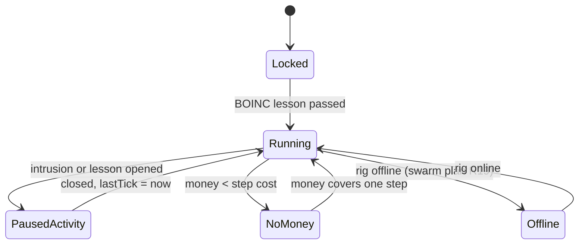
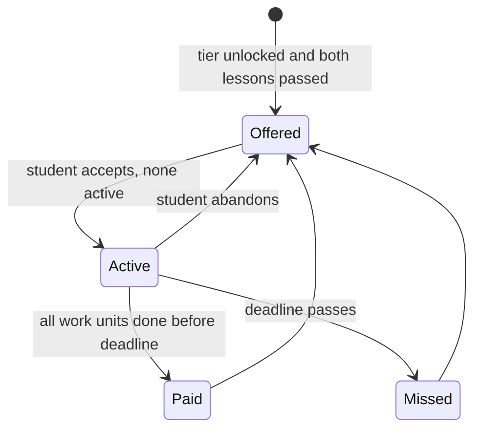

# BOINC Compute Economy - Plan

## Goal Capsule

- **Objective:** Students earn their money by putting their machines to useful distributed work, and learn from play that distributed computing is limited by bandwidth and power, not only CPU.
- **Means:** BOINC-style volunteer computing earns credit. Credit unlocks paid compute contracts and other income. An electricity bill charges for every computing machine. Campaign breach cash is retired. All rules live in one pure module that advances in one-minute steps against a clock passed in by the caller (KTD1, KTD3).
- **Product authority:** the user (project owner) settled the scope in dialogue. This plan covers the income economy from ideation idea 2, reshaped from crypto mining to BOINC volunteer computing. The swarm model, generated cities, the side-job board and the cyber range framing belong to their own plans and are not active scope here, except where this plan changes their income. The Product Contract wins on behavior; the Planning Contract wins on mechanism within it.
- **Product Contract preservation:** Product Contract unchanged. The questions it deferred to planning are now answered in KTD4-KTD10; only the exact R$ values stay with U9's balance pass.
- **Execution profile:** the pure rules in `src/core` and the content in `src/data` are built test-first (U1-U6, U9), with tests that pass in a fake clock. The scenes come next (U7, U8) and are checked with typecheck, a build and a manual playthrough.
- **Stop conditions:** do not start until the swarm and NOC capacity plan (its U1-U5) and the cyber range plan (its U1, U2) have landed. Stop and ask if the swarm landed without node builds that carry watt draw, without a usable swarm CPU, or without a swarm bandwidth function. In U5, wire side-job pay and city pay only when the reteach plan (U4) and the cities plan (U4) have landed. Otherwise leave the multiplier exported and untouched, and record that in the PR.
- **Who finishes:** `ce-work` (or a human) implements U1-U9 in order on one branch.
- **Open blockers:** none for planning. Implementation is gated by the stop conditions above.

---

## Product Contract

### Summary

Connected nodes and the student's rig run volunteer computing in real time, including up to 24 hours offline, and earn credit. Credit is reputation, not money. Credit tiers unlock paid compute contracts first, then better side-job tiers, better-paid city contracts and sponsor discounts on parts. Every computing machine adds its watts to an electricity bill in R$ with ANEEL tariff flags. Each lab node must consent before it computes. Two required lessons gate computing and contracts, and all prices move to realistic Brazilian R$.

### Problem Frame

Today a breach pays a node's reward once and 20% on every replay (`src/core/state.ts:186`). After that, the node means nothing. Income is a list of one-time payouts, so the game teaches that machines are worth money, when it could teach how networks of machines do useful work.

The swarm plan (`docs/plans/2026-10-03-0339-feat-swarm-noc-capacity-plan.md`) makes held nodes real machines whose CPU, RAM and storage add to the student's totals, with swarm bandwidth limiting usable power. It left income and "how mining shares CPU" to this work. The ideation proposed crypto mining. The project owner chose BOINC instead: volunteer computing links distributed work to reward through real research projects (SETI@home, Rosetta@home, World Community Grid), and it has owner consent built in. Real BOINC pays credit, not money, and the real payout bridges (Gridcoin) are crypto again, so the game needs its own honest rule for turning contribution into R$.

The players are students of the Técnico em Informática para Internet integrado ao ensino médio (IFRS Campus Veranópolis), about 14-15 years old. Watts and power supplies are 1st-year content the Workbench already teaches (`src/core/hardware.ts:72`). Bandwidth and links are 2nd-year content.

### Key Decisions

- **BOINC volunteer computing replaces crypto mining.** Volunteer computing teaches the same distributed-computing ideas with consent built in and no cryptojacking normalization. Governs R1-R5. (session-settled: user-directed — chosen over crypto-exchange-centered mining: BOINC links distributed computing to rewards for contributing)
- **Credit is reputation; it unlocks paid work.** This is honest to how BOINC credit works. Governs R5, R11, R16-R18. (session-settled: user-approved — chosen over a research stipend, pay per work unit, and credit with no money at all)
- **Computing runs in real time, also offline, capped at 24 hours.** Governs R1, R2. (session-settled: user-directed — chosen over a clock driven by player actions, which the agent recommended, real time only while playing, and played validation rounds; the 24 h cap was chosen over 8 h and no cap)
- **Computing suspends during intrusions and lessons.** This mirrors BOINC's "suspend while computer is in use". Governs R3. (session-settled: user-directed — chosen over a player-set CPU %, which the agent recommended, idle cycles at no cost, and computing on nodes only)
- **Contributing costs electricity.** Without a cost, suspension during intrusions makes computing free. Governs R8-R10. (session-settled: user-approved — chosen over no cost, hardware wear, and lower requirement totals)
- **The student pays power for every computing machine, lab nodes included.** Weak, power-hungry nodes can cost more than they earn, which teaches efficiency. Governs R8. (session-settled: user-approved — chosen over billing only the student's rig and splitting by volunteer vs contract work)
- **No debt: computing auto-suspends at zero.** Governs R4, R10. (session-settled: user-approved — chosen over allowing debt and paying the bill only from earnings)
- **Credit unlocks four income sources; compute contracts lead.** Contracts are the only source where the swarm itself earns. Governs R11-R18. (session-settled: user-directed — the user picked all four offered sources and chose contracts as primary, over side-job tiers, city contracts and sponsor discounts)
- **Contracts vary by data size per work unit.** Some jobs are CPU-bound and others bandwidth-bound, so the student sees which limit stopped them. Governs R12, R14. (session-settled: user-approved — chosen over relying only on the swarm plan's bandwidth cap and over per-node link limits)
- **A starter contract tier opens at 0 credit.** It covers the gap after campaign breach cash ends. Governs R11. (session-settled: user-approved — chosen over relying on lessons and side jobs, and over keeping first-breach cash)
- **Each lab node asks for consent before it computes.** Paid work on machines the student does not own must be authorized, and the cyber range framing makes every node a school lab machine. Governs R6, R7. (session-settled: user-directed — chosen over blanket consent from the lab, which the agent recommended, and over paid work only on owned machines)
- **Consent controls only computing.** A refused node still counts in swarm totals, so the swarm plan stays intact. Governs R6. (session-settled: user-approved — chosen over consent gating all swarm use and over re-asking after trust grows)
- **Two required lessons: BOINC gates computing, energy gates contracts.** Governs R21, R22. (session-settled: user-directed — chosen over one required lesson with optional energy lectures, which the agent recommended, and over one long lesson)
- **Prices are rescaled to realistic R$ here.** The PT-BR plan deferred this to the economy work, and retiring breach cash forces a rebalance anyway. Governs R20. (session-settled: user-approved — chosen over making only new numbers realistic and over deferring)
- **Volunteer work earns credit only; an accepted contract earns R$ and credit and takes priority.** Governs R5, R12, R13.
- **A missed deadline pays nothing and has no other penalty.** The power already paid carries the lesson. Governs R15.
- **The tariff flag follows an in-game monthly cycle, not real ANEEL data.** Governs R9.

### Requirements

**Volunteer computing**

- R1. While the game is open, every computing machine runs volunteer work in real time: the student's rig and each connected node that has consented and is switched on.
- R2. Time away from the game counts as computing time up to 24 hours. A clock that moved backwards counts as zero.
- R3. Computing suspends while an intrusion or a lesson is open, and resumes when it closes.
- R4. Each node has an on/off switch. A switched-off node neither earns nor draws power.
- R5. Volunteer work earns credit. Credit is never spendable; it only unlocks tiers.

**Lab consent**

- R6. When a node connects, its lab answers a consent request. Some nodes refuse. A refused node never runs volunteer work or contracts, and still counts in swarm totals as the swarm plan defines.
- R7. A refusal shows the lab's reason and contrasts authorized computing with unauthorized use of other people's machines.

**Electricity**

- R8. Each computing machine draws watts from its own build. The student pays one bill in R$ per kWh covering all of them.
- R9. A tariff flag (verde, amarela, vermelha) sets the price per kWh and changes on an in-game monthly cycle.
- R10. When money cannot cover the next bill, all computing suspends with an explanation, and money never goes below zero. Computing resumes once the student can pay.

**Compute contracts**

- R11. Credit tiers unlock contract tiers. The starter tier is open at 0 credit once both required lessons are passed.
- R12. A contract asks for N work units by a deadline. Each contract sets the CPU and the data size per work unit, and pays R$ and credit when finished.
- R13. While a contract is accepted, the swarm works on it before volunteer work.
- R14. Contract progress is limited by whichever runs out first, usable swarm CPU or swarm bandwidth, and the game names the limiting resource.
- R15. A contract missed by its deadline pays nothing and has no other penalty.

**Other credit unlocks**

- R16. Credit tiers unlock better-paid tiers on the side-job board.
- R17. Credit tiers raise the pay for generated city breaches.
- R18. Credit tiers bring sponsor discounts on parts.

**Economy**

- R19. Campaign breaches pay no cash, first breach or replay.
- R20. Part prices, lesson rewards, contract pay and the tariff use realistic Brazilian R$ values.

**Teaching**

- R21. A required BOINC lesson gates computing. It covers volunteer computing, work units and their data, validation, credit, and consent, naming cryptojacking and Lei 12.737/2012 as the unauthorized contrast. A required energy lesson gates contracts. It covers watts, kWh, tariff flags and efficiency.
- R22. Both lessons open no later than the first breach, so no student is left without income.
- R23. Every new stat (credit, work units, power draw, bill, tariff flag, limiting resource) has an explanation in the game, like the existing hardware hints.
- R24. All new text is Brazilian Portuguese and follows the PT-BR plan's rules.

### Key Flows

- F1. Earning from a contract
  - **Trigger:** The student has passed both lessons and opens the contract list.
  - **Steps:** The student accepts a starter contract. The swarm works on it in real time, ahead of volunteer work. The bill grows with every computing machine's watts. Progress shows which resource limits it. The contract finishes before its deadline and pays R$ and credit.
  - **Outcome:** Credit rises toward the next tier, which opens better contracts, side jobs, city pay and discounts.
  - **Covered by:** R8, R11-R14

### Acceptance Examples

- AE1. **Covers R6.** Given a connected node whose lab refuses consent, when the student checks the swarm, the node's CPU still counts toward node requirements, and it shows as not computing with the lab's reason.
- AE2. **Covers R10.** Given R$ 3 and a next bill of R$ 5, when the bill comes due, all computing suspends with an explanation and money stays R$ 3.
- AE3. **Covers R2.** Given the student closed the game 30 hours ago with enough money for every bill, when they return, 24 hours of computing and 24 hours of bill are applied.
- AE4. **Covers R2.** Given the device clock moved back 2 hours since the last save, when the student returns, no computing and no bill are applied.
- AE5. **Covers R14.** Given a data-heavy contract and a swarm with spare CPU but full bandwidth, when the student views progress, the game says bandwidth is the limit.
- AE6. **Covers R3.** Given computing is running, when the student opens an intrusion, computing suspends until the intrusion ends.

### Success Criteria

- From game feedback alone, a 2nd-year student can explain why a contract ran slower than its CPU suggested (bandwidth) and why a node cost more than it earned (power).
- A student who has just passed both lessons can afford the next part they need through starter contracts, without waiting on credit.

### Scope Boundaries

- The swarm model itself (ports, node builds, swarm bandwidth) is the swarm plan's scope.
- Real ANEEL tariff data, real BOINC project data and online leaderboards are not included.
- Hardware wear, debt and a player-set CPU percentage are not included.
- Proof-of-work, mining and the reteach plan's proof-of-work difficulty retarget are dropped from the release.
- City breach cash stays as the cities plan defines it; this plan only adds the credit raise (R17).

### Dependencies / Assumptions

- The swarm and NOC capacity plan has landed: nodes have builds with watt draw, and swarm bandwidth exists.
- The cyber range plan's framing holds: every node is a simulated school lab machine.
- Parts already carry a watt `draw` and builds sum it (`src/core/hardware.ts:72`), so power per machine needs no new hardware data for parts.
- Saves have no timestamp today (`src/core/state.ts:7`); real-time computing needs one.

### Outstanding Questions

**Deferred to Implementation**

- Final R$ values for parts, lessons, contracts and the starting money, tuned in U9 against the balance tests listed there.
- Final credit thresholds per tier and contract sizes, tuned in U9 from the starting values in KTD9 and KTD10.

### Sources / Research

- BOINC credit: a cobblestone is 1/200 of a day of CPU time on a 1 GFLOPS reference machine, so 1 GFLOPS running all day earns 200 credits ([BOINC Credit System](https://en.wikipedia.org/wiki/BOINC_Credit_System)). Shapes KTD4.
- ANEEL 2026 tariff flag surcharges: amarela +R$ 1,88, vermelha patamar 1 +R$ 4,46 and vermelha patamar 2 +R$ 7,87 per 100 kWh ([Bem Paraná, Aug 2026](https://www.bemparana.com.br/noticias/economia/conta-de-luz-continua-mais-cara-em-agosto-com-bandeira-amarela-veja-o-valor-da-cobranca-extra/)). Shapes KTD6.
- RGE (RS) residential tariffs rose 14,11% in 2025 and 3,13% in July 2026 ([Cenário Energia](https://cenarioenergia.com.br/2025/06/17/aneel-aprova-reajuste-nas-tarifas-da-rge-consumidores-residenciais-terao-aumento-de-1411/)). No exact R$/kWh with taxes was found, so the base price in KTD6 is an assumption.
- Code: `breach()` and `REPLAY_RATIO` in `src/core/state.ts`; part watt `draw` and `powerDraw` in `src/core/hardware.ts` and `src/data/parts.ts`; `createRng` in `src/core/random.ts`; `money()` in `src/core/fmt.ts`; the save merge in `src/core/store.ts`; `breach`/`earn` on success in `src/scenes/MinigameScene.ts`.

---

## Planning Contract

### Key Technical Decisions

- KTD1. **All economy rules live in a new pure module `src/core/compute.ts`, with the clock passed in.** Every function takes the current time in milliseconds as an argument and never reads `Date.now()`. Tests can then replay hours in a fake clock, and every acceptance example is unit-testable without Phaser. Governs R1-R15, R19.
- KTD2. **One new `GameState.compute` field with defaults in `newGame()`, and no save version bump.** It holds the last tick time, credit, total computing hours, the unbilled carry (KTD7), each node's on/off switch and consent answer, the active contract, the suspend reason and the pending away-summary. The swarm plan's KTD3 uses the same shallow-merge default path in `src/core/store.ts`. The last tick stays empty until the BOINC lesson is passed, so no time accrues before computing is unlocked. Governs R1, R2, R4, R6.
- KTD3. **Elapsed time is replayed in one-minute steps.** Elapsed time is `now − lastTick`, clamped to 0..24 h; a negative value counts as zero and resets the last tick to now. Each step:
  1. Pays the bill for that minute.
  2. Adds credit.
  3. Advances the active contract.
  4. Checks the deadline.

  After a normal replay the last tick moves forward by whole steps × 60 000 ms, so the sub-minute remainder carries into the next advance and 5-second ticks add up to real minutes. The last tick jumps to now only when elapsed was negative, when it was clamped at 24 h, or when stepping stopped for "sem saldo". Stepping makes the auto-suspend happen at the exact minute money runs out, and a 24 h replay is 1440 steps, which is cheap. Governs R1, R2, R10, R15.
- KTD4. **Credit uses BOINC's cobblestone rule, with CPU power as GFLOPS.** One step earns `200 × volunteer CPU / 1440` credit. Volunteer CPU is computing CPU minus what the active contract uses that step (KTD9), so a CPU-bound contract leaves no volunteer credit and a data-bound one leaves spare CPU earning credit (R13). Computing CPU is the own rig's `cpuPower` plus the smaller of two values: the raw CPU of computing nodes, and the usable swarm CPU from the swarm module. A refused, unasked or switched-off node adds nothing to computing CPU, but still counts in swarm totals. Governs R5, R6.
- KTD5. **A machine's power is its own build's `powerDraw`.** For the own rig that is `specsOf(state).powerDraw`. For a node, it is the same `computeSpecs` on its swarm-plan build. Routers and switches draw nothing, as the catalog already says. A machine pays full draw while it computes; idle draw is not modeled. Governs R8.
- KTD6. **Tariff: an R$ 0,95/kWh base plus ANEEL's real 2026 flag surcharges.** The surcharges per kWh are verde 0, amarela 0,0188, vermelha patamar 1 0,0446 and vermelha patamar 2 0,0787. Both vermelha levels display as "vermelha" with their patamar. An in-game month is 4 hours of total computing time. Each month's flag comes from `createRng` seeded with the month index, weighted 50/25/15/10, so the sequence is fixed and testable. Governs R9.
- KTD7. **Money stays at two decimals; the bill carries its unbilled fraction.** A one-minute step usually costs less than a centavo (a 300 W rig costs about R$ 0,00475), so rounding each step would bill nothing. Each step's full-precision cost goes into an unbilled carry stored in `compute`, and whole centavos move from money to the bill as the carry reaches them. Display goes through `money()`. If money is below the step's cost plus the carry, the suspend reason becomes "sem saldo" and stepping stops. The next advance resumes automatically once money covers one step. Governs R10.
- KTD8. **Consent answers are authored on `NetNode`.** Each campaign node carries a consent answer and a PT-BR reason. The public DNS resolver and the mail server refuse, as simulated production services. The student asks from the NOC tab, and the answer is stored in `compute`. City nodes never join the swarm (cities plan KTD12), so they need no answer. Governs R6, R7.
- KTD9. **Contracts come from a static catalog in `src/data/contracts.ts`; one is active at a time.** Each entry has a tier, a work-unit count, GFLOP per work unit, MB per work unit, a deadline in hours and pay. Per step, the work-unit rate is the smaller of two limits:
  - CPU: computing CPU × 60 ÷ GFLOP per work unit.
  - Data: data bandwidth × 60 ÷ 8 ÷ MB per work unit.

  Data bandwidth is the own `linkMbps` plus the smaller of two values: swarm bandwidth, and the sum of the NIC links of computing nodes. This mirrors KTD4, so a refused or switched-off node never speeds up a contract (R6). The smaller term is reported as the limiting resource, and the contract uses CPU equal to its work-unit rate × GFLOP per work unit ÷ 60. A deadline is wall-clock time from acceptance. Each step compares its simulated time to the deadline, and after a replay a contract still unfinished past its deadline is missed. Time spent paused, suspended or beyond the 24 h cap therefore still uses up the deadline. Contracts can be repeated, and there are 2-3 entries per tier, some CPU-bound and some data-bound. Governs R11-R15.
- KTD10. **Five credit tiers with percentage unlocks.** Starting thresholds are 0, 5 000, 25 000, 100 000 and 400 000 credit, named Iniciante, Colaborador, Pesquisador, Cientista and Laboratório parceiro. Each tier above the first adds +10% to side-job pay and city breach pay. From Pesquisador up, each tier adds a 5% part discount, up to a 15% maximum. U9 tunes these values. Governs R11, R16-R18.
- KTD11. **`breach()` keeps its signature and returns 0 for campaign nodes.** `REPLAY_RATIO` stays exported because the cities plan pays city re-breaches with it. The Minigame success text stops showing cash for node breaches. Governs R19.
- KTD12. **Two new lessons with early prerequisites.** The `boinc` lesson goes in Field Knowledge and requires `network-basics`. The `energia` lesson goes in Hardware and requires `power`. The first breach needs `ip-addressing`, which already needs `network-basics` and therefore `power`, so both lessons are open before the first breach. Computing checks `boinc`; contracts check both lessons. Governs R21, R22.
- KTD13. **A shared ticker advances the economy in every scene except Minigame and Lesson.** Each such scene starts a 5-second Phaser timer that advances to now and saves. On create, Minigame and Lesson settle to now; on leave, they move the last tick to now, so time spent inside does not count (R3). A tab closed mid-intrusion leaves the last tick from before the intrusion, and those minutes count as offline time; this small leak was accepted at synthesis. Governs R1-R3.
- KTD14. **The away summary is computed once on load and shown in the Hub.** A replay longer than 5 minutes stores credit gained, bill paid, contract events and any suspension, and the Hub shows it once, then clears it. Governs R2, R10, R15.
- KTD15. **A new BOINC screen opens from the Hub; per-node controls live in the NOC tab.** The BOINC screen shows credit, tier, credit per hour, power in W, cost per hour, tariff flag, the contract list and the active contract's progress with its limiting resource. The NOC tab (swarm plan KTD11) gains per-node on/off, "Pedir autorização" and consent status. Governs R4, R6, R14, R23.

### High-Level Technical Design

One advance replays elapsed time minute by minute:

Computing status for the whole swarm:

Contract lifecycle:

### Assumptions

- R$ 0,95/kWh approximates an RS residential tariff with taxes in 2026. No exact published value was found.
- Treating CPU power (cores × GHz) as GFLOPS is a teaching simplification, and the BOINC lesson says so.
- Abandoning a contract was not discussed. It is allowed with no pay, the same as a miss, so a student is never stuck with a contract they cannot finish.

### Sequencing

U1-U3 build the computing core: clock and credit, then the bill, then consent. U4 adds contracts, U5 retires breach cash and adds tier effects, and U6 adds the lessons and gates. U7 and U8 wire the scenes, and U9 tunes values once everything is visible. U5 and U6 can proceed in parallel after U4.

---

## Implementation Units

### U1. Compute state, clock and credit

- **Goal:** Advance volunteer computing in one-minute steps and earn credit.
- **Requirements:** R1, R2, R4, R5; KTD1-KTD4.
- **Dependencies:** none (needs the swarm plan's module per the stop conditions).
- **Files:** `src/core/compute.ts` (new), `src/core/state.ts`, `tests/compute.test.ts` (new).
- **Approach:**
  1. Add the `compute` field and its defaults to `GameState`/`newGame()` (KTD2).
  2. List the computing machines: the own rig while online, plus connected nodes that are switched on and have consent granted.
  3. Compute computing CPU (KTD4) and the advance loop (KTD3), with billing and contracts stubbed as no-ops until U2 and U4.
  4. Add the per-node on/off mutator, returning PT-BR messages like `install`.
- **Execution note:** Implement test-first with a fake clock.
- **Patterns to follow:** pure functions and `round1` in `src/core/hardware.ts`; message-returning mutators in `src/core/state.ts`; swarm test helpers in `tests/core.test.ts`.
- **Test scenarios:**
  - A rig with 12,8 CPU power running 24 h earns 2560 credit.
  - Twelve 5-second advances add exactly one step of credit, and 59 seconds of advances add none yet.
  - Covers AE3. 30 hours away applies exactly 24 hours.
  - Covers AE4. A clock 2 hours behind the last tick applies nothing and resets the last tick.
  - Before the BOINC lesson, advancing changes nothing and leaves the last tick empty.
  - A switched-off node adds no CPU; switching it on adds its CPU on the next step.
  - Usable swarm CPU caps node CPU when raw node CPU is higher.
  - With the own rig offline, nothing computes.
  - Covers AE6. Settling at an intrusion's start, then moving the last tick to its end, adds no credit for the intrusion's minutes.
  - An old save without `compute` loads with defaults through the `newGame()` merge.
- **Verification:** credit math tests pass, and existing core tests are unchanged.

### U2. Electricity bill and tariff flags

- **Goal:** Charge every computing machine's power per step and suspend at zero.
- **Requirements:** R8-R10; KTD5-KTD7.
- **Dependencies:** U1.
- **Files:** `src/data/energy.ts` (new), `src/core/compute.ts`, `tests/compute.test.ts`.
- **Approach:**
  1. Put the base price, flag surcharges, flag weights and month length in `src/data/energy.ts`.
  2. Add a flag-for-month function seeded per KTD6, plus watts and cost per step.
  3. Charge and suspend inside the step loop per KTD7.
- **Patterns to follow:** `createRng` in `src/core/random.ts`; `money()` in `src/core/fmt.ts`.
- **Test scenarios:**
  - A 300 W rig under verde for 1 hour costs R$ 0,285 (0,3 kWh × 0,95): money drops by R$ 0,28 and the carry holds R$ 0,005.
  - A 100 W rig for 10 minutes moves no centavo from money but grows the carry; billing resumes from that carry on the next advance.
  - The same hour under vermelha patamar 2 costs more by exactly 0,3 × 0,0787, counting money moved plus carry.
  - The flag for a month index is the same on every call, and the flag changes after 4 computing hours.
  - Covers AE2. With R$ 3 and a step cost above R$ 3, nothing is charged, computing suspends with "sem saldo" and money stays R$ 3.
  - Money crossing zero mid-replay stops at the last affordable minute, and money is never negative.
  - After earning, the next advance resumes and clears the suspend reason.
  - A switched-off node's watts are not billed.
- **Verification:** billing tests pass, and every bill amount has at most two decimals.

### U3. Lab consent

- **Goal:** Let the student ask each node's lab for consent and honor refusals.
- **Requirements:** R6, R7; KTD8.
- **Dependencies:** U1.
- **Files:** `src/data/nodes.ts`, `src/core/compute.ts`, `tests/compute.test.ts`, `tests/core.test.ts`.
- **Approach:**
  1. Add a consent answer and PT-BR reason to each campaign node; `resolver` and `mail` refuse.
  2. Add an ask-consent mutator for connected nodes that records the answer and returns the reason.
  3. Make the reason text contrast authorized volunteer computing with cryptojacking and Lei 12.737/2012 (R7).
- **Patterns to follow:** content-integrity tests in `tests/core.test.ts`.
- **Test scenarios:**
  - Covers AE1. A refused node adds its CPU to total specs for node requirements and adds nothing to computing CPU.
  - Asking before the node is connected returns a message and changes nothing.
  - Asking twice keeps the first answer.
  - Every non-home campaign node has a consent answer and a non-empty reason.
- **Verification:** consent tests pass, and swarm totals tests are unchanged.

### U4. Compute contracts

- **Goal:** Offer, run, pay and expire contracts limited by CPU or data.
- **Requirements:** R11-R15; KTD9.
- **Dependencies:** U2.
- **Files:** `src/data/contracts.ts` (new), `src/core/compute.ts`, `tests/compute.test.ts`.
- **Approach:**
  1. Write the catalog: per tier, 2-3 PT-BR-named research projects, at least one CPU-bound and one data-bound.
  2. Add offered contracts (by tier and lessons), plus accept and abandon mutators.
  3. In the step loop, advance progress, record the limiting resource, and pay or drop per KTD9 and R15.
- **Test scenarios:**
  - With both lessons and 0 credit, the starter-tier contracts are offered; without the `energia` lesson, none are.
  - Accepting while another contract is active is refused with a message.
  - Covers AE5. Spare CPU and too little bandwidth give data as the limit, and progress follows the data rate.
  - A CPU-bound contract on a fast link reports CPU as the limit.
  - Finishing before the deadline pays R$ and credit once and clears the active contract.
  - Passing the deadline drops the contract with no pay and leaves money unchanged except for the bill.
  - Abandoning pays nothing and frees the slot.
  - A data-bound contract still earns volunteer credit on its spare CPU; a CPU-bound contract leaves no volunteer credit.
  - Connecting a refused or switched-off node does not raise a data-bound contract's rate.
  - A contract whose deadline passes while the student was away more than 24 h is missed, even though only 24 h were stepped.
  - Every catalog entry has a positive count, size, deadline and pay, and its tier exists.
- **Verification:** contract tests pass.

### U5. Retire breach cash and add credit-tier effects

- **Goal:** Stop campaign breach pay, and apply tier bonuses and discounts.
- **Requirements:** R16-R19; KTD10, KTD11.
- **Dependencies:** U4.
- **Files:** `src/core/state.ts`, `src/core/compute.ts`, `src/scenes/MinigameScene.ts`, `tests/core.test.ts`, `tests/compute.test.ts`.
- **Approach:**
  1. `breach()` returns 0 for campaign nodes and still records first breaches; the success text drops the cash line for nodes.
  2. Export a credit-tier function, a pay multiplier and a part discount.
  3. Apply the discount in `canBuy`/`buy` and the Shop price text.
  4. Apply the multiplier to side-job pay and city breach pay only if those plans have landed (stop conditions).
- **Test scenarios:**
  - A first breach and a replay both pay 0, and the node is recorded once.
  - Credit 4 999 is Iniciante and 5 000 is Colaborador.
  - Under Pesquisador, a part listed at R$ 1 000 costs R$ 950; the discount never exceeds 15%.
  - The pay multiplier at Colaborador is 1,1.
  - `REPLAY_RATIO` is still exported.
- **Verification:** the updated breach tests pass. Tests that asserted breach cash are changed on purpose and named in the PR.

### U6. BOINC and energy lessons and gates

- **Goal:** Add the two required lessons and gate computing and contracts on them.
- **Requirements:** R21-R24; KTD12.
- **Dependencies:** U4.
- **Files:** `src/data/lessons.ts`, `src/data/computeHints.ts` (new), `src/core/compute.ts`, `tests/core.test.ts`.
- **Approach:**
  1. Write `boinc` in PT-BR: volunteer computing, work units and their data size, validation by comparing results, credit, and consent versus cryptojacking (Lei 12.737/2012). Include a quiz.
  2. Write `energia`: W, kWh, tariff flags, efficiency, and why a weak node can cost more than it earns. Include a quiz.
  3. Write explanations for credit, work units, power draw, the bill, the tariff flag and the limiting resource (R23), in the plain style of the existing hardware hints.
- **Patterns to follow:** `Lesson` entries and the lesson-graph tests in `tests/core.test.ts`; `MISSING_HINT` in `src/core/hardware.ts`.
- **Test scenarios:**
  - Both lessons are open in any state that can breach the ISP Edge Router.
  - Every lesson `requires` id exists, and the quiz answers are in range.
  - Every new stat has a non-empty explanation.
- **Verification:** the lesson-integrity tests pass.

### U7. Ticker, pause and away summary

- **Goal:** Run the economy in real time across scenes, pause it during activities, and report time away.
- **Requirements:** R1-R3, R10, R15; KTD13, KTD14.
- **Dependencies:** U4.
- **Files:** `src/ui/computeTicker.ts` (new), `src/scenes/HubScene.ts`, `src/scenes/MinigameScene.ts`, `src/scenes/LessonScene.ts`, `src/scenes/TitleScene.ts`, and the other scenes' `create`.
- **Approach:**
  1. Write a ticker helper that a scene starts in `create` to advance and save every 5 s.
  2. Minigame and Lesson settle on create and move the last tick on leave.
  3. Advance once at Title continue, store the summary, and show it once in the Hub.
- **Test expectation:** none in unit tests, because scenes are not unit-tested in this repo. The pause and resume rules live in U1's pure functions.
- **Verification:** in a manual run, credit rises on the Hub, freezes during an intrusion, and shows a summary after reloading with the clock moved forward.

### U8. BOINC screen, NOC controls and Hub readout

- **Goal:** Give the student the screens to watch, steer and understand computing.
- **Requirements:** R4, R6, R7, R11-R14, R23, R24; KTD15.
- **Dependencies:** U7.
- **Files:** `src/scenes/BoincScene.ts` (new), `src/main.ts`, `src/scenes/HubScene.ts`, `src/scenes/WorkbenchScene.ts`, `src/scenes/ShopScene.ts`, `src/scenes/StudyScene.ts`.
- **Approach:**
  1. Build the BOINC scene per KTD15, with contract accept and abandon buttons and hints from `src/data/computeHints.ts`.
  2. Add the NOC tab controls per node.
  3. Add a Hub menu entry and one monitor line (credit/h, W, R$/h, flag).
  4. Show the discounted price in the Shop.
  5. Shrink Study card rows to an 80 px pitch with 72 px cards, so a seventh Hardware lesson (`energia`) ends at y=662, above the objective bar at y=680.
- **States each screen must show:** every state gets a PT-BR line and a hint, and only its valid controls are enabled.
  - BOINC screen: locked before `boinc` (names the lesson); contracts locked before `energia`; no contract active; contract active with its limiting resource; contract just paid or missed; paused by intrusion or lesson; suspended "sem saldo"; rig offline.
  - NOC tab, per node: not connected; consent not asked ("Pedir autorização"); refused, with the lab's reason still readable and the on/off switch disabled; granted and on; granted and off. The consent answer is instant.
  - Hub monitor line: shows the suspend reason in place of credit/h whenever computing is not running.
  - Away summary (KTD14): a dismissible Hub panel listing credit gained, R$ billed, contracts paid or missed, and any suspension with its explanation.
- **Test expectation:** none in unit tests, because these are scenes. Their data comes from tested U1-U6 functions.
- **Verification:** in a manual run, each state above appears with its explanation, the limiting resource is named, labels fit their buttons, and the last Hardware card clears the objective bar.

### U9. Realistic R$ rescale and balance

- **Goal:** Move all money to realistic Brazilian values and pin the economy's outcomes.
- **Requirements:** R20, Success Criteria; KTD6, KTD9, KTD10.
- **Dependencies:** U5, U6.
- **Files:** `src/data/parts.ts`, `src/data/lessons.ts`, `src/data/contracts.ts`, `src/core/state.ts`, `tests/balance.test.ts` (new).
- **Approach:**
  1. Set part prices from typical 2026 Brazilian retail.
  2. Scale lesson rewards and `STARTING_MONEY` so the first booting build stays affordable.
  3. Tune contract pay, deadlines and tier thresholds against the tests below.
- **Test scenarios:**
  - A new game can afford the cheapest booting build plus a NIC and a router from starting money and lesson rewards alone.
  - A mid-game rig plus one connected node finishes a starter contract within its deadline, and the pay exceeds the bill for that time.
  - A starter contract's pay buys the next CPU tier within about one 50-minute class of play.
  - A weak node with high draw on a CPU-bound contract costs more per hour than its share of the pay.
  - Reaching Colaborador takes more than one class and less than a week of normal play.
- **Verification:** the balance tests pass and are named in the PR as the pinned values.

---

## Verification Contract

| Check | Command | Applies to |
| --- | --- | --- |
| Unit, content and balance tests | `npm test` | U1-U6, U9 |
| Type check | `npm run typecheck` | all units |
| Production build | `npm run build` | all units |
| Manual run | `npm run dev`, then the U7 and U8 verification steps | U7, U8 |

Tests import only `src/core` and `src/data`. Never import `src/core/store.ts` in tests, because it reads localStorage on import.

---

## Definition of Done

- Every requirement and acceptance example in the Product Contract is covered by a passing test or by a manual-run check named in its unit.
- R16 (better-paid side jobs) and R17 (better-paid city breaches) count as covered by the pay-multiplier tests when the reteach or cities plan has not landed. The PR names which of the two stay unwired.
- `npm test`, `npm run typecheck` and `npm run build` all pass.
- Existing tests pass unchanged, except breach-cash and price assertions changed on purpose (U5, U9).
- All new player-facing text is Brazilian Portuguese and uses `src/core/fmt.ts` for money and numbers.
- No abandoned-attempt code, unused exports or debug output remains in the diff.

---

<!-- ce-section: work-relationships -->
## How This Work Fits Together

This plan covers the income economy. The breakdown below is the current understanding, not a committed roadmap.

- Swarm and NOC capacity (`docs/plans/2026-10-03-0339-feat-swarm-noc-capacity-plan.md`)
  - Enables this plan: node builds, swarm totals and swarm bandwidth.
- Cyber range framing (`docs/plans/2026-10-03-0424-feat-cyber-range-ethics-plan.md`)
  - Shares the lesson-gating rule. This plan replaces that plan's expected proof-of-work lecture with the BOINC and energy lessons.
- PT-BR style system (`docs/plans/2026-10-03-0358-feat-ptbr-style-system-plan.md`)
  - Shares the writing rules; this plan carries out the R$ rescale it deferred.
- Reteach and side-job board (`docs/plans/2026-10-03-1446-feat-reteach-side-jobs-plan.md`)
  - Shares the side-job board, which R16 extends with credit tiers. That plan's proof-of-work retarget is dropped.
  - If it lands after this plan, its board pay must call this plan's pay multiplier (U5).
- Seeded IP-plan cities (`docs/plans/2026-10-03-1513-feat-seeded-ip-plan-cities-plan.md`)
  - Shares city breach pay, which R17 raises by credit tier.
  - If it lands after this plan, its city breach reward must call this plan's pay multiplier (U5).
