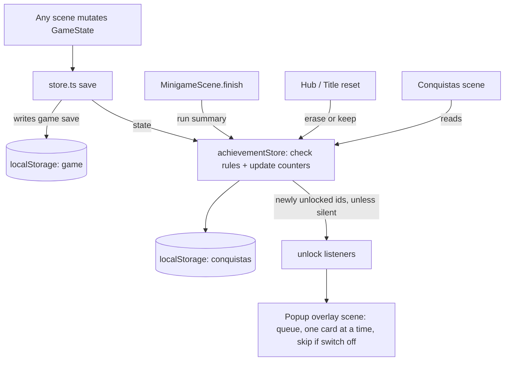

# Steam-Style Achievements - Plan

## Goal Capsule

- **Objective:** Students who like collecting achievements can chase a Steam-style list of conquistas, and students who don't care play exactly the same game as today.
- **Product authority:** This Product Contract. Campaign, formatura, certificates and pós-graduação stay as they are and remain the main drive of the game.
- **Means:** a second, independent achievement store checked after every game save, plus an overlay scene for pop-ups (KTD1, KTD3).
- **Open blockers:** None.
- **Stop conditions:** Stop and ask if any unit would need to change campaign, formatura, certificate or economy behavior, or add a reward to an achievement.
- **Execution profile:** `ce-work` implements U1-U5 in order on a feature branch, then merges into `main` locally and pushes `origin main` (no PR), after the user approves.

---

## Product Contract

### Summary

A "Conquistas" screen, reached from the Hub once the first achievement unlocks, lists the unlocked achievements and the ones the student is close to, each with an icon, a name and a short description, plus overall progress over all about 30. Unlocks show a small corner pop-up that the student can switch off. Achievements are stored apart from the game save. A reset asks whether to erase them too, and existing saves unlock what they already prove.

### Problem Frame

The teacher asked for achievements in the style that Steam and GOG made popular. Nobody will grade or check them. They are a course requirement about the concept, not a learning metric.

The game already has a main drive: the campaign ends in the formatura, and pós-graduação tiers add certificates after it (`docs/plans/2026-10-03-1608-feat-formatura-pos-graduacao-plan.md`). An achievement system that hands out money or parts, or that pushes itself into the objective bar, would compete with that drive. So the system has to feel like the real thing to students who care, and stay out of the way of everyone else.

### Key Decisions

- **Conquistas follow the game's incremental disclosure.** (session-settled: user-approved — chosen over a Steam-style exception with the button always visible and every locked achievement listed: nothing is drawn before the student can act on it, per `docs/plans/2026-10-09-1903-feat-incremental-disclosure-plan.md` R15.) Governs R1, R2, R7.
- **Achievements give no gameplay reward.** No money, parts, levels or unlocks. That keeps them from changing balance or progression. Governs R3.
- **Unlock pop-up is on by default, with an off switch.** (session-settled: user-directed — chosen over a pop-up with no switch and over silent unlocks: classic feel for those who care, an exit for those who don't.) Governs R9, R10, R11.
- **All four kinds of achievements are in the list: story milestones, skill challenges, long-term counters and secret ones.** (session-settled: user-directed — chosen as the full set from the four kinds offered: matches the Steam mix.) Governs R5, R6, R7.
- **Reset asks whether to erase achievements too.** (session-settled: user-directed — chosen over always keeping them, which the agent recommended, and over always wiping them: lets a student replay to chase missing ones or start completely clean.) Governs R13, R14.
- **Existing saves unlock what they already prove, quietly.** (session-settled: user-approved — chosen over starting everyone from zero: students past the formatura would otherwise be locked out of story achievements.) Governs R15, R16.
- **No global rarity percentages.** The game runs offline with no server, so "4% of players have this" cannot be computed.
- **The PT-BR term is "conquista"**, the word Steam's Brazilian interface uses.

### Requirements

**List and screen**

- R1. The Hub's "Conquistas" button appears when the first achievement unlocks, and is introduced like any other element (`docs/plans/2026-10-09-1903-feat-incremental-disclosure-plan.md` R6-R9). The Hub's bottom button row is rearranged to fit it.
- R2. The Conquistas screen lists the unlocked achievements and the locked ones the student is close to, each with an icon, name, short description and unlocked or locked state, and shows overall progress as unlocked/total over all achievements. Other locked achievements are not listed.
- R3. Unlocking an achievement changes nothing in the game state: no money, items, levels or access.
- R4. The list holds about 30 achievements, each with a stable id, so renaming display text never loses an unlock.

**Kinds**

- R5. Story milestones unlock through normal play (for example first PC built, first time online, formatura, each pós-graduação certificate).
- R6. Skill challenges and long-term counters are optional goals. A counter achievement shows its current progress toward the target on the Conquistas screen (for example "312/500").
- R7. Secret achievements are not listed while locked, and still count toward the total. Once unlocked they show in full.
- R8. No achievement requires an action that costs the student lasting progress (a node, certificate, lesson or level), though an achievement may reward a harmless oddity such as crashing on the last round.

**Unlock notice**

- R9. When an achievement unlocks, a small pop-up in a screen corner shows its icon and name, without blocking input or pausing a mini-game.
- R10. Several unlocks at once show one after another, not stacked over each other.
- R11. A switch on the Conquistas screen turns unlock pop-ups off and on. The choice survives reloads and resets. With pop-ups off, unlocks are still recorded.

**Persistence and reset**

- R12. Achievements and their counters are stored apart from the game save. A missing or unreadable achievement store starts empty and never affects the game save, and the reverse holds too.
- R13. Both ways of wiping the game, the Hub's "Apagar progresso" and the title screen's "Novo jogo", ask a second question when at least one achievement is unlocked: whether to also erase achievements. Answering no keeps every unlock and counter. The pop-up setting is kept either way (per R11).
- R14. After a reset that kept achievements, achievements that are already unlocked do not show their pop-up again when the new run meets them.

**Old saves**

- R15. On the first load after this ships, every achievement the existing game save can prove unlocks without pop-ups.
- R16. Counters with no saved history start at zero on launch day. Counters the save already tracks, such as rounds answered per area, start from the saved value.

**Text**

- R17. All achievement names and descriptions are PT-BR written natively from meaning, follow `src/data/termos.ts`, and use the `src/core/fmt.ts` helpers for numbers, money and plurals.
- R18. Achievement text is covered by the English-word check in `tests/content.test.ts`.

### Acceptance Examples

- AE1. **Covers R9, R11.** **Given** pop-ups are on, **when** a student breaches their first campaign node and earns an achievement, **then** a corner pop-up shows its icon and name while the result screen stays usable. **Given** pop-ups are off, **when** the same happens, **then** no pop-up appears and the Conquistas screen lists it as unlocked.
- AE2. **Covers R7.** **Given** a secret achievement is locked, **when** the student opens Conquistas, **then** it is not listed but counts toward the total. **When** it unlocks, **then** its row shows its real name and description.
- AE3. **Covers R13, R14.** **Given** a student with 12 achievements presses "Apagar progresso" and confirms, **when** asked about achievements they choose to keep them, **then** the new game starts with 13 unlocked: the 12 kept plus the secret "fresh start". Building the first PC again shows no pop-up for the already-unlocked milestone.
- AE4. **Covers R13.** **Given** the same student instead chooses to erase achievements, **then** the new game starts with 0 unlocked and all counters at zero.
- AE5. **Covers R15, R16.** **Given** a save from before this feature, past the formatura with 3 cities finished, **when** the game loads, **then** the formatura and city milestones unlock with no pop-ups. The rounds-answered counter starts from the save's per-area stats, and the cities counter starts at 3.
- AE6. **Covers R6.** **Given** a counter achievement for 500 rounds answered and 312 answered so far, **then** its row shows 312/500 and is locked.

### Scope Boundaries

- No gameplay rewards for achievements (per R3).
- No global or class-wide rarity, leaderboards, or sharing.
- No teacher view, export or grading of achievements.
- Achievements never appear in the objective bar or in `objective()` hints.
- No general settings screen. The pop-up switch lives on the Conquistas screen only.
- No sound for unlocks (the game has no audio).

### Dependencies / Assumptions

- The game has no event bus. Every state change in a scene is followed by `save()` from `src/core/store.ts`, which is the one place every change passes through.
- `src/core/store.ts` keeps the whole game under one localStorage key (`rootkit-academy-save-v1`), and `resetGame()` replaces the whole state. Separate storage (R12) means a second store.
- `src/ui/widgets.ts` has only a bottom-centre `toast()`, which `scene.start` destroys. The corner pop-up (R9) needs a new overlay.
- The Hub's bottom row (`src/scenes/HubScene.ts:96-109`) is exactly full at three buttons, so R1 needs a new layout.
- Both reset paths, Hub "Apagar progresso" (`src/scenes/HubScene.ts:104-109`) and title "Novo jogo" (`src/scenes/TitleScene.ts:28-33`), confirm with `window.confirm` today. "Novo jogo" confirms only when certificates exist.

### Sources / Research

- `docs/plans/2026-10-03-1608-feat-formatura-pos-graduacao-plan.md`: the certificate system that achievements must not compete with.
- Hook points: `breach` and `breachCityNode` (`src/core/state.ts:392`, `:460`), `completeLesson` (`:376`), `buy` (`:321`), `install` (`:345`), `completeJob` (`src/core/jobs.ts:57`), `recordAnswer` (`src/core/stats.ts:17`), and certificate issuing in `src/core/certificates.ts`.
- `docs/solutions/conventions/ptbr-text-native-not-calque.md`: PT-BR text rules for R17.

---

### Outstanding Questions

**Deferred to Planning**

- What counts as "close to" for listing a locked achievement (R2): for example, a counter past half its target, or a milestone whose prerequisite is already met. AE6 assumes a counter at 312/500 is listed.

## Planning Contract

**Product Contract preservation:** R13 changed. It now also covers the title screen's "Novo jogo" reset, and it asks only when at least one achievement is unlocked. The user confirmed this in the plan-time synthesis. AE3 now counts the fresh-start secret that a keep-reset unlocks (13, not 12). AE5 changed: it no longer mentions a money-earned counter, which the plan drops (KTD4). R1, R2, R7 and AE2 changed to follow the incremental disclosure rule (`docs/plans/2026-10-09-1903-feat-incremental-disclosure-plan.md` R15): the button appears with the first unlock, and only unlocked and close achievements are listed. What counts as "close to" is an open question below; AE6 assumes 312/500 qualifies. KTD4, KTD6 and the Appendix list resolve the former Outstanding Questions.

### Key Technical Decisions

- KTD1. **Unlock checks run after every game save.** Every state change is followed by `save()` in `src/core/store.ts`. After writing the game, `save()` hands the state to the achievement store, which checks every state-based condition and returns the newly unlocked ids. This avoids scattering hooks across `state.ts`, `jobs.ts` and the scenes.
- KTD2. **Content, rules and storage live in three separate modules.**
  - `src/data/achievements.ts` holds the content: id, kind, symbol, secret flag, counter target, and the PT-BR name and description.
  - `src/core/achievements.ts` holds the unlock rules, pure and with no Phaser, keyed by id. A test checks that every id has exactly one rule.
  - `src/core/achievementStore.ts` handles storage under its own localStorage key (`rootkit-academy-conquistas-v1`, own `version: 1`), with the same guarded load and save as `store.ts`. `store.ts` imports the achievement store, never the other way round.

  Governs R4, R12.
- KTD3. **The pop-up is an overlay scene.** `scene.start` destroys a scene's objects, and many unlocks happen just before a scene change: the Core breach leads into the formatura, and a mini-game result leads to the map. So the pop-up lives in its own scene, registered last in `src/main.ts`. It is launched once from `TitleScene`, never stopped, and has no interactive objects. Core cannot import Phaser, so the scene subscribes to the achievement store's unlock listener. The store always notifies; the scene skips display while the switch is off. Governs R9, R10, R11.
- KTD4. **Lifetime counters track increases in the game's own numbers.** For each metric, the store keeps the last value it saw in the game and a lifetime total. On each check, an increase adds the difference to the total. A decrease means the game was reset: the store resets only its last-seen value and leaves the total alone. On first load, the total is seeded from the save.
  - The metrics are rounds answered (sum of `state.stats[*].answered`), rounds answered right (sum of `.correct`), `state.runCount`, and finished cities.
  - No counter needs a new hook.
  - Money earned and parts sold are dropped, because money comes in through five different code paths.

  Governs R6, R16.
- KTD5. **Mini-game facts arrive as one run summary.** `MinigameScene.finish()` reports one summary to the achievement store. `finish()` calls `save()` twice, and the failure branch returns after the first, so the report goes right after `commitRun`/`completeJob` and before that first `save()`. The first-breach flag is computed there, before `breach()` changes `state.breached`. The summary carries:
  - area
  - success
  - mistakes
  - allowed mistakes
  - time-outs
  - whether it crashed on the final round
  - the campaign node id, if any
  - whether it was the first breach

  Skill and secret achievements about a single run read only this summary. Governs R5-R8.
- KTD6. **Icons are text symbols in a colored square.** Each achievement names one symbol character from the glyph family the UI already uses (▲ ▼ ◀ ▶ ★ ✓). The square is colored by achievement kind. Unlocked rows carry a ✓ mark, and locked rows are dimmed without it, so the state never depends on color alone. Locked secret achievements are not listed. There are no image assets. Governs R2, R7.
- KTD7. **A missing or unreadable store gets one silent check.** When the achievement key is missing, or unreadable per R12, the store starts empty. It then runs one check against the loaded game with notifications off, which can unlock only what the save proves. Governs R12, R15, R16.
- KTD8. **The reset question uses `window.confirm`, like the existing reset.** It appears only when at least one achievement is unlocked, and OK means "also erase achievements".
  - The prompt text names both outcomes: OK erases the conquistas, Cancelar keeps them, and the game is reset either way. Only the first prompt's Cancel aborts the reset.
  - On "Novo jogo", the existing confirmation appears only when certificates exist. The achievements question still stands on its own whenever an achievement is unlocked.
  - Erasing clears unlocks, totals and last-seen values, and keeps the pop-up switch.
  - Keeping unlocks the secret "fresh-start" achievement after the game reset.

  Governs R13, R14.
- KTD9. **The Conquistas screen is a 2-column grid, 10 per page, with CityList-style paging.**
  - Paging uses `< Anterior` / `n de m` / `Próxima >` buttons.
  - The header area holds the unlocked/total count and the pop-up switch.
  - There are no masks, because WebGL ignores them in Phaser 4 (`src/scenes/CertificateScene.ts:152`).
  - The Hub's bottom area becomes two rows of two 44 px buttons, each 215 px wide with a 10 px gap. The rows sit at y 548 and y 600, between the last menu hint (about y 535) and the footer note at `HEIGHT - 60`. "Trabalhos extras" and "Conquistas" go on top. "Certificados" (conditional) and "Apagar progresso" go below. When "Certificados" is hidden, "Apagar progresso" keeps its right-hand cell.

  Governs R1, R2.

### High-Level Technical Design

The diagram shows how a state change reaches the pop-up. Where it and the KTD prose differ, the prose wins.



Counter tracking per metric (KTD4), as directional pseudo-code:

```
on check(state):
  now = metric(state)
  if firstLoad: total = now; last = now
  else if now > last: total += now - last; last = now
  else if now < last: last = now      # the game was reset
```

### Implementation Constraints

- Core stays free of Phaser. The Popup and Conquistas scenes are the only new UI (layering per CLAUDE.md).
- Storage holds only ids, counter totals, last-seen values and the switch. Display text never goes into storage.
- All player text follows R17 and fits its space through `fitText`. Counter progress is a plain `n/target`, matching the existing `etapa x/y` style.

---

## Implementation Units

### U1. Achievement content and rules

**Goal:** Define the 30 achievements and a pure rule for each.

**Requirements:** R3-R8, R17, R18; KTD2, KTD4, KTD5, KTD6.

**Dependencies:** None.

**Files:**
- Create `src/data/achievements.ts`
- Create `src/core/achievements.ts`
- Modify `src/data/termos.ts`: add "conquista" (feminine), not kept in English
- Modify `tests/content.test.ts`: `runtimeTexts()` pushes every name and description
- Create `tests/achievements.test.ts`

**Approach:**
1. Content entries follow the Appendix list exactly. Write each PT-BR name and description from meaning, per `docs/solutions/conventions/ptbr-text-native-not-calque.md` and `docs/solutions/conventions/ptbr-keep-field-jargon-in-english.md`.
2. A rule takes one of three forms: a predicate on game state, a counter metric with a target, or a predicate on a run summary. One id, "fresh-start", has no rule and is unlocked only by the reset path.
3. Export one function that takes the game state, the counter totals and an optional run summary, and returns the ids whose rule holds. Skipping ids that are already unlocked is U2's job.

**Patterns to follow:**
- `src/data/tiers.ts` together with `src/core/certificates.ts`: content data plus pure rules.
- The state builders in `tests/certificate.test.ts` and `tests/cityState.test.ts`.

**Test scenarios:**
- Integrity: there are 30 entries with unique kebab-case ids. Every id except fresh-start has exactly one rule. Every counter has a positive target, and every kind is represented.
- `newGame()` satisfies no rule.
- An online rig satisfies first-boot and online. It satisfies first-lesson only if a lesson is completed.
- A state with the conclusão certificate presented satisfies formatura. A state where it is issued but not yet presented does not.
- Each tier certificate, once presented, satisfies only its own tier achievement.
- One area at `MAX_LEVEL` satisfies area-max but not all-areas-max. Every area at max satisfies both.
- The priciest part installed in every `CASE_SLOTS` slot satisfies top-rig. Build the test state through `CASE_SLOTS` only, because switches go to the NOC. One slot below its priciest part does not.
- Money of exactly 0 satisfies broke. Money of 1 does not.
- Run summaries:
  - A success with 0 mistakes satisfies flawless.
  - A success with mistakes equal to allowed, where allowed is above 0, satisfies on-the-edge.
  - A failure that crashed on the final round satisfies last-gasp.
  - A failure where every mistake was a time-out satisfies timeout-crash.
  - A first breach of the Core with 0 mistakes satisfies core-flawless.
  - A repeat breach of the Core satisfies core-again.
- A rounds-answered total of 99 does not satisfy rounds-100, and a total of 100 does.
- Every name and description passes the English-word scan in `tests/content.test.ts`.

**Verification:** The new tests and the content test pass, and typecheck is clean.

### U2. Achievement store, counters and the save hook

**Goal:** Persist unlocks, counters and the pop-up switch apart from the game save, and check them after every save.

**Requirements:** R11-R16; KTD1, KTD2, KTD3, KTD4, KTD7, KTD8.

**Dependencies:** U1.

**Files:**
- Create `src/core/achievementStore.ts`
- Modify `src/core/store.ts`: run the check after `save()`, and run the silent check after the first load
- Create `tests/achievementStore.test.ts`

**Approach:**
1. Keep a pure core with three parts:
   - serialize/parse, with `version: 1`
   - a check step that takes the achievement state, the game state, an optional run summary and a silent flag, and returns the new achievement state plus the newly unlocked ids
   - a reset step that either erases or keeps

   The localStorage wrapper stays thin and uses the same `?.` and try/catch guard as `store.ts`.
2. Listeners can subscribe to unlock notifications. There is no unsubscribe, because the one consumer, the pop-up scene, is never stopped. A silent check never notifies, and every other check notifies whatever the switch says (KTD3).
3. Also provide:
   - `recordRun(summary)`, for KTD5
   - an erase-or-keep reset entry point, for KTD8
   - getters for the Conquistas screen: the list with each unlocked flag and progress, the total, and the switch
4. Parsing tells a missing key apart from a present, valid one. A missing key and an unreadable one both lead to the silent check (KTD7).

**Patterns to follow:** The guarded load and save in `src/core/store.ts`. Tests use only the pure functions, because no test in the repo stubs localStorage.

**Test scenarios:**
- Covers AE5. First load of a save that is past the formatura, with 3 finished cities and 120 answered rounds:
  - formatura and first-city unlock
  - no notification fires
  - the rounds total is 120
  - the cities total is 3
- Counter tracking:
  - Last value 10 and a state value of 25 add 15 to the total.
  - A drop to 0 after a reset leaves the total unchanged and sets the last value to 0.
  - A later rise to 5 adds 5.
- An already unlocked id is never returned again (R14).
- Covers AE3. After a reset that keeps achievements, a fresh game meeting first-boot again returns nothing.
- Covers AE4. A reset that erases leaves no unlocks and every total at 0, and the switch keeps its value.
- A reset that keeps achievements unlocks fresh-start, and every other unlock and total stays.
- Parsing:
  - A wrong version or malformed JSON gives an empty state, and the game state is untouched.
  - Unknown ids are dropped.
- With the switch off, unlocks are still recorded and listeners are still notified.
- A listener receives ids in unlock order. Several unlocks in one check arrive as one ordered batch.

**Verification:** The tests pass. Reloading in the browser keeps the unlocks. The game save keeps its key and format.

### U3. Wire run summaries and the reset question

**Goal:** Feed mini-game facts into the store, and ask about achievements on both reset paths.

**Requirements:** R5-R8, R13, R14; KTD5, KTD8.

**Dependencies:** U2.

**Files:**
- Modify `src/scenes/MinigameScene.ts`: count time-outs and record whether the run crashed on its final round, then call `recordRun` in `finish()` before `save()`
- Modify `src/scenes/HubScene.ts`: the reset button
- Modify `src/scenes/TitleScene.ts`: "Novo jogo"

**Approach:**
1. MinigameScene: `resolve()` already knows `timedOut`, `crashed` and `done`, so keep the counts on the scene and build the summary once in `finish()`. Quitting through `leave()` sends no summary.
2. Reset: after the existing confirmation, or on its own when "Novo jogo" shows none, ask the achievements `window.confirm` if any achievement is unlocked. Use the wording KTD8 requires, then call the erase or keep step in the order KTD8 gives.
3. Run summary: placement per KTD5, before the first `save()` in `finish()`, so failed runs are reported too.

**Patterns to follow:** The `window.confirm` reset in `HubScene.ts`, and the "Novo jogo" confirmation in `TitleScene.ts`, which only appears when certificates exist.

**Test scenarios:**
- Test expectation: none. This unit is scene wiring. U2's pure tests cover `recordRun` and the reset steps. U5's browser pass checks the wiring:
  - a node run with no mistakes unlocks flawless
  - both reset paths ask the question only when something is unlocked

**Verification:** The browser pass in U5.

### U4. Pop-up overlay scene

**Goal:** Show a small corner card for each unlock, one after another, across scene changes.

**Requirements:** R9, R10, R11; KTD3, KTD6.

**Dependencies:** U2.

**Files:**
- Create `src/scenes/ConquistaPopupScene.ts`
- Modify `src/main.ts`: register the scene last
- Modify `src/scenes/TitleScene.ts`: launch the scene once

**Approach:**
1. Subscribe to unlock notifications and push the ids into a queue.
2. Show one card at a time in the top-right corner, under the 56 px header. A card holds the symbol square, the achievement's name and a short label meaning "achievement unlocked". Each card stays about 3 seconds, then tweens out before the next one shows.
3. Drop notifications while the switch is off (KTD3).
4. Add no interactive objects. Guard against a second launch when the Title scene restarts.

**Patterns to follow:** The timing and depth of `toast()` in `src/ui/widgets.ts`; `COLORS` and `fitText`.

**Test scenarios:**
- Test expectation: none. This unit is Phaser UI only, and U2 already tests the queue order. The browser pass checks that:
  - two unlocks from one mini-game result show two cards in turn
  - a card stays visible through the change to NetMap or Formatura
  - clicks reach the scene underneath

**Verification:** The browser pass in U5, run once with pop-ups on and once with them off.

### U5. Conquistas screen and Hub entry

**Goal:** Show students the list, their progress and the pop-up switch.

**Requirements:** R1, R2, R6, R7, R11; KTD6, KTD9. Shows AE1, AE2 and AE6 on screen.

**Dependencies:** U2. The full browser pass also needs U3 and U4.

**Files:**
- Create `src/scenes/ConquistasScene.ts`
- Modify `src/main.ts`
- Modify `src/core/disclosure.ts` and `src/data/intros.ts`: add the Conquistas element after Certificados, available once an achievement is unlocked, with its log line, goal and card
- Modify `src/scenes/HubScene.ts`: bottom area as two rows of two buttons
- Modify `docs/solutions/developer-experience/manual-ui-check-phaser-scenes.md`: add the achievement key to the seeding notes

**Approach:**
1. The header shows the title "Conquistas", a back button to the Hub, and the count "n de 30".
2. The grid shows 10 cells per page. Each cell shows the symbol square, name and description, plus `n/target` for counters. Unlocked cells carry ✓ (KTD6). Locked cells are dimmed. Only unlocked and close achievements get a cell (R2), and locked secret ones never do (R7).
3. The switch is a button whose label shows the current state. Its wording is written in this unit under R17.

**Patterns to follow:**
- `src/scenes/CityListScene.ts`: paging
- `Layer` in `src/ui/widgets.ts`: redraw
- `header()`

**Test scenarios:**
- Test expectation: none for the scene itself. The source-literal scan in `tests/content.test.ts` already reads `src/scenes`, so the scene's strings are covered. The browser pass checks:
  - AE1: pop-ups on and off
  - AE2: a secret achievement absent before it unlocks and listed after
  - a new game has no Conquistas button, and the first unlock introduces it with a pulse and a log line
  - AE6: a counter showing 312/500
  - the Hub layout with and without "Certificados"
  - that the top-right pop-up corner does not hide key content in the Minigame, Formatura and CityList scenes
  - `fitText` on the longest name

**Verification:** A browser pass covering every AE with seeded localStorage, per `docs/solutions/developer-experience/manual-ui-check-phaser-scenes.md`. Nothing overlaps at 1280x720.

---

## Verification Contract

| Gate | Command / check | Applies to |
|---|---|---|
| Unit tests | `npm test` | U1, U2 |
| Types | `npm run typecheck` | all |
| Build | `npm run build` | all |
| Content scan | `npx vitest run tests/content.test.ts` | U1, U5 |
| Browser pass | `npm run dev` with seeded saves per `docs/solutions/developer-experience/manual-ui-check-phaser-scenes.md`: AE1-AE6, both reset paths, a pop-up across a scene change | U3-U5 |
| Native PT-BR read | The user reads every achievement name and description, and the screen and pop-up labels | U1, U4, U5 |

## Definition of Done

- U1-U5 are done, and every Verification Contract row has passed.
- Campaign, economy, certificate and objective behavior are unchanged. Existing tests pass unchanged, apart from additions to `tests/content.test.ts`.
- The game save format is unchanged: `version: 1`, same key.
- The user has approved the PT-BR text.
- No experimental code, debug logs or unused exports are left, and `noUnusedLocals` is clean.

---

## Appendix

### Achievement list

Names and descriptions are written in U1.

- Kind: S story, K skill, C counter, X secret.
- Source: state (checked after each save), counter (KTD4), run (KTD5), reset (KTD8).

| id | Kind | Unlocks when | Source |
|---|---|---|---|
| first-boot | S | The installed build boots (`computeSpecs(...).boots`) | state |
| first-lesson | S | At least one lesson is completed | state |
| online | S | `isOnline(state)` | state |
| first-breach | S | A campaign node other than home is in `breached` | state |
| swarm | S | At least one machine is in `state.swarm` | state |
| noc | S | At least one entry is in `state.noc` | state |
| formatura | S | The conclusão certificate is presented | state |
| especializacao | S | The Especialização certificate is presented | state |
| mestrado | S | The Mestrado certificate is presented | state |
| doutorado | S | The Doutorado certificate is presented | state |
| first-city | S | Any city is finished | state |
| all-lessons | K | Every lesson in `LESSONS` is completed | state |
| area-max | K | Any area is at its `MAX_LEVEL` | state |
| all-areas-max | K | Every area is at its `MAX_LEVEL` | state |
| top-rig | K | Every `CASE_SLOTS` slot (switch excluded) holds that slot's priciest part | state |
| flawless | K | A run succeeds with 0 mistakes | run |
| on-the-edge | K | A run succeeds with mistakes equal to allowed, and allowed is above 0 | run |
| core-flawless | K | The Core's first breach has 0 mistakes | run |
| rounds-100 | C | 100 rounds answered | counter |
| rounds-500 | C | 500 rounds answered | counter |
| rounds-1000 | C | 1000 rounds answered | counter |
| correct-250 | C | 250 rounds answered right | counter |
| runs-50 | C | 50 mini-games finished (`runCount`) | counter |
| cities-10 | C | 10 cities finished | counter |
| last-gasp | X | A run crashes on its final round | run |
| timeout-crash | X | A run fails and every mistake was a time-out | run |
| broke | X | Money is exactly 0 | state |
| unplugged | X | The network is configured but the PC no longer boots | state |
| core-again | X | The Core is breached again after the first time | run |
| fresh-start | X | The game is reset with achievements kept | reset |

### Deferred implementation notes

- unplugged is the state predicate `netConfig !== null` and the build does not boot. Removing a part (`uninstall` in `src/core/state.ts`) leaves `netConfig` set.
- A burst of unlocks, such as the Core breach plus the formatura, simply queues. A collapse rule ("e mais N") was considered and not built, since a short queue of 3-second cards harms nothing. Revisit it if a real burst feels long in the browser pass.
- Exact helper and listener names.

### Research sources

- `src/core/store.ts`: guarded load and save, and `resetGame()`.
- `save()` call sites after a mutation: the Shop, Workbench, Lesson, NetSetup, Route, CityList, Formatura, Certificate and Minigame scenes.
- `src/scenes/MinigameScene.ts`: `resolve()` holds `timedOut`, `crashed` and `done`, and `finish()` runs `commitRun`, `completeJob` and `save()`.
- `src/scenes/CityListScene.ts:77-101`: paging pattern.
- `tests/content.test.ts:88-226`: `runtimeTexts()`, and a source-literal scan that reads only `src/scenes` and `src/ui`.
