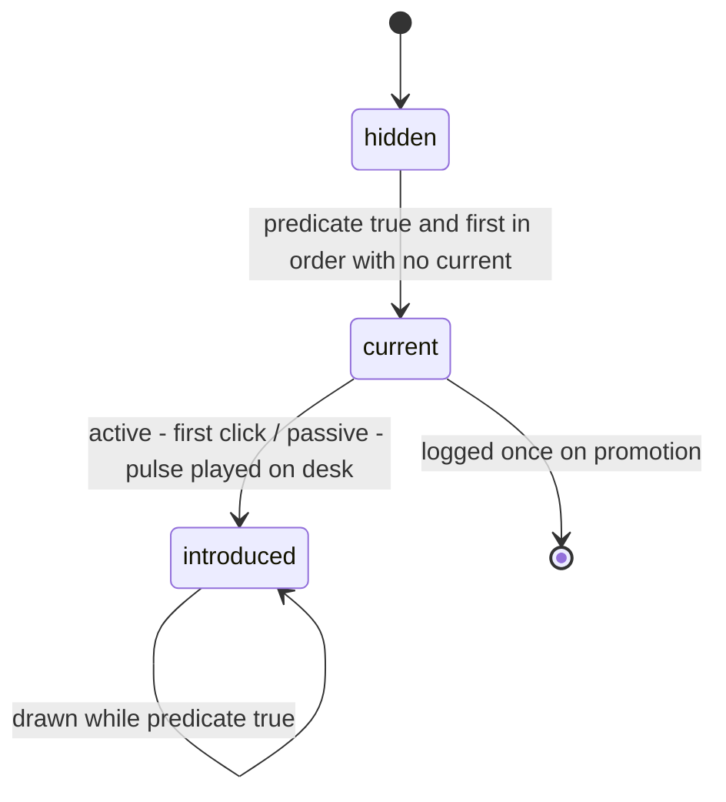
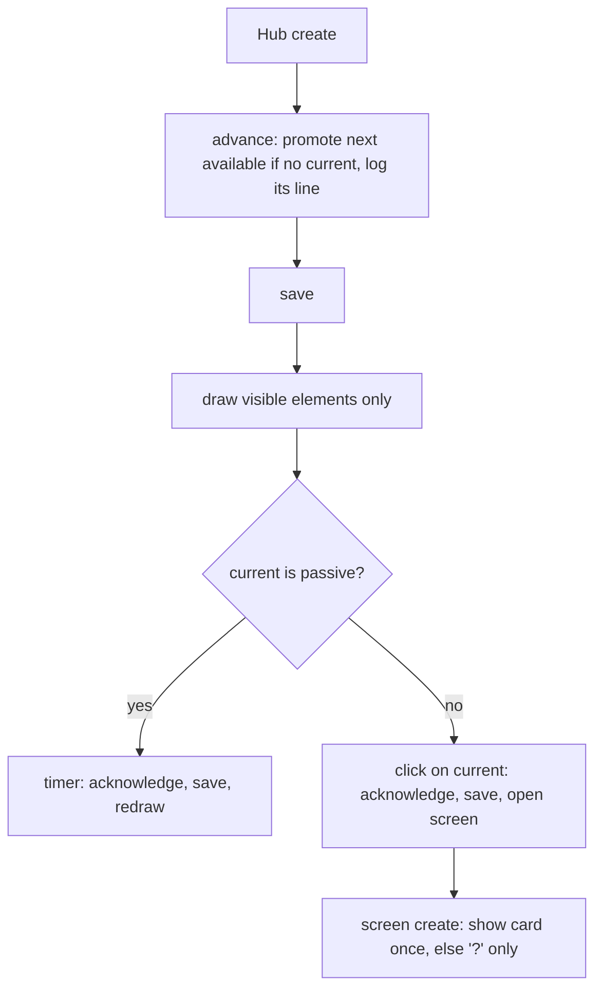

# Incremental Disclosure - Plan

## Goal Capsule

- **Objective:** A student meets the game one piece at a time. Everything on screen is something they can use now and have been shown how to use, so each step feels as simple as the first screen.
- **Means:** a pure core registry decides which interface elements exist and introduces them one at a time; scenes draw only what it allows (KTD1, KTD2).
- **Authority:** Product Contract R-IDs win on behavior; KTDs win on mechanism; units override neither. The project owner (the user) settles product questions and reviews all new PT-BR text.
- **Stop conditions:** stop and ask if a change would alter an existing save's ids, change mini-game rounds pinned by `tests/minigames-context.test.ts`, or require drawing a disabled or placeholder element.
- **Execution profile:** single code change across `src/core`, `src/ui`, `src/scenes`, `src/data` and tests; ships by local merge into `main` and push of `origin main`, no PR.
- **Open blockers:** none. U7 revises the achievements plan (`docs/plans/2026-10-09-1801-feat-steam-achievements-plan.md`) to match R15.

---

## Product Contract

Product Contract preservation note: requirements, flows, acceptance examples and IDs are kept from the brainstorm unchanged. Only these changed: the questions planning resolved now point to their KTDs, R9 covers elements that cannot be opened, and R11 places the log on the desk, as the owner approved.

### Summary

The game opens on a bare desk with one button, and the interface grows from there. Each control, screen, list entry and map machine appears only once the player can use it or it is their next goal. A new element arrives alone: it pulses, gets a line in a message log, and the first time it is opened, a short card explains its controls. A goal line under the log always names the next step.

### Problem Frame

Today a first-time player sees most of the game at once. The Hub draws all six menu items, with Configuração de Rede, Mapa da Rede and Cidades greyed out under hints. Study shows locked lessons with a lock and "Antes, faça". The Shop lists every part, the locked ones with a lock and a disabled button. The Net Map draws unreachable machines as "???".

The owner's concern is the player's sense of control. A screen full of things reserved for a future the player cannot act on yet produces anxiety, not curiosity. Showing many new things at once overwhelms the player. The intended feel comes from incremental games such as A Dark Room and Crank, where each step feels like a new game just opened. In those games a button appears when it is being introduced, so the player learns everything about it and feels confident with it from then on.

The pós-graduação already follows this rule (`docs/plans/2026-10-03-1608-feat-formatura-pos-graduacao-plan.md`, R25-R27). That plan deferred the same pass over the shipped screens to this one.

### Key Decisions

- **One more thing at a time, game-wide.** Nothing is drawn disabled or as a placeholder. Governs R2, R3. (session-settled: user-directed — chosen over keeping locked items visible with hints: each step should feel as simple as the first screen, because it adds one thing to learn.)
- **The game starts on a bare desk with one button.** Governs R1. (session-settled: user-directed — chosen over today's Hub trimmed to available items and over opening straight into the first lesson: closest to the feel of A Dark Room.)
- **A message log plus a goal line replace the hint bar.** Governs R11, R12. (session-settled: user-directed — chosen over a log whose newest line doubles as the goal and over no explicit goal: a player who stalls still sees the next step.)
- **An element is introduced by a pulse, a log line and a card on first open.** Governs R6, R7, R8. (session-settled: user-approved — chosen over a one-line tip next to each control and over the log line alone: the card can explain every control of a new screen at once.)
- **Unlocks queue; they never arrive together.** The game's progression rules decide what is available, and the queue decides the pace. Governs R9. (session-settled: user-approved — chosen over revealing everything the moment its rule turns true, which breaks the principle when several things unlock together, and over a hand-written tutorial sequence, which would duplicate the progression rules and drift from them.)
- **Unreachable Net Map machines are not drawn.** The map grows outward from the player's PC, as the city map already does. Governs R3. (session-settled: user-approved — chosen over keeping the "???" teasers.)
- **An existing save counts as already introduced.** Governs R13. (session-settled: user-approved — chosen over showing each screen's card on its next open after the update: students mid-game would otherwise hit a string of interruptions.)
- **Achievements follow the same rule.** Governs R15. (session-settled: user-approved — chosen over a Steam-style exception and over a hidden button with a full locked list.)
- **Available includes "can work toward now".** A part whose lesson is done shows even when the player cannot afford it, and a reachable machine shows even when its requirements are unmet. Saving up and upgrading are goals the player can act on. Governs R3, R4.

### Requirements

**First screen and growth**

- R1. A new game opens on the station with a dark monitor, a message log holding one opening line, the goal line, and one button: Estudar.
- R2. Every interface element is drawn only once it is available to the player or is their next goal; nothing is drawn disabled, locked or as a placeholder.
- R3. Inside screens the same rule holds: Study lists only completed and open lessons, and a track only once it has one; the Shop lists only parts whose lesson is complete; the Net Map draws only the player's PC and the machines a breached neighbor reaches.
- R4. A visible Net Map machine whose requirements are not met keeps showing its requirement checks, and a visible Shop part the player cannot afford keeps showing why it cannot be bought.
- R5. "Apagar progresso" appears only once there is progress to erase, after the first lesson is passed.

**Introducing an element**

- R6. When an element first becomes visible, it pulses until the player first uses it, and the log gains one line saying what it is for.
- R7. The first time the player opens a screen, a short card explains each of its controls and is dismissed with one click; it never opens again on its own.
- R8. Every screen that has a card offers a "?" that reopens it.
- R9. At most one element is being introduced at any moment; when several become available together, they wait in progression order, and the next one appears only after the previous one has been opened, or, for an element that cannot be opened, after it has been shown.
- R10. Screens reached through other screens (lesson, intrusion, network setup, city map, routing form, certificate) get their card on first open like any other screen.

**Goal and log**

- R11. The bottom hint bar is replaced by a message log on the desk, of introductions and notable events, plus a goal line on every screen that always names the player's next step.
- R12. The log keeps its newest lines in view and lets older ones scroll away.

**Saves and other systems**

- R13. A save made before this change loads with everything it already reached visible and treated as introduced: no pulse, card or log line for those; elements reached afterwards are introduced normally, and "?" opens any card.
- R14. Pós-graduação elements keep their current visibility rules (formatura plan R25-R27) and join the same introduction queue.
- R15. The "Conquistas" button appears when the first achievement unlocks and is introduced like any other element; its screen lists unlocked achievements plus those the player is close to, and the rest stay hidden.
- R16. All new player text (log lines, goal lines, cards) follows the project's PT-BR rules.

### Key Flows

- F1. A brand-new player's first minutes
  - **Trigger:** "Novo jogo" on the title screen.
  - **Steps:**
    - The desk shows the log's opening line, a goal line pointing to Study, and Estudar, which pulses.
    - Opening Study shows its card first, listing only "O que é um computador?".
    - Passing the quiz pays the reward, so the money counter appears with a log line. Next in the queue, Loja appears with its own log line and pulse.
    - Buying the first part brings Bancada, and so on.
  - **Covered by:** R1, R2, R3, R6, R7, R9, R11
- F2. Several things unlock at once
  - **Trigger:** one action makes two or more elements available, such as a lesson that opens new parts and a new Hub entry.
  - **Steps:** The first element in progression order appears, pulses and gets its log line. The others wait. Once the player opens the first, the next one appears, until the queue is empty. The goal line names the element currently being introduced.
  - **Covered by:** R6, R9, R11

### Acceptance Examples

- AE1. Nothing but Estudar
  - **Covers R1, R2, R5.**
  - **Given** a new game, **when** the station opens, **then** no money counter, Shop, Workbench, network setup, map, cities, side jobs or "Apagar progresso" is drawn.
- AE2. Two unlocks, one at a time
  - **Covers R9.**
  - **Given** an action that makes Shop parts and a new Hub entry available together, **when** it completes, **then** only the first of them appears and pulses, and the second appears only after the first has been opened.
- AE3. Old save, no interruptions
  - **Covers R13.**
  - **Given** a save from before this change that has breached three machines, **when** it loads, **then** every screen it reached opens without a card, pulse or log flood, and its "?" still shows the card.
- AE4. Shop shows what can be worked toward
  - **Covers R3, R4.**
  - **Given** a player who has passed the memory lesson but not the network lesson, **when** they open the Shop, **then** RAM sticks they cannot afford yet are listed with the reason, and no network card is listed.
- AE5. The map grows outward
  - **Covers R3, R4.**
  - **Given** a player who has breached only the provider's edge router, **when** they open the Net Map, **then** only their PC, that router and the machines it links to are drawn. Machines beyond them are not drawn, not even as "???". A reachable machine with unmet requirements shows its ✗ checks.
- AE6. A card on demand
  - **Covers R7, R8.**
  - **Given** a player who dismissed the Workbench card, **when** they reopen the Workbench, **then** no card opens, and pressing "?" shows it again.

### Success Criteria

- On the first screen of a new game, the player has exactly one control to press.
- At any moment, at most one element on screen is one the player has not been introduced to.
- A student can say what every visible control does, because each one arrived with its explanation.

### Scope Boundaries

- Teaching IT concepts stays with the lessons. The cards explain how to use the game's controls, not the subject matter.
- The title screen ("Continuar", "Novo jogo") is unchanged.
- Deferred for later: sound, animation beyond the pulse, and replaying the introductions for an existing save.
- Teacher-facing views and class reports are out of scope.

<!-- ce-section: work-relationships -->
### How This Work Fits Together

This plan covers the disclosure pass over every shipped screen. The relationships below are the current understanding, not a committed roadmap.

- Formatura and pós-graduação (`docs/plans/2026-10-03-1608-feat-formatura-pos-graduacao-plan.md`): Shares its rule (R25 there). Implemented; its elements join this plan's introduction queue (R14).
- Steam-style achievements (`docs/plans/2026-10-09-1801-feat-steam-achievements-plan.md`): Depends on this plan's rule. Its R1 (button visible from a new game) and R2 (locked achievements listed) must change to match R15.
- BOINC compute economy (`docs/plans/2026-10-03-1735-feat-boinc-compute-economy-plan.md`): Still to decide. Any screen or control it adds should arrive through the same queue and card.

### Dependencies / Assumptions

- Assumption: the design rests on the owner's reference games and intent, not on observed playtests of first-time students.
- Assumption: the card count stays around one per screen, roughly 15 PT-BR cards, all reviewed by the owner like the other plans' content.

### Outstanding Questions

**Resolved in planning**

- Progression order of the queue: KTD3.
- Log lines in view: KTD6.
- A later control on a known screen gets its own card: KTD4.

**Deferred to the achievements plan**

- What counts as "close to" for listing a locked achievement.

---

## Planning Contract

### Key Technical Decisions

- KTD1. **One pure registry owns disclosure.** A new `src/core/disclosure.ts` lists every interface element in progression order with a predicate built from existing rules (`hasLesson`, `isOnline`, `canStartCities`, `isTierOpen`, the Hub's current `enabled` checks). The Hub marks Loja and Bancada always enabled, so those two, and the elements the Hub never had, get new predicates: money counter and Apagar progresso once at least one lesson is completed, Loja once at least one part's `requiresLesson` is done, Bancada once the inventory or the installed build is non-empty. Scenes ask it whether to draw; they never test progression themselves. Rationale: the queue must follow the game's rules (Key Decision "Unlocks queue"), and a single owner keeps scenes and tests from drifting. Governs R2, R9, R14.
- KTD2. **An element is hidden, current or introduced.** At most one element is `current`: drawn, pulsing, with its log line already written. Acknowledging it moves it to `introduced` and promotes the next available one. Visible means the predicate is true and the element is current or introduced. An introduced element whose predicate turns false again (Net Map while offline) is hidden without being re-introduced. A current element whose predicate turns false (the router removed while Configuração de Rede is current) stays current but is not drawn; meanwhile `goalLine` falls back to `objective(state)`, and nothing else is promoted. When its predicate is true again it is drawn and pulses with no second log line. Governs R2, R6, R9.
- KTD3. **Progression order is the registry order:** Estudar, money counter, Loja, Apagar progresso, Bancada, Trabalhos extras, Configuração de Rede, Mapa da Rede, NOC tab, Cidades, Certificados, Pós-graduação tab. A slot is reserved for Conquistas (U7). Among available elements, the first not yet introduced is promoted.
- KTD4. **Active and passive elements.** Clickable elements (Hub entries, the Pós-graduação and NOC tabs) are acknowledged on first click. Passive or destructive ones (money counter, Apagar progresso) are acknowledged once their pulse has played on the desk for a few seconds, so nobody has to press reset to advance the queue. A tab that arrives on a screen the player knows is its own element with its own card. Governs R6, R7, R9. (session-settled: user-approved — chosen over folding a later tab into its screen's first card: a control arriving later is introduced like any other.)
- KTD5. **Only controls and screens queue.** Lessons, Shop parts, Shop slot tabs, map machines, cities and certificates in a list appear as soon as their rule allows, with no pulse or wait. Core helpers decide those lists so tests can cover them. Governs R3, R4. (session-settled: user-approved — chosen over queueing every list entry: one lesson that opens ten parts would drip them in one at a time.)
- KTD6. **The log is on the desk only.** It shows the five newest lines and stores the last 30 in the save. Every other screen replaces `objectiveBar` with the one-line goal. The goal line names the current element's goal when one exists, and otherwise falls back to `objective(state)`. Governs R11, R12. (session-settled: user-approved — chosen over a log on every screen: inner screens keep their space and show only the goal.)
- KTD7. **Disclosure state lives in `GameState` as one new field, with save version still 1.** `store.ts` already merges additive fields over `newGame()` (as with `areaLevels`). A loaded save without the field is pre-disclosure: it gets every currently available element as introduced and every card whose screen it reached as seen. A reset or new game returns to the bare desk. Governs R1, R13.
- KTD8. **Log events come from state rules.** `completeLesson`, `breach`, `breachCityNode` finishing a city, and certificate issue each add one line through the disclosure module. Purchases and installs keep their toast. Governs R11.
- KTD9. **Text lives in data, rules in core.** `src/data/intros.ts` holds each element's log line and goal, and each card's title and control lines, keyed by element and card id. The core registry references those ids. This keeps the `scenes -> core -> data` direction, and lets `tests/content.test.ts` scan the text as runtime data. Governs R16.

### High-Level Technical Design

Element lifecycle (KTD2, KTD4):

One desk draw (KTD1, KTD6):

### Assumptions

- The Hub's `enabled` rules for Configuração de Rede, Mapa da Rede and Cidades are the right availability rules; they become predicates unchanged.
- The Trabalhos extras predicate is "the board would list at least one area or review job". The implementer reuses the board's own filter in `src/scenes/JobBoardScene.ts`, moved into core if it lives in the scene.
- The NOC tab predicate is "the player has a breached node or owns a switch". The implementer confirms it against what the NOC tab can actually do at that point.

### Sequencing

U1 then U2 build the core and its save handling. U3 adds widgets on top of them. U4, U5 and U6 change scenes and can land in that order. U7 is a doc change and is independent.

---

## Implementation Units

### U1. Disclosure core and its text

- **Goal:** the registry, queue, goal line and log as pure logic, plus the PT-BR text they reference.
- **Requirements:** R2, R6, R9, R11, R12, R14, R16; KTD1-KTD6, KTD8, KTD9.
- **Dependencies:** none.
- **Files:** `src/core/disclosure.ts` (new), `src/data/intros.ts` (new), `src/core/state.ts`, `tests/disclosure.test.ts` (new), `tests/content.test.ts`.
- **Approach:**
  1. Add the disclosure field to `GameState` and `newGame()`. A new game holds the opening log line and nothing introduced.
  2. Implement in `disclosure.ts`: the ordered element list, `isVisible`, `advance` (promote and log), `acknowledge`, `goalLine`, `logEvent` (capped at 30), and card-seen queries. Element and card ids are stable kebab-case strings, per the save-ids rule in `CLAUDE.md`.
  3. Call `logEvent` from the state rules named in KTD8, with text built from `fmt.ts` helpers.
  4. Add the intros text to `runtimeTexts()` in `tests/content.test.ts`.
- **Patterns to follow:** `postGraduateGoal` in `src/core/state.ts` for goal text and one-step-at-a-time rules. `isLessonVisible` for visibility predicates.
- **Test scenarios:**
  - Covers AE1. `newGame()`: only Estudar is visible, it is current, and the log holds the opening line.
  - Completing `computer-basics` then `advance`: the money counter becomes current and the Loja stays hidden.
  - Covers AE2. With the money counter and Loja both available, acknowledging the money counter makes the Loja current. Acknowledging the Loja makes Apagar progresso current.
  - `advance` called twice with no state change writes the log line once.
  - Acknowledging an element that is not current changes nothing.
  - An introduced Mapa da Rede with the PC offline is not visible; back online, it is visible and not current.
  - Covers R14. The Pós-graduação tab stays hidden until `isTierOpen(TIERS[0])` and then joins the queue in order.
  - `goalLine` returns the current element's goal while one exists and `objective(state)` once the queue is empty.
  - A new game with Estudar acknowledged and no lesson passed promotes nothing.
  - With Configuração de Rede current, removing the router hides it, `goalLine` equals `objective(state)` and nothing is promoted. Reinstalling the router draws it again as current with no new log line.
  - The log keeps at most 30 lines and drops the oldest.
  - `completeLesson` and a campaign `breach` each add exactly one log line.
  - Every element and card id has text in `intros.ts`, and every text entry has an id.
  - The content scan flags no English words in the intros text.
- **Verification:** the queue tests pass, and walking the registry order over a scripted playthrough introduces one element at a time.

### U2. Old saves load as already introduced

- **Goal:** a pre-disclosure save opens with everything it reached visible and silent.
- **Requirements:** R13; KTD7.
- **Dependencies:** U1.
- **Files:** `src/core/store.ts`, `src/core/disclosure.ts`, `tests/disclosure.test.ts`.
- **Approach:** in `load()`, when the parsed save has no disclosure field, derive it from the save with a pure `knownDisclosure(state)` in `disclosure.ts`, and give it an empty log. That function marks every available element introduced. It marks a card seen when the save shows its screen was reached, for example a completed lesson for the lesson card, `runCount > 0` for the intrusion card, or a started city for the city map card.
- **Patterns to follow:** the `areaLevels` merge in `src/core/store.ts`.
- **Test scenarios:**
  - Covers AE3. A save with three breached nodes and no disclosure field: every available element is introduced, none is current, and no log line is written by `knownDisclosure`.
  - The same save: the Net Map and intrusion cards count as seen, while the cities card does not if no city was started.
  - A save made after this change keeps its stored disclosure field unchanged.
  - A save with an unknown element id in `introduced` (from a later version) loads without error.
- **Verification:** loading an existing local save in the browser shows the full menu with no pulse, card or log flood.

### U3. Shared widgets: goal line, log, pulse, card, "?"

- **Goal:** the UI building blocks every scene uses.
- **Requirements:** R6, R7, R8, R11, R12; KTD4, KTD6.
- **Dependencies:** U1.
- **Files:** `src/ui/widgets.ts`.
- **Approach:**
  1. Replace `objectiveBar` with a goal line built on `goalLine(state)`.
  2. Add a desk message-log panel showing the five newest lines.
  3. Add a pulse helper for a button container, mirroring the reachable-node tween in `src/scenes/NetMapScene.ts`.
  4. Add a modal card: a full-screen input blocker, a title, one line per control, and one "Entendi" button. Add `showCardOnce(scene, cardId, onClose?)`, which opens it only if unseen and then marks it seen and saves. Both it and the "?" reopening call `onClose` when the card is dismissed, and report whether a card opened.
  5. Let `header()` draw the money only while the money element is visible, and take an optional card id that adds a "?" button in a fixed slot at the header's right edge. The money draws to its left only while visible.
- **Patterns to follow:** `toast` and `fitText` for sizing, and `Layer` for redraws.
- **Test expectation:** none in Vitest, since this is Phaser UI. U4-U6 verify it in the browser, and its text is covered through `intros.ts` by U1.
- **Verification:** each widget renders at 1280x720 without overflow, and the card blocks clicks beneath it.

### U4. The bare desk

- **Goal:** the Hub draws only visible elements and runs the queue.
- **Requirements:** R1, R2, R5, R6, R9, R11; F1, F2.
- **Dependencies:** U1, U3.
- **Files:** `src/scenes/HubScene.ts`.
- **Approach:**
  1. On create, call `advance` and save, then draw.
  2. Show a dark "SEM SINAL" monitor until the Bancada is introduced, and the boot checklist after it.
  3. Shrink the monitor to make room for the log panel beneath it.
  4. Stack only visible menu items from the top. Keep purpose hints and drop requirement hints, so `citiesHint` keeps only its open text.
  5. A current active item pulses and acknowledges on click before opening its screen. A current passive item acknowledges on a short timer and the scene redraws.
- **Patterns to follow:** the conditional Certificados button already in `HubScene`.
- **Test scenarios:** none in Vitest; queue behavior is covered in U1. Browser checks:
  - Covers AE1. A new game shows the monitor, the log, the goal line and Estudar only.
  - Covers F1. Pass the first lesson and return: the money counter appears and pulses, then the Loja appears alone.
- **Verification:** the F1 walkthrough in the dev server introduces one element at a time, with the goal line naming each.

### U5. Inside screens show only what is available

- **Goal:** Study, Shop, Net Map and the Workbench follow R3 and R4.
- **Requirements:** R3, R4, R14; KTD4, KTD5; AE4, AE5.
- **Dependencies:** U1, U3.
- **Files:** `src/core/disclosure.ts` (list helpers), `src/scenes/StudyScene.ts`, `src/scenes/ShopScene.ts`, `src/scenes/NetMapScene.ts`, `src/scenes/WorkbenchScene.ts`, `tests/disclosure.test.ts`.
- **Approach:**
  1. Study lists only done and open lessons, and a track column only when it has one. The 🔒 and "Antes, faça" branches go. The Pós-graduação tab draws only while its element is visible, and pulses and acknowledges like a Hub entry.
  2. The Shop lists only parts whose lesson is done, and a slot tab only when its slot has one. The default tab is the first listed slot. The `no-money` reason stays on the button.
  3. The Net Map draws only home, breached and reachable nodes, and only links between drawn nodes. The legend drops "desconhecido".
  4. The Workbench NOC tab follows the same rule as the Pós-graduação tab.
- **Patterns to follow:** `CityMapScene` skipping hidden nodes, and `canBuy().code` for the locked check.
- **Test scenarios:**
  - Covers AE4. With `memory` done but not `network-basics`, the listed parts include RAM and no network card, and an unaffordable RAM stick still reports `no-money`.
  - Covers AE5. With only the provider's edge router breached, the listed nodes are home, that router and its links.
  - Before any lesson, the Study list holds only `computer-basics`, and the networking track is not listed.
  - A new game with `computer-basics` done lists one Shop slot, the motherboard.
- **Verification:** AE4 and AE5 hold in the browser, and no 🔒, "???" or disabled buy button for a lesson-locked part remains.

### U6. A card on every screen

- **Goal:** each screen shows its card on first open and offers "?".
- **Requirements:** R7, R8, R10, R16; AE6.
- **Dependencies:** U1, U3.
- **Files:** `src/data/intros.ts`, every scene in `src/scenes/` except `TitleScene.ts` and `HubScene.ts`.
- **Approach:** call `showCardOnce` at the end of each scene's `create` and pass the card id to `header()`. Lesson, Minigame, Certificate and Formatura have no `objectiveBar` today; they get the "?" and the card, and keep their own bottom area. MinigameScene starts its first round only after an unseen card is dismissed, and its round clock stops while any card is open, including one reopened by "?". Write one card per screen, about 15 in all, each a title plus one line per control, natively in PT-BR (`docs/solutions/conventions/ptbr-text-native-not-calque.md`).
- **Patterns to follow:** the scene-level `header(this, title, back)` call each scene already makes.
- **Test scenarios:** card text is covered by the U1 content scan. Browser checks:
  - Covers AE6. Dismiss the Workbench card, reopen the Workbench, and confirm no card opens and "?" shows it.
  - On the first intrusion, the round timer does not move while the card is open, and pressing "?" mid-round stops it until the card closes.
- **Verification:** opening every screen once on a new game shows each card exactly once, and the owner reads every card.

### U7. Align the achievements plan and the glossary

- **Goal:** the achievements plan matches R15 before it is implemented.
- **Requirements:** R15.
- **Dependencies:** none.
- **Files:** `docs/plans/2026-10-09-1801-feat-steam-achievements-plan.md`, `CONCEPTS.md`.
- **Approach:**
  1. Rewrite that plan's R1: the Conquistas button appears with the first unlock as a registry element.
  2. Rewrite its R2: list unlocked achievements and near ones, and hide the rest.
  3. Point its Key Decisions at this plan's Introduction rule.
  4. Keep the Introduction entry in `CONCEPTS.md`.
- **Test expectation:** none, since these are documents only.
- **Verification:** no requirement in the achievements plan draws the button before the first unlock or lists a far-off locked achievement.

---

## Verification Contract

| Gate | Command or check | Proves |
|---|---|---|
| Unit tests | `npm test` | U1, U2, U5 scenarios; content scan over the new text; existing pinned rounds unchanged |
| Types | `npm run typecheck` | the new `GameState` field and the widget signatures, under `noUnusedLocals` |
| Build | `npm run build` | the deploy workflow will pass |
| New-game walkthrough | dev server, new game through the first breach | F1, AE1, AE2, AE6: one new element at a time, each card once |
| Old-save walkthrough | dev server, a save copied from before the change | AE3: full menu, no pulse, card or log flood |

---

## Definition of Done

- Every unit's Verification holds and every gate in the Verification Contract passes.
- No scene draws a disabled, locked or "???" element for something not yet available. A grep for `🔒`, `'???'` and `Antes, faça` in `src/scenes` finds nothing.
- `objectiveBar` is gone and every scene uses the goal line.
- The owner has read the new log lines, goal lines and cards in PT-BR.
- No abandoned-attempt code remains in the diff.
