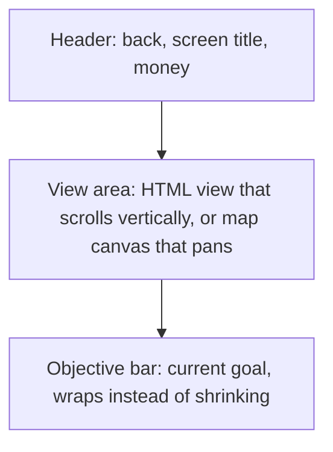
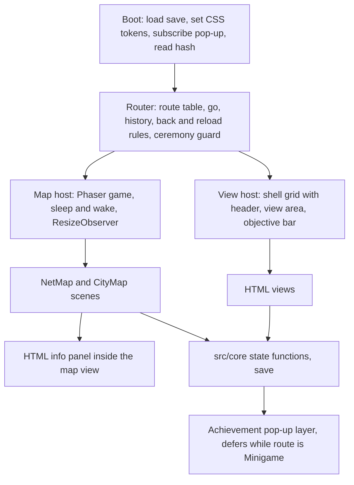
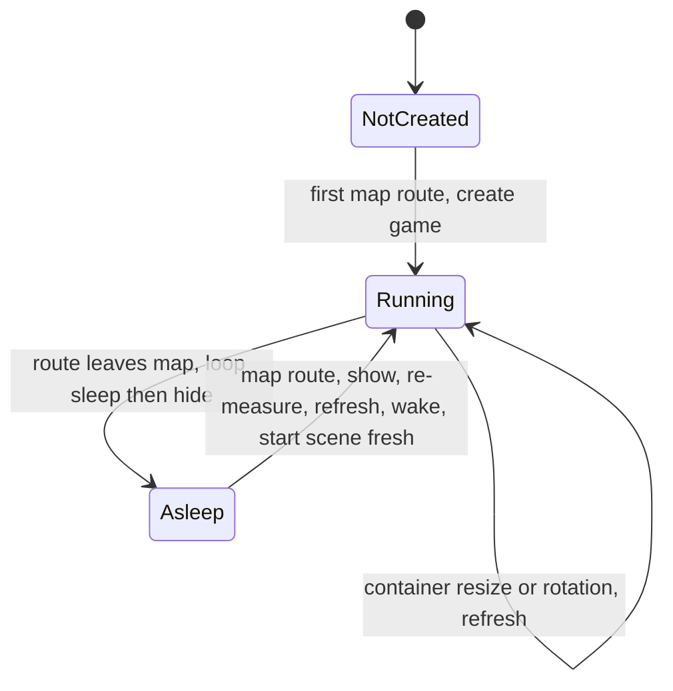
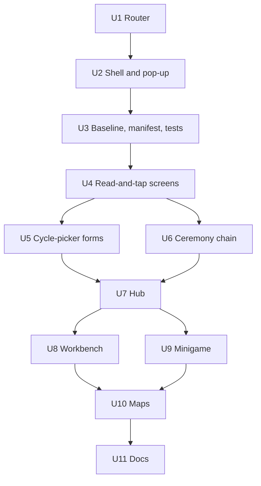

# Mobile Responsive UI - Plan

## Goal Capsule

- **Objective:** A student opens the game link on any smartphone, held in portrait or landscape, and plays the whole game without pinch-zooming; the game stays fully playable on desktop.
- **Means:** Text, list, and form screens become responsive HTML/CSS views behind one navigation layer; Phaser stays only for the network map and the city map (Key Decisions; KTD1, KTD2, KTD3).
- **Product authority:** The project owner. Layout details follow standard mobile web practice rather than per-screen sign-off. The Product Contract wins on behavior; KTDs win on mechanism.
- **Execution profile:** Screen-by-screen migration (R20). Every unit leaves the game playable end to end and passes the Verification Contract before the next starts.
- **Stop conditions:** Stop and ask if a unit would need a change to `src/core`, `src/data`, or the save format (R18), or if a screen cannot meet R1, R2, or R6 without dropping information it shows today.
- **Who finishes:** The implementer lands each unit on a feature branch; the project owner ships by merging locally into `main` and pushing, which triggers the GitHub Pages deploy.
- **Open blockers:** None.

---

## Product Contract

Product Contract preservation: changed R15 (both maps pan; pinch over a map is an exception to the pinch-zoom decision) and added R22, R23, R24, AE6, AE7 for back-button, reload, and confirmation behavior. All were confirmed in the plan's scoping synthesis. Document review then corrected R22's premise (the mini-game does have a Voltar, which quits the run) and tightened R23's wording to match the restore rules; the confirmed behavior is unchanged. No other R/AE meaning changed.

### Summary

Rebuild the game's interface mobile-first with standard responsive web techniques: every screen except the two maps becomes an HTML view that reflows to the screen width and scrolls natively. The maps stay on a canvas that fills its area and pans by touch. One navigation layer lands first so screens can move one at a time; the terminal look, all game rules, and existing saves stay as they are.

### Problem Frame

The whole game is one fixed 1280x720 canvas scaled down to fit the screen (`src/main.ts`, `src/ui/widgets.ts`). On a portrait phone 390 px wide that is a 0.30 scale: 16 px text shows at about 5 px and a 36 px button at about 11 px. Landscape only improves it to about 0.54. The project owner tried it on a phone and had to keep zooming in and out to read and tap. None of the usual mobile web basics are in place: no orientation, touch, safe-area, or install handling exists, and `fitText` copes with long Portuguese by shrinking fonts down to 11 px, which compounds the problem.

The players are students of a technical high-school IT course (IFRS) who mostly have a phone at hand, so a game they cannot comfortably play on one misses much of its audience.

### Key Decisions

- **HTML/CSS views for everything except the two maps.** Text-heavy screens are what HTML lays out natively: reflow, scroll, real controls, and the user's text-size settings. (session-settled: user-directed — chosen over a responsive all-Phaser canvas and over two fixed canvas designs swapped on rotation: the textbook responsive approach reflows text instead of shrinking it, and the fixed designs would not fit every screen.) Governs R11, R13.
- **Follow standard mobile web practice instead of bespoke layout sign-off.** (session-settled: user-directed — chosen over sketching and judging layout options per screen: "go by the book".) Governs R1-R7, R16.
- **Mini-game rounds move to HTML too.** Both round kinds, choice and bits, are only buttons and readouts, so only the maps need a canvas. Governs R11.
- **Value pickers stay tap controls.** IP, mask, route, and city-code values are chosen with cycle buttons today; they stay that way at touch size, so only the formatura name needs a phone keyboard. Governs R8, R9.
- **Pinch-zoom stays enabled, except over the maps.** Disabling user zoom breaks accessibility guidance; the maps own their touch gestures for panning, so pinch there does nothing. (session-settled: user-approved — chosen over map-level pinch zoom: a fixed readable scale plus panning meets R14 without a second gesture system.) Governs R15, R16.
- **Screen-by-screen migration.** Each step leaves the game playable end to end, so the work can ship and be checked in slices. Governs R20.
- **Installable, not offline.** A home-screen install that opens full screen is cheap and standard; offline play is deferred. Governs R17.
- **The phone's back button mirrors the on-screen Voltar; reload returns to safe ground.** A run or a ceremony is never lost to a stray back gesture or a reload. (session-settled: user-approved — chosen over making every step a history entry: mid-step state lives only in memory and would re-roll or crash.) Governs R22, R23.
- **In-page dialogs replace browser confirm pop-ups.** Some in-app phone browsers silently block `window.confirm`, which would make "Novo jogo" and "Apagar progresso" dead buttons. (session-settled: user-approved — chosen over keeping `window.confirm`.) Governs R24.

### Requirements

The diagram shows the shell every screen shares; R5 and R13 carry the rules.

**Layout and readability**

- R1. Every screen fits the viewport from 320 CSS px wide upward with no horizontal page scroll; only map areas pan sideways.
- R2. Body text renders at 16 CSS px or larger and no player-visible text renders below 14 CSS px, in units that follow the browser and OS text-size settings.
- R3. Layouts are mobile-first and work in portrait and landscape with no rotation lock; wider screens, desktop included, get wider multi-column layouts at breakpoints.
- R4. Long Portuguese text wraps and the view scrolls vertically; no text shrinks its font to fit a frame.
- R5. The header (back, title, money) and the objective bar stay reachable on every screen without covering content, and respect safe-area insets such as notches and home indicators.

**Touch and input**

- R6. Every interactive control has a touch target of at least 44x44 CSS px, spaced so a tap does not hit its neighbour.
- R7. No information or action depends on hover, and every control shows a visible pressed state on touch.
- R8. Value pickers (IP octets, mask, gateway, DNS, route fields, city code) stay tap-only cycle controls sized per R6.
- R9. The formatura name field opens the phone keyboard, stays visible above it while typing, and submits from the keyboard's confirm key.
- R10. Controls are real, semantic buttons and inputs, so desktop keyboard navigation and screen readers work.

**Screens**

- R11. Every screen except the network map and the city map is an HTML view: Title, Hub, Study, Lesson, Shop, Workbench, NetSetup, JobBoard, Minigame (choice and bits rounds), CityList, Route, Formatura, Certificate, Conquistas, and the achievement pop-up.
- R12. The visual identity carries over: the colour palette, the monospace font, and the terminal feel.

**Maps**

- R13. The network map and the city map draw on a canvas that fills the view area at the device's pixel density and redraws on rotation or resize without losing state.
- R14. Map nodes have touch targets per R6, and map labels meet R2's 14 CSS px floor at the default zoom.
- R15. Both maps pan by finger drag in any direction, with arrow buttons kept, and pinch over a map does not zoom; node details open in an HTML panel that leaves the map's controls reachable on narrow screens.

**Web baseline**

- R16. The page follows mobile web basics: a correct viewport setup, a theme colour, no double-tap zoom delay, and user zoom left enabled outside the maps.
- R17. The game is installable to the home screen with a name and icons and opens full screen from there.

**Navigation**

- R22. The phone's back button does what the screen's Voltar button does, except during a running mini-game (whose on-screen Voltar quits the run) and the formatura steps, where it does nothing.
- R23. Reloading the page or opening the link mid-game lands on a screen that needs no unfinished step: a screen that holds no in-memory step and needs no route data comes back as it was; any other screen, Title included, returns to the Hub, or to Title when no save exists.
- R24. Destructive confirmations ("Novo jogo", "Apagar progresso") appear as in-page dialogs.

**Continuity**

- R18. Existing saves load unchanged; no game rule, content, or save-format change is part of this work.
- R19. The English-word guard in `tests/content.test.ts` covers player-visible text in the new views as it covers scene source today.
- R20. The migration goes screen by screen, and after each step the game is playable end to end on both phone and desktop.
- R21. Desktop play at 1280x720 and larger keeps working with mouse and keyboard.

### Acceptance Examples

- AE1. **Covers R3, R13.** **Given** the city map is open in portrait with a node selected, **when** the phone rotates to landscape, **then** the map redraws to fill the new area, the selection and the money stay, and nothing reloads.
- AE2. **Covers R2, R4.** **Given** the longest lesson text on a 360 px wide portrait screen, **when** the lesson opens, **then** the text wraps at 16 CSS px or larger and the view scrolls, with no shrunken text.
- AE3. **Covers R1, R6, R11.** **Given** the Workbench on a 360 px wide portrait screen, **when** the player browses parts, **then** the parts list and the build panel stack vertically, nothing scrolls sideways, and the install and sell buttons are at least 44x44 CSS px.
- AE4. **Covers R9.** **Given** the formatura on a phone, **when** the player taps the name field, **then** the keyboard opens, the field stays visible above it, and the keyboard's confirm key submits the name.
- AE5. **Covers R18.** **Given** a save from the current version in the browser, **when** the new version loads, **then** money, installed parts, lessons, breached nodes, cities, and certificates are intact.
- AE6. **Covers R22.** **Given** a mini-game round is running, **when** the player presses the phone's back button, **then** the round keeps running and nothing navigates; **given** the Shop is open, back returns to the Hub exactly as Voltar does.
- AE7. **Covers R23.** **Given** the player is on page 3 of a lesson, **when** the page reloads, **then** the Hub opens with progress intact; **given** the Shop is open, a reload reopens the Shop.

### Success Criteria

- On a real Android phone and in iOS Safari at 360x640 portrait, a player completes the opening loop (build the PC, configure the network, breach a node, take a lesson, open a city) without zooming.
- An automated mobile accessibility audit of each screen reports no target-size or text-contrast failures.

### Scope Boundaries

- Deferred: offline play (service worker caching).
- Deferred: tablet-specific layouts beyond the breakpoints of R3.
- Deferred: turning the cycle-button pickers into typed inputs.
- Not part of this work: new art or animation, gameplay or content changes, and a native app wrapper.
- Considered and not built: zoom (pinch or +/-) on the maps. A fixed readable scale plus panning meets R14; revisit if players report the maps feel cramped on small phones.
- Considered and not built: deep links that restore mid-step state (lesson page, mini-game round). Rounds are seeded from the clock and steps live in memory; R23's Hub fallback is enough unless players report losing progress.
- Not touched: the uncommitted `gh-pages` deploy script and dependency in `package.json`; they belong to separate work.

#### Deferred to Follow-Up Work

- A `docs/solutions/` learning on the DOM/canvas hybrid, breakpoints, and manifest once the work lands (no prior art exists in the repo).

### Dependencies / Assumptions

- Target browsers are current Chrome on Android and Safari on iOS, plus desktop Chrome, Firefox, and Edge.
- The smallest supported width is 320 CSS px.
- Students' phones may be low-end, so the rebuilt interface should not load noticeably slower than the current build.
- `src/core` and `src/data` have no Phaser imports, so game logic and its tests carry over untouched.

### Sources / Research

- `src/main.ts` and `src/ui/widgets.ts`: fixed 1280x720 canvas with `Phaser.Scale.FIT`, `MIN_FONT_SIZE` 11, and the header, objective bar, toast, intro card, and the one HTML text input.
- Smallest text today: 10-11 px on the city and network maps (`src/scenes/CityMapScene.ts`, `src/scenes/NetMapScene.ts`). Smallest controls: 24-32 px tall rows and buttons in `src/scenes/WorkbenchScene.ts`; 50x24 map arrows in `src/scenes/CityMapScene.ts`.
- `src/scenes/NetSetupScene.ts`, `src/scenes/RouteScene.ts`, `src/scenes/CityListScene.ts`: values are chosen with cycle buttons, not typed.
- `docs/plans/2026-10-03-1608-feat-formatura-pos-graduacao-plan.md`: already expected the formatura to work on a phone-width browser.

---

## Planning Contract

### Key Technical Decisions

- KTD1. **Views are plain TypeScript building DOM through one element helper, with styles in one CSS file.** No UI framework; Phaser stays the only runtime dependency. Markup never sits in string literals, so the English-word scan sees only player text (a template like `
` would trip it on "card"). Each view is a module exposing mount and unmount over a container, mirroring today's `create` plus `Layer` redraw. (session-settled: user-approved — chosen over a view library such as Preact or lit: keeps one runtime dependency and the scan simple.) Governs R10, R11, R19.
- KTD2. **One route table and a `go(key, data)` function replace every `this.scene.start`.** It lands first, while every screen is still Phaser, so each later unit swaps one route's target (Phaser scene or HTML view) without touching callers. It owns history: each navigation pushes a hash entry; `popstate` runs the current screen's Voltar target and then replaces the current entry with that target's hash, so the entry always names the screen shown, or re-pushes when back is disabled on the screen (R22); and boot reads the hash and restores only routes marked restorable, otherwise the Hub (R23). `startPendingCeremony` becomes a router guard instead of a Phaser-scene function. (session-settled: user-approved — chosen over per-step history entries: in-memory steps cannot be restored.) Governs R20, R22, R23.
- KTD3. **One Phaser game, kept asleep while an HTML view shows.** Hiding the canvas while the loop runs lets the next size measurement read 0x0, so leaving a map is: sleep the loop, then hide. Entering is: show, re-measure the map host, resize, wake, then always start the map scene fresh with its route data, never wake an old scene. During migration the game keeps `Scale.FIT` at 1280x720 for unmigrated scenes. U10 replaces it with a canvas sized by the map host: a `ResizeObserver` on the host (Phaser only listens to window resize) sets the game size to the host's CSS size times `devicePixelRatio` and scales the canvas back down to CSS size (`Scale.NONE` with `scale.resize` and `scale.setZoom(1 / dpr)`). `Scale.RESIZE` is not used because it keeps the backing store at 1 canvas px per CSS px, which blurs every map on high-density phones. Governs R13, R20.
- KTD4. **Maps draw at a fixed readable scale and pan in both axes.** Scenes keep today's in-world label sizes and layout. Camera zoom is the device pixel ratio times 14 divided by the smallest map label size (about 1.4 on CityMap, whose IP labels are 10 px; 14/11 on NetMap), so every label renders at 14 CSS px or more without labels of neighbouring rows overlapping. Hit areas, the 14 CSS px floor, and pan limits are computed in CSS px (game px divided by the device pixel ratio). Node hit areas grow to at least 44 CSS px independent of the drawn size. Drag pans both axes, arrows stay, and the canvas sets `touch-action: none` so the map owns the gesture. Node coordinates in `src/data/nodes.ts` and the generator in `src/core/city.ts` stay untouched: every transform happens in the view (`tests/city.test.ts` asserts generator bounds). Instantiates the pinch Key Decision. Governs R13, R14, R15.
- KTD5. **The shell is a full-height grid: header, scrolling view area, objective bar.** Height uses `100dvh` with a `100vh` fallback; only the middle row scrolls, so the header and bar never cover content or the focused control. Safe-area insets pad the shell (`viewport-fit=cover`). Type uses `rem` with a 1rem body, a 0.875rem floor, and `clamp` for headings. Breakpoints are mobile base, about 40rem (two columns), and about 64rem (desktop), plus a short-height rule (about 30rem) that compacts the header and bar for landscape phones and the open keyboard. Hover styles live under `@media (hover: hover)`; every control gets `:active` and `:focus-visible` states; `touch-action: manipulation` removes the double-tap delay; `prefers-reduced-motion` stops pulses and the title rain. Colours come from the existing `COLORS` object, emitted as CSS custom properties at boot so the maps and the CSS share one source. Tones used for text keep their hue but are lightened where needed to reach 4.5:1 against the background and panel colours: today `muted` (#5b7083) is about 3.9:1 on the background and `accentDim` about 3.1:1, which fails the Success Criteria contrast audit. Governs R1-R7, R12, R16.
- KTD6. **Shared shell components replace the Phaser widgets one for one.** Header (back, title, money, "?" card), objective bar, toast, intro card, message log, cycle field, and an in-page confirm dialog (R24). The intro card keeps the open and close notifications the mini-game clock and the formatura depend on (`docs/solutions/design-patterns/acknowledge-every-entry-path-under-incremental-disclosure.md`). Governs R5, R6, R8, R24.
- KTD7. **The achievement pop-up becomes a fixed DOM layer outside the view host.** It subscribes once at boot (a reload can skip Title, which launches it today), uses `pointer-events: none`, and defers while the current route is Minigame by asking the router, not Phaser (`docs/solutions/design-patterns/cross-scene-ui-needs-an-overlay-scene.md`). Governs R11.
- KTD8. **Disclosure acknowledgement moves into the destination view's mount.** Today `useElement` runs in the Hub button click, so back and reload paths skip it; acknowledging on mount covers every entry path. The Hub's 3-second passive timer clears on unmount and counts only while the page is visible. Governs R22, R23.
- KTD9. **The mini-game clock runs on `requestAnimationFrame` with a capped delta and pauses while the page is hidden.** The first-time intro card pauses it; the "?" card mid-round does not, matching today's rule; card listeners are removed on unmount. The pure timing math lives in a small testable module. Governs R11, R20.
- KTD10. **Two test layers.** Vitest in its current node environment covers pure logic (routes, back and reload rules, clock math). A Playwright suite covers every screen at 320x568, 360x640, 390x844, 844x390, 768x1024, and 1280x720 in Chromium and WebKit: no horizontal overflow, interactive targets at least 44x44 CSS px, and an axe scan with the `wcag2a`, `wcag2aa`, `wcag21aa`, and `wcag22aa` tags (`wcag22aa` alone selects only the rules new in 2.2 and skips colour contrast). Screens open from seeded saves (`version: 1`, as in `docs/solutions/developer-experience/manual-ui-check-phaser-scenes.md`). The suite runs as its own script, in the deploy workflow before the build; its files are named so Vitest does not collect them. (session-settled: user-approved — chosen over keeping layout checks manual: CI catches overflow and target-size regressions on every push.) Governs R1, R2, R6, R21.
- KTD11. **The English-word scan follows the text.** `tests/content.test.ts` globs the new view and app directories recursively alongside the remaining scenes; its rules (literals with a space, `NOT_PLAYER_TEXT`) stay as they are. Governs R19.
- KTD12. **Manifest and icons live in `public/` with relative URLs.** `start_url`, `scope`, and `id` are `./` for the `/extensao1/` subpath; icons 192, 512, and maskable, plus a 180 px `apple-touch-icon`; `display: standalone`, `orientation: any`, and a `theme_color` from `COLORS.bg`. No service worker. Governs R17.
- KTD13. **UI-only memory that today survives by Phaser reusing scene instances stays remembered.** The Shop's last slot tab and the Workbench's last tab move to module-level view state, so the behavior players see does not change. Governs R18.

### High-Level Technical Design

Component shape after migration. The router decides whether a route mounts an HTML view or wakes the map host; nothing else navigates.

Map host lifecycle (KTD3):

Back and reload rules (KTD2, R22, R23):

| Situation | Phone back | Reload or opened link |
|---|---|---|
| Screen with Voltar, restorable (Hub, Study, Shop, Workbench, NetSetup, Jobs, Cities, Conquistas, Certificate list, NetMap) | Runs Voltar's target | Reopens that screen |
| Screen with Voltar, holding an in-memory step (Lesson, Route, CityMap with a selection, Certificate reopened) | Runs Voltar's target | Hub |
| Screen where back is disabled (Minigame run, whose on-screen Voltar quits the run; Formatura steps; Title) | Nothing; history entry re-pushed | Hub, or Title when no save exists |
| Pending ceremony exists | Ceremony guard redirects as Hub does today | Ceremony guard redirects |

Migration sequence: U1 and U2 change no screen's look; U3 adds the baseline and test harness; U4 to U9 each move a group of screens; U10 converts the maps and removes `Scale.FIT`; U11 updates docs.

### Risks and System-Wide Impact

| Risk or impact | Decision |
|---|---|
| Mixed state mid-migration: a Phaser screen and an HTML screen disagree on header money or toasts. | Each world draws its own chrome until its screen moves; both read `game()` on mount, so values agree after every navigation. Accepted for the migration window. |
| Hiding the canvas while the Phaser loop runs collapses the map to 0x0. | Mitigated by KTD3's fixed sleep-then-hide and show-measure-wake order, checked by U10's resize and re-entry scenarios. |
| The deploy workflow gets slower and gains a browser dependency. | Accepted: the suite runs Chromium and WebKit only, after Vitest, and a failure blocks the deploy just as a failing unit test does today (KTD10). |
| Emulation misses the on-screen keyboard, notches, toolbars, and real touch pan. | Mitigated by the real-device gate before shipping U6 and U10 (Verification Contract). |
| New player text in views escapes the English-word scan. | Mitigated by KTD11, proven by U3's probe scenario. |
| A save written by an older build fails to load after the rebuild. | No change to `src/core/store.ts` or the save format (R18); covered by AE5 in the Definition of Done. |
| Interface code becomes a larger share of the bundle. | Accepted: views are plain TypeScript with no new runtime dependency, and the Phaser game is created only once a map is first visited (KTD3). Loading Phaser's code on demand is left to the implementer as an optional improvement. |
| Contributors and docs still describe the 1280x720 canvas. | U11 updates `CLAUDE.md` and the manual UI check doc. |

### Assumptions

- Phaser 4.2.1's `game.loop.sleep()`/`wake()`, `scale.resize`, and `scale.setZoom` behave as its source shows (verified against `node_modules/phaser` during research, not at runtime).
- Chrome's install prompt does not require a service worker for this manifest; if it does, installability on Android degrades to "add to home screen" without blocking anything else.

---

## Implementation Units

| U-ID | Title | Key files | Depends on |
|---|---|---|---|
| U1 | Router and history | `src/app/router.ts`, `src/app/routes.ts`, all `src/scenes/*.ts` | — |
| U2 | Shell components and DOM pop-up | `src/app/dom.ts`, `src/app/shell.ts`, `src/app/styles.css`, `src/app/achievementPopup.ts`, `src/main.ts` | U1 |
| U3 | Web baseline, manifest, test harness | `index.html`, `public/`, `playwright.config.ts`, `e2e/`, `tests/content.test.ts`, `.github/workflows/deploy.yml` | U2 |
| U4 | Read-and-tap screens | `src/views/{Title,Study,Lesson,Shop,JobBoard,Conquistas}View.ts` | U3 |
| U5 | Cycle-picker forms | `src/views/{NetSetup,Route,CityList}View.ts` | U4 |
| U6 | Ceremony chain | `src/views/{Formatura,Certificate}View.ts` | U4 |
| U7 | Hub | `src/views/HubView.ts` | U5, U6 |
| U8 | Workbench | `src/views/WorkbenchView.ts` | U7 |
| U9 | Mini-game | `src/views/MinigameView.ts`, `src/app/clock.ts` | U7 |
| U10 | Maps in a responsive host | `src/app/mapHost.ts`, `src/views/{NetMap,CityMap}View.ts`, `src/scenes/{NetMap,CityMap}Scene.ts` | U8, U9 |
| U11 | Documentation | `CLAUDE.md`, `docs/solutions/developer-experience/manual-ui-check-phaser-scenes.md` | U10 |

### U1. Router and history

**Goal:** Every navigation goes through one route table and `go(key, data)`, with phone-back and reload behavior, while every screen is still a Phaser scene.

**Requirements:** R20, R22, R23; KTD2.

**Dependencies:** None.

**Files:**
- Create: `src/app/routes.ts` (pure route table: key, restorable flag, Voltar target, no-back flag), `src/app/router.ts` (go, history, popstate, boot-time hash restore, ceremony guard)
- Modify: every scene in `src/scenes/` that calls `this.scene.start` or `startPendingCeremony`; `src/scenes/CertificateScene.ts` (ceremony guard moves out); `src/main.ts`
- Test: `tests/routes.test.ts`

**Approach:**
1. Keep the pure rules (which route restores, what back does, where reload lands) in `src/app/routes.ts` with no DOM or Phaser imports, so Vitest tests them in node.
2. `router.ts` starts Phaser scenes for now; later units register HTML views against the same keys. Route keys stay the current scene keys (`Jobs`, `Cities` included), and route data keeps the existing exported `XData` types.
3. `pendingCeremonyRoute(state)` replaces `startPendingCeremony(scene)`; Hub entry, CityMap `finishedNow`, and Minigame `leave` call the router guard.
4. Keep `advance(game()); useElement('net-map')` on the NetSetup shortcut until U5 moves acknowledgement into the destination (KTD8).
5. Launch the `ConquistaPopup` overlay scene once at boot instead of from `TitleScene`, because a restored route skips Title; U2 replaces that launch with the DOM pop-up.

**Patterns to follow:** exported `XData` interfaces next to their screen; `import type` across screens to avoid cycles.

**Test scenarios:**
- Restorable route `Shop` with no data resolves to itself on boot.
- Non-restorable route `Lesson` on boot resolves to `Hub`.
- Unknown hash resolves to `Hub` when a save exists and to `Title` when none does.
- Covers AE6. Back on `Minigame` resolves to "stay" (no navigation).
- Back on `Shop` resolves to `Hub`; back on `Route` resolves to `CityMap` with its city index.
- Hub, then NetSetup, then NetMap through the shortcut, then back: the router shows the Hub and the current history entry names the Hub, so a reload restores the Hub, not NetSetup.
- A reload on a restored route (for example `Shop`) still shows achievement pop-ups.
- A pending ceremony makes the guard return the Formatura or Certificate route; with none it returns nothing.

**Verification:** `this.scene.start(` appears only in `src/app/router.ts`; the full game plays end to end on desktop exactly as before, and phone back on Shop returns to the Hub.

### U2. Shell components and DOM pop-up

**Goal:** The DOM view host, shared shell components, CSS tokens, and the achievement pop-up exist and work, with no screen moved yet.

**Requirements:** R5, R6, R7, R10, R12, R24 (component level); KTD1, KTD5, KTD6, KTD7.

**Dependencies:** U1.

**Files:**
- Create: `src/app/dom.ts` (element helper), `src/app/shell.ts` (view host, header, objective bar, toast, intro card, message log, cycle field, confirm dialog), `src/app/styles.css`, `src/app/achievementPopup.ts`, `src/app/tokens.ts` (CSS custom properties from `COLORS`)
- Modify: `src/main.ts` (import styles, set tokens, subscribe pop-up at boot, show either the view host or the canvas per route), `src/app/router.ts` (pop-up defer query), `src/scenes/TitleScene.ts` (stop launching the pop-up scene)
- Delete: `src/scenes/ConquistaPopupScene.ts`
- Test: `tests/routes.test.ts` (pop-up defer rule)

**Approach:**
1. Move `COLORS`, `hex`, and `FONT` to a Phaser-free module (or keep them where they are and re-export) so CSS tokens and map scenes share one source (KTD5).
2. The intro card exposes open and close notifications equivalent to `card-open`/`card-close`, and records `markCardSeen` as today.
3. The confirm dialog returns the player's choice asynchronously; existing `window.confirm` callers move to it as their screens migrate, and `resetEverything` moves in this unit.
4. The canvas container and the view host are siblings; the router shows one and hides the other. During migration the canvas container fills the screen as today.

**Patterns to follow:** `src/ui/widgets.ts` behavior for each component (money visible only once disclosed, pulse while current, toast duration from message length); `docs/solutions/design-patterns/cross-scene-ui-needs-an-overlay-scene.md` for the pop-up queue and click-through.

**Test scenarios:**
- Pop-up defer rule: route `Minigame` defers; any other route shows.
- Two unlocks in one save queue and show one after the other (manual check in the browser, since the layer is DOM).
- Test expectation for the CSS and component markup: covered by U3's browser suite once a screen uses them.

**Verification:** Unlocking an achievement on a Phaser screen shows the DOM pop-up in the corner without blocking taps; it waits while a mini-game runs; typecheck passes with `ConquistaPopupScene` removed from `src/main.ts`.

### U3. Web baseline, manifest, and test harness

**Goal:** The page follows mobile web basics, the game is installable, and the browser test suite and widened English-word scan are in CI.

**Requirements:** R16, R17, R19; KTD10, KTD11, KTD12.

**Dependencies:** U2.

**Files:**
- Modify: `index.html` (viewport with `viewport-fit=cover`, `theme-color`, manifest and apple-touch-icon links with relative hrefs, remove `overflow: hidden` from `body`), `tests/content.test.ts` (glob `src/app/**/*.ts` and `src/views/**/*.ts`), `.github/workflows/deploy.yml` (install Playwright browsers, run the layout suite before the build), `package.json` (devDependencies `@playwright/test`, `@axe-core/playwright`; a `test:e2e` script), `.gitignore` (`test-results/`, `playwright-report/`)
- Create: `public/manifest.webmanifest`, `public/icons/` (192, 512, maskable, 180), `playwright.config.ts`, `e2e/helpers.ts` (seed a save, open a route, overflow and target-size checks, axe), `e2e/shell.e2e.ts`

**Approach:**
1. Name browser tests `*.e2e.ts` so Vitest's default include does not collect them; `npm test` stays Vitest only.
2. The helper seeds `localStorage` with a `version: 1` save and opens a route by hash, so each later unit adds one spec per screen.
3. Icons are generated once from the terminal palette (green on the dark background); a simple monogram is enough.
4. Leave the uncommitted `gh-pages` edits in `package.json` and `package-lock.json` out of this work. Set them aside before adding the Playwright dependencies, commit both files with only the new entries, then restore the `gh-pages` edits locally. Otherwise the committed lockfile lists `gh-pages` while the committed `package.json` does not, and `npm ci` in the deploy workflow fails.

**Execution note:** This is mostly configuration; prove it with a smoke run of the suite against the Title route and a `vite build` plus `vite preview --base /extensao1/` check that the manifest and icons resolve.

**Test scenarios:**
- English-word scan fails when a literal with a space and an English word is added to a file under `src/views/` (temporary probe, removed after).
- Shell smoke spec at every viewport: no horizontal overflow on the Title route.
- The built `dist/manifest.webmanifest` is served at a relative path and lists the icons.

**Verification:** `npm ci` succeeds on a clean checkout of the commit; the deploy workflow runs Vitest, the browser suite, and the build; Chrome DevTools' Application panel shows the manifest as installable on the preview build.

### U4. Read-and-tap screens

**Goal:** Title, Study, Lesson, Shop, JobBoard, and Conquistas are HTML views.

**Requirements:** R1-R7, R10, R11, R12, R20; AE2; KTD1, KTD6, KTD8, KTD13.

**Dependencies:** U3.

**Files:**
- Create: `src/views/TitleView.ts`, `src/views/StudyView.ts`, `src/views/LessonView.ts`, `src/views/ShopView.ts`, `src/views/JobBoardView.ts`, `src/views/ConquistasView.ts`
- Modify: `src/app/routes.ts` / `src/app/router.ts` (register views), `src/main.ts` (drop migrated scenes)
- Delete: the six matching files in `src/scenes/`
- Test: `e2e/read-and-tap.e2e.ts`

**Approach:**
1. Carry every player string over verbatim from the scene; only paging that existed because the canvas was fixed (Conquistas grid pages) becomes scrolling.
2. Study's card columns stack on narrow screens and sit side by side above the 40rem breakpoint.
3. Title's falling-digit rain becomes a decorative CSS layer that stops under `prefers-reduced-motion`; "Novo jogo" uses the confirm dialog (R24).
4. Shop keeps its last slot tab in module state (KTD13); disabled buy buttons still show `canBuy().reason`.

**Patterns to follow:** the scene's `draw()` as the view's render; `coreFn` then `save()` then refresh header and objective bar then redraw then toast.

**Test scenarios:**
- Covers AE2. The longest lesson page at 360x640 has body text of at least 16 CSS px and no horizontal overflow.
- Buying a part in the Shop updates the header money and shows the toast.
- Shop reopened after leaving shows the last slot tab.
- A locked part shows its reason text and its button is disabled but still at least 44x44 CSS px.
- "Novo jogo" on Title opens the in-page dialog; cancelling keeps the save.
- Each of the six screens passes overflow, target-size, and axe checks at every viewport.

**Verification:** The six screens work on phone and desktop; the remaining Phaser screens still open from them and back to them.

### U5. Cycle-picker forms

**Goal:** NetSetup, Route, and CityList are HTML views using one shared cycle field.

**Requirements:** R1, R6, R8, R11, R20; KTD6, KTD8.

**Dependencies:** U4.

**Files:**
- Create: `src/views/NetSetupView.ts`, `src/views/RouteView.ts`, `src/views/CityListView.ts`
- Modify: `src/app/shell.ts` (cycle field variants for `<`/`>` and ▲/▼), router registration, `src/main.ts`
- Delete: `src/scenes/NetSetupScene.ts`, `src/scenes/RouteScene.ts`, `src/scenes/CityListScene.ts`
- Test: `e2e/forms.e2e.ts`

**Approach:**
1. CityList's seven-column code form wraps into rows on narrow screens; each column stays a labelled group so screen readers announce the field.
2. Monospace-aligned blocks built with `alignColumns` (NetSetup router note, Route preview line) render in `<pre>` and may scroll inside their own box, never the page.
3. The NetSetup shortcut to NetMap stops acknowledging in the button; NetMap's route acknowledges on mount (KTD8). Until U10, the router performs that acknowledgement when it starts the NetMap scene.

**Test scenarios:**
- Cycling an octet past 255 wraps the way it does today, and Aplicar shows the validation result from `validateNetConfig`.
- Route with a four-field gate kind at 320x568 shows every field without horizontal overflow.
- CityList code form at 320x568 wraps its columns and every ▲/▼ is at least 44x44 CSS px.
- Opening NetMap from the NetSetup shortcut acknowledges the `net-map` disclosure exactly once.

**Verification:** A player can configure the network, enter a city by code, and apply a route on a phone without zooming.

### U6. Ceremony chain

**Goal:** Formatura and Certificate are HTML views, with a real name field that behaves on phone keyboards.

**Requirements:** R9, R11, R22, R23, R20; AE4; KTD2, KTD6.

**Dependencies:** U4.

**Files:**
- Create: `src/views/FormaturaView.ts`, `src/views/CertificateView.ts`
- Modify: router registration and ceremony guard wiring, `src/main.ts` (drop `dom.createContainer` once no scene uses `textInput`), `src/ui/widgets.ts` (remove `textInput`)
- Delete: `src/scenes/FormaturaScene.ts`, `src/scenes/CertificateScene.ts`
- Test: `e2e/ceremony.e2e.ts`

**Approach:**
1. The name field is an `<input>` with `enterkeyhint="done"`, `autocapitalize="words"`, the existing max length, and `validateStudentName` feedback updated in place so the keyboard stays open and the typed value survives re-render and rotation.
2. On focus, the field scrolls into view inside the view area; the short-height rule (KTD5) compacts the header and bar while the keyboard is open.
3. The intro card and the field share the DOM, so today's hide-on-card-open workaround goes away; the card still blocks the field while open.
4. The certificate's area table becomes one column per area on narrow screens; the lesson list scrolls natively instead of ▲/▼ paging.

**Test scenarios:**
- Covers AE4 (emulated). Focusing the name field keeps it inside the visible viewport at 390x844 and 844x390.
- An invalid name shows the validation message without clearing the field.
- Back during a Formatura step does nothing; reload during it lands on the Hub, which redirects into the pending ceremony as today.
- A reopened certificate at 360x640 shows every area row without horizontal overflow.

**Verification:** The formatura can be completed on a real phone with the on-screen keyboard (part of the manual device check).

### U7. Hub

**Goal:** The Hub is an HTML view with its monitor block, message log, disclosure-filtered menu, and passive timer.

**Requirements:** R1-R7, R11, R20, R23, R24; KTD6, KTD8.

**Dependencies:** U5, U6.

**Files:**
- Create: `src/views/HubView.ts`
- Modify: router registration, `src/main.ts`
- Delete: `src/scenes/HubScene.ts`
- Test: `e2e/hub.e2e.ts`, `tests/routes.test.ts` (any rule the Hub adds)

**Approach:**
1. The monitor block keeps monospace alignment in a `<pre>` that wraps on narrow screens rather than shrinking.
2. Menu entries acknowledge nothing on press; each destination acknowledges on mount (KTD8).
3. The 3-second passive timer clears on unmount and pauses while the page is hidden.
4. "Apagar progresso" uses the confirm dialog (R24); `notice` arrives as a toast.

**Test scenarios:**
- A save with one passive element: after 3 s on the Hub the element is acknowledged; leaving at 2 s does not acknowledge it.
- A save where only the first menu entries are disclosed shows only those entries.
- A pending ceremony redirects away from the Hub on entry.
- Hub at 320x568 and 844x390 passes overflow, target-size, and axe checks.

**Verification:** The Hub is the hub of navigation for both HTML and Phaser screens with no regressions in what it shows for early, mid, and late saves.

### U8. Workbench

**Goal:** The Workbench (case tab and NOC/swarm tab) is an HTML view.

**Requirements:** R1, R6, R11, R20; AE3; KTD6, KTD13.

**Dependencies:** U7.

**Files:**
- Create: `src/views/WorkbenchView.ts`
- Modify: router registration, `src/main.ts`
- Delete: `src/scenes/WorkbenchScene.ts`
- Test: `e2e/workbench.e2e.ts`

**Approach:**
1. Slot rows, diagnostics, and inventory stack on narrow screens and sit in two columns above 64rem; NOC row pagination becomes scrolling.
2. Row actions (instalar, vender, remover) become full-size buttons per R6, so a row may wrap its actions under its text.
3. The last tab stays remembered in module state (KTD13); the toast colour still compares state before and after the action.

**Test scenarios:**
- Covers AE3. At 360x640 the parts list and build panel stack, nothing overflows, and install and sell buttons are at least 44x44 CSS px.
- Installing a part updates diagnostics and header money in one redraw.
- The NOC tab with more providers than fit on screen scrolls instead of paging.

**Verification:** A player builds and upgrades a PC and manages the NOC on a phone without zooming.

### U9. Mini-game

**Goal:** The mini-game (choice and bits rounds, timer, integrity, explanation, finish) is an HTML view with the clock off Phaser.

**Requirements:** R6, R11, R20, R22; AE6; KTD7, KTD9.

**Dependencies:** U7.

**Files:**
- Create: `src/views/MinigameView.ts`, `src/app/clock.ts`
- Modify: router registration, `src/main.ts`
- Delete: `src/scenes/MinigameScene.ts`
- Test: `tests/clock.test.ts`, `e2e/minigame.e2e.ts`

**Approach:**
1. `clock.ts` holds pure timing (remaining time, delta cap, paused flag); the view drives it from `requestAnimationFrame` and `visibilitychange`.
2. One `running` guard covers both the answer path and the timeout path, so a late tap after a timeout cannot score twice.
3. Bits rounds render as toggle buttons with their place values; more than eight bits wrap to two rows as today, each at least 44x44 CSS px.
4. `leave()` routes through the router and its ceremony guard. The header keeps its on-screen Voltar, which calls `leave()` and is the only way to abandon a run; only the phone's back button is disabled during a run (R22).

**Test scenarios:**
- Clock: a 5 s frame gap advances by at most the cap.
- Clock: paused time does not count down; resuming continues from the same remaining time.
- First-time intro card before the first round pauses the clock; the "?" card mid-round does not.
- An answer arriving after the timeout fired is ignored.
- Covers AE6. Phone back during a round keeps the round running.
- A bits round with 16 bits at 320x568 has no overflow and every toggle is at least 44x44 CSS px.
- An achievement unlocked by the final answer shows only after the mini-game route is left.

**Verification:** Mini-games from NetMap, Jobs, and a city play to completion on a phone; outcomes, rewards, and returns match today.

### U10. Maps in a responsive host

**Goal:** NetMap and CityMap render in a resizable canvas inside an HTML view, readable and pannable on phones, and the fixed 1280x720 canvas is gone.

**Requirements:** R1, R11, R13, R14, R15, R16, R21; AE1; KTD3, KTD4.

**Dependencies:** U8, U9.

**Files:**
- Create: `src/app/mapHost.ts`, `src/views/NetMapView.ts`, `src/views/CityMapView.ts` (header, legend, arrows, and the HTML info panel around the canvas)
- Modify: `src/scenes/NetMapScene.ts`, `src/scenes/CityMapScene.ts` (draw only the diagram; pan both axes; camera zoom per KTD4; enlarged hit areas; emit node selection to the view), `src/main.ts` (lazy game creation, host-driven size per KTD3, no fixed size), `src/ui/widgets.ts` (reduce to what the map scenes still use)
- Test: `e2e/maps.e2e.ts`

**Approach:**
1. Implement the map host lifecycle exactly as KTD3's state diagram; the selection lives in the view, so a rotation or resize redraws the canvas without losing it.
2. Each scene computes its camera zoom and pan limits from the current canvas size so labels stay at 14 CSS px (KTD4); CityMap's second camera bookkeeping for the info panel goes away because the panel is HTML.
3. NetMap gains the same drag-pan CityMap has, in both axes, with arrow buttons in the view.
4. Map view layout: in portrait the info panel is a dismissible bottom sheet capped at about 40% of the view area, the canvas keeps the remaining height, and the arrows overlay the canvas; at the short-height breakpoint (landscape phones) the panel sits beside the canvas.
5. The hint copy ("Clique em um nó…", "Arraste o mapa…") is rewritten to read naturally for touch and mouse, following `docs/solutions/conventions/ptbr-text-native-not-calque.md`.
6. With no Phaser screen left, remove `Scale.FIT`, `WIDTH`/`HEIGHT` as layout constants, and `fitText` from everything but map labels.

**Execution note:** Check on a real phone early in this unit; emulation does not reproduce touch pan inertia or high-density rendering faithfully.

**Test scenarios:**
- Covers AE1. City map at 390x844 with a node selected, resized to 844x390: the canvas fills the new area and the info panel still shows the same node.
- Every NetMap node's hit area is at least 44x44 CSS px at 360x640.
- Dragging on the canvas pans the map and does not scroll the page; dragging on the info panel does not pan.
- Leaving a map and returning with `select` data opens that node's panel (fresh scene start, not a stale wake).
- Desktop 1280x720: both maps open with the home node in view, and drag or the arrows reach every node.
- The canvas backing width equals its CSS width times `devicePixelRatio` at DPR 1, 2, and 3.
- With the info panel open at 360x640 and 844x390, the canvas keeps a usable height and the arrows stay visible and tappable.

**Verification:** A player breaches nodes and plays through a city on a phone in both orientations; the Phaser game exists only while a map has been visited, and its loop sleeps on other screens.

### U11. Documentation

**Goal:** Project docs describe the new architecture and how to check UI.

**Requirements:** R19, R20 (keeps future work consistent).

**Dependencies:** U10.

**Files:**
- Modify: `CLAUDE.md` (architecture layers now include `src/app/` and `src/views/`; layout section replaces the 1280x720 note with the shell, breakpoints, and the map host; commands add `npm run test:e2e`), `docs/solutions/developer-experience/manual-ui-check-phaser-scenes.md` (DOM selectors replace canvas-coordinate clicks; map notes updated), `README.md` (mention phone play)

**Approach:** Describe only what exists after U10; keep the PT-BR text rules unchanged.

**Test expectation:** none -- documentation only.

**Verification:** A reader of `CLAUDE.md` can add a new screen as an HTML view and a test spec without reading this plan.

---

## Verification Contract

| Gate | Command or check | Applies to |
|---|---|---|
| Unit and content tests | `npm test` | every unit |
| Types | `npm run typecheck` | every unit |
| Browser layout suite | `npm run test:e2e` (Chromium and WebKit, viewport matrix in KTD10) | U3 onward |
| Build | `npm run build`, then `vite preview --base /extensao1/` to check paths and manifest | U3, U10 |
| Navigation discipline | `scene.start(` appears only in `src/app/router.ts` (U1-U9) and, after U10, only in `src/app/mapHost.ts` | U1 onward |
| Migration completeness | each migrated scene file is deleted and unregistered in `src/main.ts` | U2, U4-U10 |
| Real devices | one Android phone (Chrome) and one iPhone (Safari): opening loop from Success Criteria, formatura keyboard, map pan, rotation, home-screen install, and two back presses during a mini-game run (Chrome may skip history entries re-pushed without a tap) | before shipping U6, U10 |
| PT-BR | changed player text reviewed by a native reader per `docs/solutions/conventions/ptbr-text-native-not-calque.md` | U4-U10 when copy changes |

---

## Definition of Done

- Every R1-R24 is met and traced to a unit; AE1-AE7 have passing checks (automated, or the real-device check for AE4).
- `npm test`, `npm run typecheck`, `npm run test:e2e`, and `npm run build` pass locally and in the deploy workflow.
- No file in `src/scenes/` remains except `NetMapScene.ts` and `CityMapScene.ts`; `Scale.FIT` and the Phaser DOM container are gone.
- An existing save from the current production build loads with progress intact (AE5).
- Abandoned experiments and unused widgets are removed from the diff.
- `CLAUDE.md` and the manual UI check doc describe the new structure.
