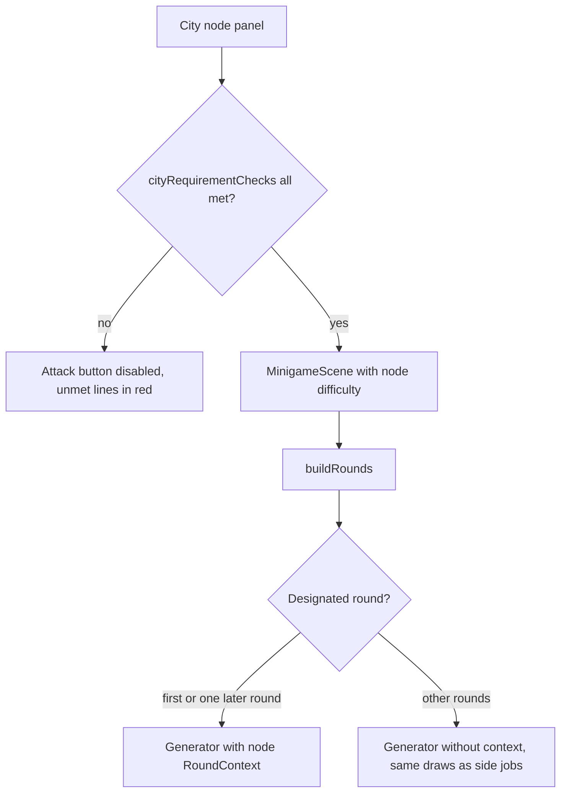

# City Difficulty Scaling - Plan

## Goal Capsule

- **Objective:** A student who climbs the city levels meets harder questions until each area's content runs out. Within one intrusion, no answer repeats from round to round. A city never asks for a level the student has not yet reached in the side jobs. Side jobs push the student up one level at a time, and cities let them repeat a level they already reached as often as they like.
- **Means:** city node difficulty follows the city level instead of the structure cap (KTD1); the node's own addresses feed at most two rounds of an intrusion (KTD3); a city node opens only when the area level reaches the node's difficulty (KTD4).
- **Authority:** Product Contract R-IDs win on behavior; KTDs win on mechanism; units override neither. The project owner (the user) settles product questions and reviews all new PT-BR text.
- **Stop conditions:** stop and ask if a change would alter the ids of any city node or subnet, or change the rounds pinned by `tests/minigames-context.test.ts` ("leaves rounds without a context exactly as pinned").
- **Execution profile:** one code change across `src/core`, `src/scenes`, tests and `CONCEPTS.md`. It ships by local merge into `main` and push of `origin main`, with no PR.
- **Open blockers:** none.

---

## Product Contract

### Summary

City nodes get harder as the city level rises, past level 12, up to the highest level each area's content supports. An intrusion into a city node uses the node's own network in only one or two rounds and draws the rest at the node's difficulty. A city node can be attacked only once the student's side-job level in its area reaches the node's difficulty, and the node panel says which level to reach.

### Problem Frame

Students practice in two places. Side jobs raise an area level one step at a time after a clean run, and they never offer the same level again. Cities are where a student can repeat a level as often as they want. That only works if city difficulty tracks something the student controls, and today it does not.

Three defects break this:

- Difficulty stops rising at city level 12. `generateCity` computes `growth = min(level, STRUCTURE_MAX_LEVEL)` with the cap at 12 (`src/core/city.ts:93`). `cityDifficulty` takes `growth`, not `level` (`src/core/city.ts:297`). Cities at levels 12, 20 and 99 have the same difficulty spread: mostly ★3–4, and ★5 only on the deepest routers and the core.
- One intrusion repeats its answers. With a city context, every subnet round takes the node's own prefix and network (`src/core/minigames.ts:272-273`). Only the host changes, so the network address, broadcast address and mask have one answer for the whole intrusion. The prefix also comes from the city's address plan, not from the difficulty's prefix set, so ★5 asks the same kind of question as ★1. 8-bit binary rounds draw only from the host's non-zero octets after the leading 10, which allows at most 3 values (`binaryValue`, `src/core/minigames.ts:196`). Routers are always subnet nodes, which makes subnet the most common area in every city.
- Nothing ties a city node to the student's level. A student can meet a ★5 subnet node while their side jobs are at level 2.

### Requirements

**Difficulty scaling**

- R1. City node difficulty keeps rising with the city level beyond level 12, until each area reaches its maximum level (`MAX_LEVEL`).
- R2. Cities at levels 1–12 keep the difficulty each node has today.
- R3. A city's structure (subnets, addresses, node ids, areas, rewards, requirements other than difficulty) stays exactly as today for every level and seed.

**Variety within one intrusion**

- R4. In one intrusion into a city node, at least one and at most two rounds use the node's own addresses. Every other round is drawn the way a side job of the same area and difficulty draws it.
- R5. Rounds of side jobs and campaign nodes stay exactly as today.

**Gate on the area level**

- R6. A city node can be attacked only when the student's area level in the node's area is at least the node's difficulty. This applies to first breaches and to repeat attacks alike.
- R7. A city node's panel lists the area-level requirement next to the hardware requirements. The line names the area, the level to reach and the student's current level, and shows as met or unmet like the others.
- R8. The next-city ladder keeps rising with finished cities, whatever the student's area levels.

### Key Decisions

- **Difficulty, variety and gate ship together.** The gate alone keeps nodes from being too hard but cannot make high cities harder. Governs R1, R4, R6. (session-settled: user-approved — chosen over adding only the area-level gate: the gate cannot raise the difficulty of cities above level 12)
- **The ladder ignores area levels.** A student may start a city whose deeper nodes stay locked until they do more side jobs. Governs R8. (session-settled: user-approved — chosen over making the next city wait for side-job levels: keeps cities open as the place to practice the levels already reached)
- **The gate checks only the node's own area.** Routers are subnet nodes, so a low subnet level can lock a whole branch of the city. Governs R6. (session-settled: user-approved — chosen over a gate that also considers other areas: one rule the student can read on the panel)

### Scope Boundaries

- Content for ports, HTTP, DNS, NAT, VLAN and IPv6 above level 3. Their city nodes stay at ★3 at most, and lifting that needs new question content, not this change.
- How side jobs raise area levels. City intrusions do not raise area levels.
- Repetition in campaign map nodes and side jobs.
- Map size. It still stops growing at level 12 (`STRUCTURE_MAX_LEVEL`).
- A steeper difficulty curve. The slope stays at one level per four city levels (KTD1). With that slope, binary reaches level 7 near city level 25.
- City codes shared before this change. They rebuild the same map with new difficulties at levels above 12. No class has used codes yet.

---

## Planning Contract

### Key Technical Decisions

- KTD1. **`cityDifficulty` takes the uncapped level in place of `growth`.** The formula stays `1 + floor((level - 1 + depth) / 4)`, clamped to `MAX_LEVEL[area]`. For levels 1–12 `growth` equals `level`, so those cities keep every difficulty (R2), and levels above 12 keep rising (R1). Difficulty draws no random numbers, so the generator's rng stream and the structure stay the same (R3). Governs R1, R2, R3. A steeper curve was rejected because it would also change cities at levels 1–12.
- KTD2. **Pin the structure apart from difficulty.** `PINNED_CITIES_HASH` in `tests/city.test.ts` covers levels 40 and 99, so it changes. Add a second pinned hash over the same sample cities with `difficulty` stripped. Compute it on `main` before changing `cityDifficulty`, and never update it. That hash is what protects saved city progress and shared codes, because both store only ids. Governs R3.
- KTD3. **`buildRounds` passes the round context only to designated rounds.** The first round and one later round receive the `RoundContext`; the rest are built without one. The generators do not change: without a context, `subnetRound` already draws its prefix from the difficulty's prefix set and a random private host, and `binaryRound` draws a random value. The context-free path makes the same rng calls as today, so the pinned rounds hash stays the same (R5). `TypedContext` (NAT, VLAN, IPv6) still reaches every round, since those generators already draw a fresh host per round (`docs/solutions/design-patterns/give-new-minigame-areas-enough-question-shapes.md`). Governs R4, R5. (session-settled: user-approved — chosen over keeping every round on the node's network and varying only the question: the node's network allows too few distinct answers)
- KTD4. **A city-only requirement check wraps `checkRequirements`.** A new core function returns `checkRequirements(state, node)` plus one area-level check. `canConnectCityNode` and the city node panel both use it. Campaign nodes and `NodeRequirements` do not change, and nothing new is stored on the node. Governs R6, R7.
- KTD5. **The area-level line shows on every city node, including ★1 nodes, where it is always met.** Showing it everywhere teaches the link between side jobs and cities before it first blocks the student. Governs R7.

### High-Level Technical Design

Directional only. How an intrusion into a city node is built and gated:

### Assumptions

None beyond the Scope Boundaries.

---

## Implementation Units

### U1. City difficulty follows the city level

- **Goal:** City node difficulty keeps rising past level 12.
- **Requirements:** R1, R2, R3; KTD1, KTD2.
- **Dependencies:** none.
- **Files:** `src/core/city.ts`, `tests/city.test.ts`.
- **Approach:**
  1. On `main`, before any change, compute and pin the structure hash (KTD2) over the existing sample levels and seeds with `difficulty` removed from each node.
  2. Pass `level` to `cityDifficulty` from `makeNode` in place of `growth`, and update its doc comment.
  3. Update `PINNED_CITIES_HASH` and its comment: difficulty may change by design; the structure hash guards ids.
- **Patterns to follow:** the existing `city stability` test and its `fnv1a` helper in `tests/city.test.ts`.
- **Test scenarios:**
  - For every level 1–12 and seeds 1–20, each node's difficulty equals `cityDifficulty(area, level, depth)` under the old `growth` input, so it is unchanged.
  - For a fixed seed, the highest binary node difficulty at level 40 is greater than at level 12.
  - At level 99, every binary node is ★7 and every subnet node is ★5. Ports, HTTP, DNS and typed-area nodes are ★3.
  - Difficulty never decreases as the level rises, for the same seed, node id and type.
  - The structure hash with difficulty stripped matches the value pinned before the change, for plain cities and for each typed city type.
- **Verification:** the existing city property tests pass unchanged, and both pinned hashes hold.

### U2. Use the node's addresses in one or two rounds

- **Goal:** One intrusion into a city node no longer repeats its answers and follows the node's difficulty.
- **Requirements:** R4, R5; KTD3.
- **Dependencies:** none.
- **Files:** `src/core/minigames.ts`, `tests/minigames-context.test.ts`.
- **Approach:**
  1. In `buildRounds`, give the `RoundContext` only to the first round and to one later round, chosen from the rng only when a context is present.
  2. Keep every draw on the context-free path as it is.
  3. Rewrite tests that assume every round uses the context so they hold for the designated rounds only.
- **Execution note:** run the pinned "leaves rounds without a context exactly as pinned" test before and after; it must pass unmodified (`docs/solutions/design-patterns/extend-seeded-generators-without-changing-old-rounds.md`).
- **Patterns to follow:** the `focus` handling in `buildRounds`, which draws extra randomness only on its own branch.
- **Test scenarios:**
  - For subnet nodes from city levels 1–12, seeds 1–20: in each intrusion, between one and two rounds use a host inside the node's subnet.
  - In the same sample, no two rounds of one intrusion have the same prompt.
  - At difficulty 3 or higher, the rounds that do not use the context draw prefixes from the difficulty's prefix set. Across the sample, at least one of those prefixes differs from the node's own prefix.
  - For 8-bit binary nodes, at most two decimal-to-binary targets in one intrusion come from the host's octets.
  - Every round stays valid with a context (existing "keeps every round valid with a context" test).
  - Rounds without a context still match `PINNED_ROUNDS_HASH`.
  - Typed contexts: NAT, VLAN and IPv6 nodes still pass their context to every round, and their existing tests pass.
- **Verification:** the area and context tests pass, and the pinned rounds hash is unchanged.

### U3. Area-level gate in core

- **Goal:** A city node cannot be attacked before the student's area level reaches its difficulty.
- **Requirements:** R6, R7, R8; KTD4, KTD5.
- **Dependencies:** none (independent of U1, but U1 makes the gate matter above level 12).
- **Files:** `src/core/state.ts`, `tests/cityState.test.ts`, `tests/content.test.ts`.
- **Approach:**
  1. Add a city requirement-check function returning `checkRequirements` plus one check: met when `state.areaLevels[node.minigame] >= node.difficulty`.
  2. Its label names the area (`MINIGAME_AREAS`), the level to reach and the current level. Write it natively in PT-BR, along the lines of "Trabalhos extras: nível 4 em Endereçamento IP (você está no nível 2)", and flag it for the owner's review.
  3. Make `canConnectCityNode` use it.
  4. Leave `nextCityLevel` untouched (R8).
  5. Add the city check labels to the English scan in `tests/content.test.ts`, which today scans only `checkRequirements` labels of campaign `NODES`.
- **Patterns to follow:** the existing `RequirementCheck` labels in `checkRequirements` (`src/core/state.ts`), which state the need and what the student has.
- **Test scenarios:**
  - A reachable ★3 subnet node with `areaLevels.subnet = 2` cannot be connected, and its area-level check is unmet.
  - Raising `areaLevels.subnet` to 3 makes the same node connectable when every other requirement is met.
  - A ★1 node is always connectable with respect to area level, since every area starts at level 1. Its area-level line is present and met.
  - A breached ★4 node with `areaLevels` below 4 cannot be attacked again.
  - The label contains the area name from `MINIGAME_AREAS`, the required level and the current level.
  - `nextCityLevel` still counts finished cities, even when every area level is 1.
  - No city node requires a level above its area's `MAX_LEVEL`, which side jobs can reach, so every node of every sampled city can eventually open.
  - Campaign nodes: `checkRequirements` returns the same checks as before for every node in `NODES`.
- **Verification:** the city state tests pass, and the content scan covers and accepts the city labels.

### U4. Show the gate in the city map

- **Goal:** The node panel shows the area-level line and keeps the attack button disabled while it is unmet.
- **Requirements:** R6, R7.
- **Dependencies:** U3.
- **Files:** `src/scenes/CityMapScene.ts`.
- **Approach:**
  1. In `showInfo`, list the city requirement checks in place of `checkRequirements`.
  2. The attack button already reads `canConnectCityNode`, so it follows U3.
  3. The panel's height already follows its content; confirm the extra line fits next to the gate hints and the `fitText` labels.
- **Test scenarios:** Test expectation: none -- scene rendering only; the rule is tested in U3. Check it by hand in the browser.
- **Verification:** in the dev server, a city node above the student's area level shows a red area-level line and a disabled attack button. Follow `docs/solutions/developer-experience/manual-ui-check-phaser-scenes.md` to seed a save with cities and click nodes.

### U5. Update the shared vocabulary

- **Goal:** `CONCEPTS.md` describes the gate and the difficulty rule.
- **Requirements:** R1, R6.
- **Dependencies:** U1, U3.
- **Files:** `CONCEPTS.md`.
- **Approach:**
  1. Under City, say that node difficulty rises with the city level up to each area's maximum.
  2. Under City, also say that a node opens only once the student's Area level in its area reaches the node's difficulty.
  3. Under Area level, add that it also gates city nodes.
- **Test scenarios:** Test expectation: none -- documentation only.
- **Verification:** the City and Area level entries agree with R1 and R6.

---

## Verification Contract

| Gate | Command | Proves |
|---|---|---|
| Unit tests | `npm test` | R1–R8 through the U1–U3 scenarios, the pinned hashes and the content scan |
| One file | `npx vitest run tests/minigames-context.test.ts` | Pinned context-free rounds unchanged (R5) |
| Types | `npm run typecheck` | No unused or mistyped code in `src` and `tests` |
| Build | `npm run build` | Production build, as the Pages deploy runs it |
| Browser | `npm run dev` with a seeded save | U4 panel line and disabled button |

---

## Definition of Done

- Every U1–U3 test scenario exists and passes. `npm test`, `npm run typecheck` and `npm run build` succeed.
- `PINNED_ROUNDS_HASH` is unchanged. The new structure hash was computed before U1 changed code and is unchanged after it.
- The panel check in U4 was done in the browser.
- The new PT-BR label is reported to the owner for a native read.
- No temporary dump tests or abandoned code remain in the diff.
