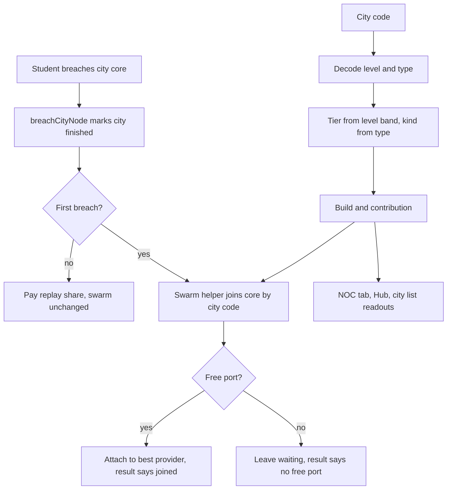

# Swarm from City Cores - Plan

## Goal Capsule

- **Objective:** A student who keeps playing generated cities builds a swarm out of the cities they finish, and that swarm is what lets them clear the harder late cities that their own computer can no longer handle alone.
- **Means:** each finished city's core joins the swarm under its city code (KTD1), with hardware derived from the city's level and type (KTD2); campaign nodes leave the swarm; city requirements keep growing past the campaign Core's above level 12 (KTD4).
- **Authority:** the user owns product decisions; the Product Contract wins on behavior and the Planning Contract wins on mechanism within it. Session-settled decisions are not reopened.
- **Stop conditions:** stop and ask if keeping the city structure hash stable proves impossible (KTD5), or if the balance targets in R14 cannot be met with the existing parts catalog without new parts.
- **Execution profile:** standard feature work in the existing TypeScript layers (`src/data`, `src/core`, `src/scenes`), test-first for core rules.
- **Finishing:** `ce-work` implements, verifies and ships by merging the feature branch into `main` locally and pushing `origin/main` (no pull requests). A push to `main` deploys to GitHub Pages.

---

## Product Contract

### Summary

Finished city cores become the only members of the swarm, replacing the campaign nodes. Each core's machine gets stronger with the city's level, and NAT, VLAN and IPv6 cities give stronger or port-carrying machines. Above level 12, city requirements rise past the campaign Core's toward a ceiling that only a student with a well-connected swarm can meet. The NOC tab, Hub, city screens, achievement, intros and glossary follow the move, and old saves load cleanly.

### Problem Frame

The swarm was built on the campaign network because generated cities did not exist yet. The cities plan deferred how the two combine to whichever landed second, and cities have now landed. Campaign nodes make a fixed, finite swarm, while cities are the game's endless play and so far pay only cash.

Moving the swarm to cities alone is not enough. Cities open only after the campaign Core, which already demands the top rig (70 processing, 64 GB RAM, 1000 GB, 10 Gbps), and city requirements are capped at the Core's. A student who can open a city already meets everything a city asks, so a city-only swarm would change almost nothing. Late cities must ask for more than one computer can give, so that the swarm is how the student keeps going.

### Key Decisions

- **The swarm machine is each city's core.** Breaching the core finishes the city and plugs it into the swarm. Governs R1, R2. (session-settled: user-directed — chosen over adding an extra swarm node to every city: no new map content and every finished city counts)
- **Machine hardware scales with the city's level and its type.** Harder cities give stronger machines, and NAT, VLAN and IPv6 cities give a better or port-carrying machine. Governs R5, R6. (session-settled: user-directed — chosen over level-only scaling and over one identical machine per city)
- **Campaign nodes leave the swarm.** Governs R3, R4. (session-settled: user-directed — the swarm was meant to come from generated cities, which did not exist when it was first built)
- **Late cities ask more than the campaign Core.** City requirements keep growing past the Core's above a level threshold, up to a ceiling a strong swarm reaches. Governs R12, R13. (session-settled: user-directed — chosen over keeping the swarm as post-game flavor until the BOINC economy and over lowering the late campaign's requirements)
- **Campaign nodes keep their hardware as flavor.** Breaching one still lists its parts, but it never joins the swarm. Governs R4. (session-settled: user-approved — chosen over removing campaign hardware entirely)
- **The NOC appears with the first finished city.** Switches stay buyable from Networks 101 as now. Governs R10. (session-settled: user-approved — chosen over showing the NOC from the first campaign breach)
- **Old saves drop campaign swarm entries silently.** Nothing the student built or bought is lost. Governs R9. (session-settled: user-approved — chosen over a message or refund)
- **The old balance target is replaced.** The swarm no longer helps reach the campaign Core; the targets in R14 apply instead. Governs R14. (session-settled: user-approved — the swarm now exists only after the campaign)

### Requirements

**Swarm membership**

- R1. Each finished city contributes exactly one swarm machine, its core, which becomes available to connect when the core is first breached.
- R2. When the core is first breached and a port is free, the machine joins the swarm automatically; otherwise it waits disconnected, and the breach result says which happened.
- R3. Campaign nodes never join the swarm and never appear in the NOC.
- R4. Breaching a campaign node still reveals its parts on the breach result and the Net Map, with no swarm status shown for it.
- R5. A city core's machine is stronger the higher its city's level, and stops growing past a level cap so that typing a very high city code gives no stronger machine.
- R6. NAT, VLAN and IPv6 city cores give a better or port-carrying machine than a plain city core of the same level, and at least one city type carries ports.
- R7. A replayed core, or a city code entered again, never adds a second machine or changes an existing connection.

**Saves and visibility**

- R8. Every place that names a swarm machine tells city cores apart by their city code.
- R9. Saves from before this change load with no campaign swarm entries, and cities finished before this change show their cores waiting in the NOC.
- R10. The NOC tab and its introduction appear once a city is finished or the student owns or has installed a switch, and never before.
- R11. The NOC tab explains what to do when there is nothing to connect yet, without telling the student to breach campaign nodes.

**Late-city difficulty**

- R12. Cities up to level 12 keep asking at most what the campaign Core asks.
- R13. Above level 12, a city's processing, RAM and storage requirements rise past the Core's toward a fixed ceiling, NAT, VLAN and IPv6 cities rise faster, and the link requirement stays capped at what the student's own computer can reach.
- R14. The student's own top rig alone fails mid-ladder cities above level 12. The cores a student holds on reaching level 13 are not enough for the ceiling, while the cores held on reaching level 24, behind a 10 Gbps router and a 10 Gbps switch, meet it. With the router's ports full, the switch's uplink speed decides whether the extra cores' power counts.

**Text**

- R15. Player text about the swarm stays native PT-BR, keeps "swarm" as the kept English term, and names machines as city cores rather than "nós".

### Acceptance Examples

- AE1. **Covers R2.** Given a student whose router has a free LAN port, when they breach the core of city `RIO-3-4821` for the first time, the result screen says the core of that city joined the swarm through the router.
- AE2. **Covers R2.** Given every port taken, when a core is first breached, the result screen says it is waiting for a free port, and the NOC lists it under waiting machines.
- AE3. **Covers R7.** Given a finished city already in the swarm, when the student replays its core or enters its code again, the swarm is unchanged.
- AE4. **Covers R9.** Given a save whose swarm attaches campaign ids `isp` and `uni` (one to the router, one to the other) and which has two finished cities, when it loads, the swarm is empty and both cores wait in the NOC.
- AE5. **Covers R10.** Given a student who won the campaign but has finished no city and owns no switch, the Workbench shows no NOC tab.
- AE6. **Covers R5.** Given two plain cities at levels 12 and 99, their cores give the same machine.
- AE7. **Covers R13, R14.** Given a student with the top rig and no swarm, a level-18 plain city core asks for more processing than they have.

### Scope Boundaries

- The BOINC compute economy stays unimplemented; its plan assumed campaign nodes answer consent requests, and that plan needs revising before it runs.
- Campaign node requirements and rewards stay as originally written. Without swarm help the campaign Core again needs the top rig, as it did before the swarm existed.
- City layout, addresses, node ids and city codes do not change; only requirements past level 12 change.
- Considered and not built: a guard against farming city codes at level 9 or above, where cores reach the top tier. Every such city still takes a full playthrough, and R14 calibrates the ceiling so that a handful of top-tier cores is not enough; evidence that students bypass the ladder this way would change the call.
- Considered and not built: blocking switch installs before the NOC appears. R10's switch condition shows the NOC as soon as a switch exists, so no switch is ever stranded in a hidden tab.

#### Deferred to Follow-Up Work

- Revise `docs/plans/2026-10-03-1735-feat-boinc-compute-economy-plan.md` so consent answers belong to city cores (its KTD8) before it runs.
- A native-speaker read of the new swarm and NOC text.

---

## Planning Contract

### Key Technical Decisions

- KTD1. **The swarm key is the city code.** `GameState.swarm` keeps its shape, but its machine keys become `encodeCityCode(level, seed, type)` strings (e.g. `RIO-3-4821`, `NAT-RIO-3-4821`). The code maps one-to-one to a started city, cannot collide with `router` or `sw<n>` provider ids, and decodes to level and type without generating the city. A provider is the `router`, a NOC id, or the key of a connected core that carries ports. Governs R1, R7, R8.
- KTD2. **Machine hardware is a pure function of the code, never stored on generated cities.** A new lookup turns a key into the machine's name, kind, tier, build and contribution. The tier comes from the level band (1-4, 5-8, 9+), which also enforces R5's cap. The kind comes from the type: plain gives `server`, NAT gives `edge-router`, VLAN gives `distribution-switch` and IPv6 gives `datacenter` with a `switch: 'sw_24_gig'` override. The override matters because `datacenter` and `server` share the same tier-3 parts, so without it an IPv6 core at level 9 or above would equal a plain one. It reuses `resolveBuild` and `buildContribution` in `src/data/nodeBuilds.ts`. Keeping it out of `generateCity` preserves the pinned city hashes and the "city nodes carry no hardware" test. Governs R5, R6 and instantiates the hardware Key Decision.
- KTD3. **Joining is a core-level helper the result screen calls.** `breachCityNode` stays free of swarm side effects. A new swarm helper joins a finished city's core by its index, gated on the city being finished, and `joinSwarm`'s `not-breached` code becomes a city-not-finished code. The mini-game result screen shows the outcome, because a typed city's first core opens the certificate ceremony before the city map's finished banner. Governs R2, R7.
- KTD4. **Late requirements extend the existing curve.** Up to level 12 nothing changes. Above it, each node keeps its depth share from `requirements()` and multiplies it by an overflow target, so the depth gradient survives and only the deepest node, the core, asks the full target. The target interpolates from the Core's values at level 12 to a ceiling at level 24, with NAT, VLAN and IPv6 cities counting 4 levels higher in that overflow only. `requirements()` therefore also receives the uncapped level and the type, and its RAM clamp to the Core applies only up to level 12. The link stays at the 10 Gbps cap. The ceiling starts from R14's balance: at least what the cores held at level 13 (four each of tiers 1, 2 and 3) cannot reach, raised until both R14 pins hold. Typed cities at or below level 12 ask what they do today, so the pós-graduação certificates are not gated behind a swarm. Governs R12, R13, R14.
- KTD5. **Requirements leave the structure hash like difficulty did.** Requirements draw no random numbers, so they never move ids or addresses. The structure-stability test strips `requires` next to `difficulty`, and the full cities hash is updated, as it was when difficulty followed the level. The "never asks more than the Core" test narrows to levels up to 12. Governs R12, R13.
- KTD6. **Old saves are filtered in `restore`.** Swarm keys are machines and values are providers. A machine entry is dropped when its key is not the code of a finished city, then any entry whose provider is neither the `router`, a NOC id nor a kept key is dropped too, repeated until stable. `restore` also clears `disclosure.current` when it is `noc-tab` and the new rule (KTD7) makes it unavailable, so an old save waiting on the NOC introduction does not stall the queue before `cities`. Both follow the existing drop of an unknown `disclosure.current` in `src/core/store.ts`. Cities finished before this change are not joined on load; they wait in the NOC. Governs R9.
- KTD7. **The NOC availability rule swaps campaign breaches for finished cities.** `noc-tab` becomes available when any city is finished, a switch sits in the NOC, or a switch is in the inventory. Old saves derive their introduced elements from that rule as today. Governs R10.
- KTD8. **Machines are named "o núcleo de <código>" in text.** The UI names a machine as the city core plus its code, and messages are rewritten around "núcleo" instead of "o nó X". The term is settled in `src/data/termos.ts` before strings are written. Governs R8, R15.

### High-Level Technical Design

How a core becomes a swarm machine, and where its hardware comes from:

### Assumptions

- The starting ceiling in KTD4 is a target to tune, not a fixed number. The R14 pins decide the final values.

### Sequencing

U1 and U3 are independent. U2 needs U1. U4 and U5 need U2. U6 comes last.

---

## Implementation Units

### U1. City core machines

- **Goal:** Turn a city code into a swarm machine with a name, kind, tier, build and contribution.
- **Requirements:** R5, R6, R8; KTD1, KTD2, KTD8.
- **Dependencies:** none.
- **Files:** `src/core/swarm.ts` (or a small new `src/core/swarmMachine.ts` if `swarm.ts` grows unwieldy), `src/data/nodeBuilds.ts`, `src/data/termos.ts`, `tests/core.test.ts`.
- **Approach:**
  1. Decode the key with `decodeCityCode`, map the level band to a tier and the type to a kind (KTD2), and resolve the build with the existing helpers.
  2. Add a build-based part-name helper next to `nodePartNames`, since cores have no `NetNode.hardware`.
  3. Name the machine as the city core plus its code (KTD8), and settle the term in `termos.ts`.
- **Patterns to follow:** `resolveBuild` and `buildContribution` in `src/data/nodeBuilds.ts`; `decodeCityCode` in `src/core/cityCode.ts`.
- **Test scenarios:**
  - A plain level-3 code gives a tier-1 server; level 6 gives tier 2; level 10 gives tier 3.
  - Covers AE6. Plain codes at levels 12 and 99 give identical contributions.
  - A NAT code gives an edge router with ports, and a VLAN code gives a distribution switch with ports.
  - An IPv6 code gives a datacenter build that carries ports at every tier, and is stronger than the plain server at tiers 1 and 2.
  - Two codes with the same level and type but different seeds give equal machines with different names.
  - An invalid key is rejected rather than resolving to a machine.
- **Verification:** every city type and level band resolves to real catalog parts, and at least one type carries ports.

### U2. Swarm keyed by city code

- **Goal:** Make the swarm module and save loading work on city codes instead of campaign ids.
- **Requirements:** R1, R3, R7, R9; KTD1, KTD3, KTD6.
- **Dependencies:** U1.
- **Files:** `src/core/swarm.ts`, `src/core/state.ts`, `src/core/store.ts`, `tests/core.test.ts`, `tests/cityState.test.ts`, `tests/disclosure.test.ts` (the `restore` tests live there).
- **Approach:**
  1. Replace every `getNode` lookup on a swarm key (`nodeStats`, `nodeName`, `providerLabel`, `blockedMessage`) with the U1 lookup.
  2. Gate `joinSwarm` on a finished city with that code, and add the join-by-city-index helper (KTD3).
  3. Filter old entries in `restore` (KTD6).
  4. Rewrite the swarm test helpers to attach finished-city codes instead of campaign ids; the math and action tests keep their intent.
- **Execution note:** Rewrite the existing swarm math and action tests onto city codes first, and watch them fail, before changing the module.
- **Patterns to follow:** the `disclosure.current` drop in `restore` (`src/core/store.ts`); the stable `SwarmCode` results.
- **Test scenarios:**
  - Covers AE1. Finishing a city with a free router port joins its core through the router.
  - Covers AE2. With every port taken, joining returns the no-free-port code and the core stays waiting.
  - Covers AE3. Joining an already connected core returns already-connected, and a replay changes nothing.
  - Joining the code of an unfinished or unknown city returns the city-not-finished code.
  - A NAT core with ports becomes a provider, and blocked removal of it names its dependents by city code.
  - Covers AE4. A save attaching `isp` to the router and `uni` to `isp` loads with an empty swarm, and NOC switches are kept.
  - A finished city's code attached to the router survives the filter, and one attached to a dropped campaign provider is dropped.
  - A save whose `disclosure.current` is `noc-tab`, with campaign breaches, a won campaign and no switch, loads with `current` cleared, and `cities` is introduced next.
  - The online rule still holds: an offline rig adds no swarm power and keeps its connections.
- **Verification:** the swarm math, actions and requirements tests pass on city codes, and no swarm path calls `getNode` on a key.

### U3. Late cities ask more

- **Goal:** Make requirements above level 12 rise past the campaign Core's toward the ceiling.
- **Requirements:** R12, R13; KTD4, KTD5.
- **Dependencies:** none.
- **Files:** `src/core/city.ts`, `tests/city.test.ts`, `tests/cityState.test.ts`.
- **Approach:**
  1. Extend `requirements()` per KTD4; keep levels up to 12 byte-identical.
  2. Update the stability test per KTD5 and narrow the Core-cap test to levels up to 12.
- **Patterns to follow:** the difficulty change that already re-pinned `PINNED_CITIES_HASH` while keeping `PINNED_STRUCTURE_HASH`.
- **Test scenarios:**
  - Every node in cities at levels 1-12, plain and typed, asks at most the Core's values.
  - A plain level-13 core asks more processing than the Core, and a level-24 core asks the ceiling.
  - In a level-13 city, a depth-0 host still asks less than the core, and less than the student's top rig.
  - Levels above 24 ask exactly the ceiling.
  - A NAT city at level 16 asks more than a plain city at level 16.
  - The link requirement never exceeds 10 Gbps at any level.
  - The structure hash is unchanged for plain and typed sample cities.
- **Verification:** the stability and requirement tests pass, and only `PINNED_CITIES_HASH` changed.

### U4. Join on breach and the swarm screens

- **Goal:** Show the join on the result screen and point every swarm screen at city cores.
- **Requirements:** R2, R3, R4, R8, R11; KTD3, KTD8.
- **Dependencies:** U2.
- **Files:** `src/scenes/MinigameScene.ts`, `src/scenes/WorkbenchScene.ts`, `src/scenes/HubScene.ts`, `src/scenes/NetMapScene.ts`, `src/scenes/CityListScene.ts`, `src/scenes/CityMapScene.ts`.
- **Approach:**
  1. In the mini-game's city branch, call the join helper on a first core breach and show joined or waiting. The campaign branch keeps only the parts line.
  2. In the NOC tab, list waiting machines from finished cities not in the swarm. Name rows with the U1 lookup and replace the empty text (R11).
  3. Remove the swarm dot, legend and status line from the Net Map, and show each finished city's swarm status in the city list.
- **Patterns to follow:** the existing result-screen detail block; `docs/solutions/developer-experience/manual-ui-check-phaser-scenes.md` for the browser check.
- **Test scenarios:**
  - Test expectation: scene code has no unit tests; its rules are covered in U2. Verify in the browser: a first core breach shows joined or waiting, the NOC lists and connects finished cores, the Net Map shows parts with no swarm marks, and the city list shows status.
- **Verification:** a manual browser pass through one plain and one typed city covers each screen, including the certificate ceremony path.

### U5. NOC visibility, achievement and text

- **Goal:** Make the NOC introduction follow finished cities and rewrite swarm text around city cores.
- **Requirements:** R10, R15; KTD7, KTD8.
- **Dependencies:** U2.
- **Files:** `src/core/disclosure.ts`, `src/data/intros.ts`, `src/data/achievements.ts`, `CONCEPTS.md`, `tests/disclosure.test.ts`, `tests/achievements.test.ts`, `tests/content.test.ts`.
- **Approach:**
  1. Change the `noc-tab` rule (KTD7) and update the veteran test.
  2. Rewrite the NOC intro lines and the swarm achievement description for city cores (U4 removes the Net Map swarm legend).
  3. Point the content scan's swarm messages at city codes.
  4. Update the CONCEPTS.md Swarm entry, whose current text describes breached network nodes.
- **Patterns to follow:** `docs/solutions/conventions/ptbr-text-native-not-calque.md`, `docs/solutions/conventions/ptbr-keep-field-jargon-in-english.md`, `docs/solutions/design-patterns/acknowledge-every-entry-path-under-incremental-disclosure.md`.
- **Test scenarios:**
  - Covers AE5. A won campaign with no finished city and no switch leaves `noc-tab` unavailable.
  - A finished city makes `noc-tab` available and queues its introduction.
  - A switch in the inventory, or installed in the NOC, makes `noc-tab` available.
  - An old save with campaign breaches only derives no `noc-tab` introduction.
  - The swarm achievement unlocks when a city code is in the swarm.
  - The content scan passes over join, leave and blocked messages built from city codes.
- **Verification:** the disclosure, achievement and content tests pass.

### U6. Balance pins and docs

- **Goal:** Pin the new balance and describe the change.
- **Requirements:** R14; KTD4.
- **Dependencies:** U2, U3.
- **Files:** `tests/core.test.ts`, `README.md`.
- **Approach:**
  1. Replace the three old balance pins with R14's targets, tuning KTD4's ceiling until they hold.
  2. Update the README swarm section to describe city cores and late cities.
- **Test scenarios:**
  - Covers AE7. The top rig alone fails a level-18 plain city core.
  - The top rig plus the cores held on reaching level 13 (four each of tiers 1, 2 and 3) fails the level-24 ceiling.
  - The top rig plus the cores held on reaching level 24, behind a 10 Gbps router and a `sw_48_10g`, meets the ceiling.
  - With the router's ports full, the same extra cores behind a `sw_24_gig` fail the ceiling, because its 1 Gbps uplink caps their usable power.
  - The top rig meets every city up to level 12 with no swarm.
- **Verification:** the balance pins pass with catalog parts only.

---

## Verification Contract

| Gate | Command | Applies to |
|---|---|---|
| Unit tests | `npm test` | every unit |
| Types | `npm run typecheck` | every unit |
| Build | `npm run build` | before shipping |
| Browser check | `npm run dev`, then the U4 pass | U4, U5 |

## Definition of Done

- Every unit's verification holds, and `npm test`, `npm run typecheck` and `npm run build` pass.
- No swarm path resolves a key with `getNode`, and no campaign id can enter the swarm.
- `PINNED_STRUCTURE_HASH` is unchanged.
- Code from abandoned approaches is removed from the diff.
- The branch is merged into `main` locally and pushed to `origin/main`.
