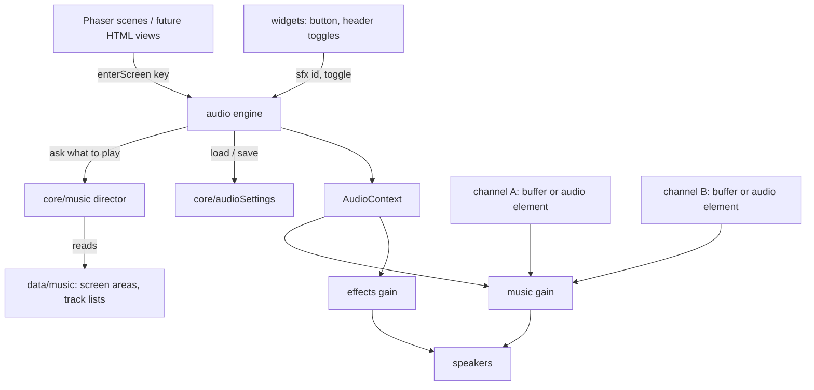
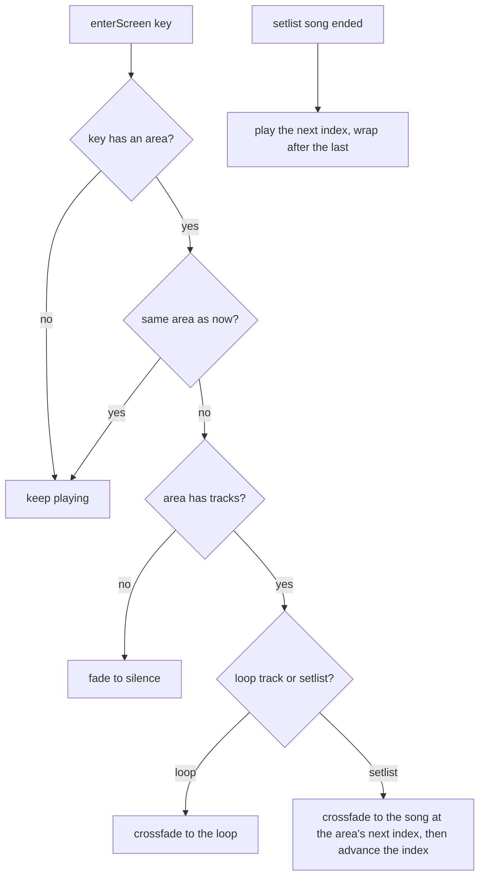

# Game Audio - Plan

## Goal Capsule

- **Objective:** Players hear area-specific background music and action sound effects that give the game feel and mark where they are, and can silence either one at any moment, including in class.
- **Means:** One page-level audio layer shared by the HTML views and the Phaser maps, playing the owner's exported music files and sound effects synthesized in code.
- **Product authority:** The project owner, who also composes the music.
- **Open blockers:** None.
- **Execution profile:** Implementation units U1 to U7 in dependency order; the owner judges sound by ear in the browser check and reads the new PT-BR prompts.
- **Stop conditions:** Stop and ask if Safari or Chrome refuses playback even after the KTD5 unlock, or if a looping track cannot be made gapless with loop points; both would change a Key Technical Decision.

---

## Product Contract

### Summary

The game gets music by area: one track for the title, a setlist for study and workbench, a setlist for the maps, and one track for side jobs and hacks. The music crossfades when the area changes. Retro sound effects synthesized in code respond to player actions. Both are on by default, and each has its own mute toggle that the game remembers. A new first phase on the title screen ("press any key") unlocks the browser's audio and starts the title track.

### Problem Frame

The game has no audio at all. No sound code exists in `src/`, the achievements plan states "the game has no audio", and the incremental disclosure plan deferred sound. Breaching a node, buying a part or answering a mini-game round has no feedback beyond text and colour, and nothing marks the move between studying, the maps and hacking. The owner is composing tracks for these areas and needs a defined way for the game to play them.

The players are IFRS technical high-school IT students who often play on phones in class. Sound that cannot be silenced quickly would embarrass them there. Browsers also block audio until the first tap or key press, so a track that starts "on open" in practice starts on the first gesture.

### Key Decisions

- **Music and sound effects are on by default, with a mute always in reach.** (session-settled: user-directed — chosen over starting silent and over asking on first open: the music should be heard, and a visible, remembered mute covers the classroom case.) Governs R9, R10, R11.
- **Sound effects are synthesized in code.** (session-settled: user-directed — chosen over owner-composed clips and a free CC0 pack: no files to download, fits the terminal look, and is tuned by parameters.) Governs R12, R13.
- **The title screen splits into two phases so the first gesture starts the title track.** (session-settled: user-directed — chosen over letting the title track run into the hub and over accepting that it is mostly heard on return visits: on a one-phase title the first tap usually leaves the screen.) Governs R14, R15, R16.
- **Music ships as exported audio files, not MIDI.** (session-settled: user-approved — chosen over playing the `.mid` through an in-browser synth: MIDI carries notes only, so it would not sound like the owner's Online Sequencer mix and needs a soundfont or instrument design; the size saving, about 1 KB versus about 660 KB per 20 s, does not outweigh that.) Governs R7.
- **One audio layer serves both renderers.** The mobile refactor moves every screen except the two maps to HTML, so audio lives at page level rather than inside Phaser, and music survives the switch between an HTML view and a map canvas. Governs R4, R18.
- **Area changes crossfade, screen changes inside an area do not.** The current song keeps playing as the player moves around one area. Governs R4, R5.
- **Two on/off toggles, no volume sliders.** Music and effects mute separately, which is the smallest control set that lets a player keep one and drop the other. Governs R9.

### Requirements

**Music areas**

- R1. Every screen belongs to exactly one music area, per this mapping:

| Music area | Music | Screens |
|---|---|---|
| Title | one looping track | Title (both phases), Formatura, Certificate |
| Study and workbench | setlist | Hub, Study, Lesson, Shop, Workbench, NetSetup, Conquistas |
| Maps | setlist | NetMap, CityList, CityMap, Route |
| Side jobs and hacks | one looping track | JobBoard, Minigame |

- R2. A single-track area loops its track without an audible gap or click at the loop point.
- R3. A setlist plays its tracks in a fixed order and wraps back to the first after the last.
- R4. Moving between screens of the same area keeps the current song playing without restarting it.
- R5. Changing area crossfades from the old area's music to the new area's music, with no silence gap and no overlap louder than either track alone.
- R6. Returning to a setlist area starts that setlist's next song rather than replaying the one heard last.
- R7. The game plays music from audio files the owner exports, and adding or reordering a track in an area does not require changing game logic.
- R8. Music pauses when the page is hidden (phone locked, tab in the background, app switched) and resumes from the same point when the page is visible again.

**Controls**

- R9. The player can turn music and sound effects on and off independently, and both start on for a new player.
- R10. Both toggles are reachable from every screen, including the title screen's second phase and the maps, without leaving the current screen.
- R11. The game remembers both toggle states across sessions, separately from the game save, so resetting the save does not reset them.

**Sound effects**

- R12. Player actions play a short sound effect: button presses, purchase, part install and removal, correct and wrong mini-game answers, a successful breach, a failed breach, and an achievement unlock, which sounds when its corner card appears.
- R13. Sound effects are generated in the browser in a retro terminal style, need no audio file downloads, and never interrupt or duck the music.

**Title screen**

- R14. On open, the title screen shows a first phase with only "ROOTKIT ACADEMY" and a line that slowly fades in and out, in the style of old arcade "press any key" prompts.
- R15. Any key press, click or tap on the first phase starts the title track and moves to the current title screen (Continuar / Novo jogo).
- R16. The big "ROOTKIT ACADEMY" title sits in the same position on both phases, so moving between them reads as one screen gaining content.
- R17. The prompt line reads as a tap prompt on touch devices and a key prompt on devices with a keyboard; both wordings are written in native PT-BR and go to the owner for review.

**Compatibility**

- R18. Audio works the same before, during and after the mobile responsive refactor (`docs/plans/2026-10-10-0252-refactor-mobile-responsive-ui-plan.md`), in HTML views and on the Phaser maps.
- R19. A track loads when its area is first needed, not all tracks at startup, so the first screen does not wait on music downloads.
- R20. Saves are unaffected: no save field changes and existing saves load as before.

### Key Flows

- F1. First open
  - **Trigger:** A player opens the game link.
  - **Steps:** The first title phase shows the title and the pulsing prompt, with no sound. The player presses a key or taps. The title track starts and the current title screen appears with the title in the same place. The player picks Continuar or Novo jogo, and the title track crossfades into the study and workbench setlist.
  - **Covered by:** R1, R5, R14, R15, R16
- F2. Moving through the game
  - **Trigger:** A player goes from Hub to Shop to NetMap to Minigame and back to Hub.
  - **Steps:** Hub to Shop keeps the song. Shop to NetMap crossfades to the maps setlist. NetMap to Minigame crossfades to the side jobs and hacks track, which loops during the round. Minigame to Hub crossfades to the next song of the study and workbench setlist.
  - **Covered by:** R3, R4, R5, R6

### Acceptance Examples

- AE1. **Covers R9, R11.** **Given** a player turned music off and left effects on, **when** they reload the game next day, **then** the game opens with music off and effects on.
- AE2. **Covers R11, R20.** **Given** music is off, **when** the player resets the game from the title screen, **then** the save is cleared and music stays off.
- AE3. **Covers R4.** **Given** the second song of the study and workbench setlist is playing in Hub, **when** the player opens Shop and then Workbench, **then** the same song keeps playing without a restart or fade.
- AE4. **Covers R8.** **Given** the maps setlist is playing on a phone, **when** the player locks the phone and unlocks it a minute later, **then** the music was silent while locked and resumes where it stopped.
- AE5. **Covers R13.** **Given** music and effects are both on, **when** the player buys a part, **then** the purchase effect plays over the music and the music volume does not change.
- AE6. **Covers R9, R15.** **Given** music is off and effects are on, **when** the player taps the first title phase, **then** the title screen appears with no music and the tap plays its effect.

### Scope Boundaries

- Deferred for later: volume sliders, a jukebox or track picker, MIDI playback, offline caching of audio files, per-node or per-city tracks, and music that reacts to game events (tension during a breach timer, a stinger on breach).
- Not part of this work: composing the tracks (the owner's work) and the mobile refactor itself.

### Dependencies / Assumptions

- The owner exports each music area's tracks as files; the sample `antropofilia v1.mp3` is 20.6 s, 44.1 kHz stereo, 256 kb/s, 662 KB. Assumption: exports around 128 kb/s are good enough for this music and halve the download.
- The owner composes the title and the side jobs and hacks tracks to loop cleanly, since they repeat for as long as the player stays in those areas (R2).
- Final tracks need a tracked folder: `.references/` is ignored by the `.*` rule in `.gitignore`.
- The game deploys to GitHub Pages, so every audio file adds to the static download.

### Outstanding Questions

**Deferred to Implementation**

- Whether "Toque na tela para continuar..." and "Pressione qualquer tecla para continuar..." are the final prompt wordings (R17); the owner reads them in the browser check.
- Whether the title track's MP3 loops without an audible click in Chrome, Firefox and Safari; if it does not, set its loop points per KTD3.

### Sources / Research

- `src/scenes/TitleScene.ts:18` places the title at the canvas centre, y 190, over the matrix rain; R16 keeps that position on both phases.
- `src/ui/widgets.ts` `button()` and `header()` are the shared button and header helpers that every Phaser screen uses today.
- `docs/plans/2026-10-10-0252-refactor-mobile-responsive-ui-plan.md` R11 and R13 define which screens become HTML views and which stay on a canvas.
- `.references/music/antropofilia v1.mp3` and `.references/music/antropofilia v1.mid` are the owner's sample exports.

---

## Planning Contract

**Product Contract preservation:** changed: R12 — the achievement sound plays when its corner card appears, so it is silent with pop-ups off and waits out a mini-game like the card; R10 — clarified that the toggles sit on the title screen's second phase, since R14 keeps the first phase to the title and the prompt. Both were confirmed in the plan's scoping synthesis. Resolved deferred questions moved into KTD3, KTD4 and KTD7.

### Key Technical Decisions

- KTD1. **A new `src/audio/` layer owns playback; core keeps the pure rules.** `src/core/music.ts` decides what should play (area lookup, setlist order, return behavior) and `src/core/audioSettings.ts` stores the toggles, both without Phaser or browser audio, so Vitest covers them. `src/audio/` holds the Web Audio engine and the effect recipes and is imported by scenes and `src/ui/widgets.ts` only. The layer order becomes `scenes/ui -> audio -> core -> data`. Governs R1, R3, R4, R6, R9, R11.
- KTD2. **One shared AudioContext with a music gain and an effects gain.** Turning a toggle off sets its gain to zero and stops new music starts; effects mix on top of music with no ducking (R13). One context also means one unlock.
- KTD3. **Looping tracks play from decoded buffers; setlist songs stream.** A track flagged `loop` in the data is fetched, decoded once and played by a looping buffer source, which loops sample-accurately, with optional loop-start and loop-end seconds in the data to trim MP3 encoder padding. Setlist songs play through two reusable HTML audio elements wired into the graph, so a three-minute song never sits decoded in phone memory (about 30 MB per stereo minute). (session-settled: user-approved — chosen over decoding every track: long setlist songs would cost tens of MB each on phones.) Governs R2, R7, R19.
- KTD4. **Crossfade runs on two channels.** Each channel is a gain node fed by either a buffer source or one of the two audio elements. A change waits until the new track can play, keeping the old one going meanwhile, then fades the new channel in and the old one out over 1.5 s with equal-power curves, so the sum never gets louder than one track. A change during a fade stops the oldest channel at once; the latest request wins. Governs R5.
- KTD5. **The engine unlocks audio from native document listeners, not Phaser input.** Phaser processes keyboard input in its game loop, outside the browser's gesture handler, so a resume called from a Phaser key handler can be refused. The engine registers one-shot `pointerup`, `touchend`, `click` and `keydown` listeners on `document` that resume the context and prime both audio elements. The splash then asks the engine to start music, and the engine waits for the context to be running. Governs R15.
- KTD6. **Screens report themselves through one hook in `src/main.ts`.** After the game boots, every registered scene's create event calls `enterScreen(sceneKey)` on the engine, and keys with no area (the conquista overlay) are ignored. The mobile refactor's HTML views will call the same function, which keeps R18 true without touching scene code. Governs R1, R4, R18.
- KTD7. **Toggles are two small `Música` / `Efeitos` buttons in the header's right group, before the money, and in the title screen's top-right corner on its second phase.** An off toggle keeps its label and turns muted grey, and it stays pressable. `header()` already draws on every screen except Title (verified across all 15 other screens), so one widget change covers R10. Governs R10.
- KTD8. **The first sample becomes the title track; other areas start empty.** `antropofilia v1.mp3` is copied to `src/assets/music/antropofilia.mp3` and imported as a URL, so a missing or renamed file fails the build instead of going silent. An area with no tracks fades to silence. (session-settled: user-approved — chosen over reusing the one sample everywhere: the owner adds tracks as composed, one data line each.) Governs R7.
- KTD9. **Sound effects come from a fixed recipe table keyed by a closed set of ids.** The ids are `click`, `buy`, `refuse`, `install`, `remove`, `correct`, `wrong`, `breach`, `fail` and `unlock`. Each recipe is a short oscillator sequence (square or triangle waves, millisecond envelopes), and a typed record makes a missing recipe a type error. `button()` plays `click` on every press, and the action sound layers on top. Governs R12, R13.
- KTD10. **Settings live under their own key, `rootkit-academy-audio-v1`.** They follow the `achievementStore.ts` pattern (version field, tolerant parse, defaults on anything unreadable) and are never touched by `resetGame` or `resetEverything`. Governs R9, R11, R20.

### High-Level Technical Design

Component flow:

Director decision on each `enterScreen` and on song end:

The director keeps the current area and a next index per setlist area, and advances the index when a song starts. Leaving mid-song therefore makes the return play the following song (R6). The director knows nothing about the toggles: with music off the engine still follows the director silently, and turning music on starts the current area's song from its beginning.

### Assumptions

- Vitest resolves `?url` asset imports through Vite's pipeline, so tests can import `src/data/music.ts`. If it does not, the screen-to-area mapping moves to an asset-free file.
- Phaser 4 still emits a per-scene create event that the boot hook can subscribe to, as Phaser 3 does.

### Risks

- iPhones in silent mode mute Web Audio output. This is not handled: it matches what players expect from a muted phone, and an optional audio-session hint can come later if players report it.
- Safari may refuse `play()` on an audio element first used outside a gesture. KTD5 primes both elements during the unlock gesture; if Safari still refuses, the fallback is to stream setlist songs through decoded buffers with a length cap.
- Tracks are about 330 KB per 20 s at 128 kb/s. Long setlists grow the Pages download, but they load lazily (R19).

---

## Implementation Units

### U1. Audio settings store

**Goal:** Persist the music and effects toggles under their own key, defaulting to on.

**Requirements:** R9, R11, R20; KTD10.

**Dependencies:** none.

**Files:** `src/core/audioSettings.ts` (new), `tests/audioSettings.test.ts` (new).

**Approach:**
1. Mirror `src/core/achievementStore.ts`: a versioned state `{ version: 1, music, effects }`, a tolerant `parse` that returns defaults on missing or corrupt input, `serialize`, and load/save wrappers that swallow storage errors like `store.ts` does.
2. Expose read and toggle functions plus a change listener that the engine subscribes to, the way `onUnlock` works for conquistas.

**Patterns to follow:** `src/core/achievementStore.ts` (own key, parse/serialize split, listener), `src/core/store.ts` (storage guards), and the `vi.stubGlobal('localStorage', ...)` setup in `tests/achievementStore.test.ts`, since Vitest runs without browser storage.

**Test scenarios:**
- A missing value parses to music on, effects on.
- Corrupt JSON and a wrong version both parse to the defaults.
- A stored `{ music: false, effects: true }` round-trips through serialize and parse unchanged.
- Covers AE1. Toggling music off and reloading from the serialized string keeps music off and effects on.
- Covers AE2. `resetGame()` leaves the stored audio settings unchanged.

**Verification:** Settings survive a reload and a game reset in the tests; typecheck passes.

### U2. Music areas data and director

**Goal:** Map every screen to a music area and decide, as pure logic, which track plays on each screen change and song end.

**Requirements:** R1, R3, R4, R6, R7; F2; KTD1, KTD8.

**Dependencies:** none.

**Files:** `src/data/music.ts` (new), `src/core/music.ts` (new), `src/assets/music/antropofilia.mp3` (copied from `.references/music/antropofilia v1.mp3`), `tests/music.test.ts` (new).

**Approach:**
1. `src/data/music.ts`: a `MusicArea` union (`title`, `desk`, `maps`, `hacks`), the screen-key-to-area mapping from R1 keyed by scene key, which differs from the class name for two screens (`Cities` for CityList, `Jobs` for JobBoard), and per-area track lists. Each track has an id, an imported URL, and for loop areas a `loop` flag with optional loop points. The title area lists `antropofilia`, and the other areas start empty.
2. `src/core/music.ts`: a director state (current area, next index per setlist area) with `enter(state, screenKey)` and `songEnded(state)` returning a command: keep, play a track in an area, or silence.

**Patterns to follow:** id-linked content in `src/data/` (CLAUDE.md "Saves store only ids"); scene source scanning with `import.meta.glob` in `tests/content.test.ts`.

**Test scenarios:**
- Every scene key declared with `super('...')` in `src/scenes/*.ts`, except `ConquistaPopup`, maps to exactly one area.
- Entering Hub from no area returns a play command for the desk setlist's first song.
- Covers AE3. Entering Shop, then Workbench, while the desk area plays returns keep both times.
- Covers F2. Hub to NetMap to Minigame to Hub returns desk song 1, the maps play, the hacks play, then desk song 2.
- With a two-song setlist, `songEnded` advances 1 to 2, then wraps to 1.
- A setlist with one song replays that song on return.
- Entering an area with no tracks returns silence.
- An unknown screen key returns keep and leaves the state unchanged.

**Verification:** Director tests pass. Adding a track to an area changes only `src/data/music.ts`.

### U3. Audio engine

**Goal:** Play the director's commands through Web Audio with crossfades, gapless loops, unlock and visibility handling, and the settings applied.

**Requirements:** R2, R4, R5, R8, R13, R18, R19; KTD2, KTD3, KTD4, KTD5, KTD6.

**Dependencies:** U1, U2.

**Files:** `src/audio/engine.ts` (new), `src/main.ts` (boot hook).

**Approach:**
1. Create the context lazily, with music and effects gains set from U1 and updated on its change listener.
2. Install the native unlock listeners per KTD5, and expose `start()` for the splash and `enterScreen(key)` for the boot hook (KTD6).
3. Play buffer tracks with a looping source (cached decode per URL) and setlist songs on the two primed audio elements, whose `ended` event calls `songEnded`.
4. Crossfade per KTD4, and on a load or decode failure log a warning and leave that channel silent.
5. On `visibilitychange`, suspend the context and pause the playing element, then resume both when the page is visible again.

**Execution note:** No unit tests: this is browser audio plumbing over the tested director. Prove it by listening in the browser check.

**Patterns to follow:** native DOM work in `textInput()` in `src/ui/widgets.ts`; the core-to-UI listener in `src/scenes/ConquistaPopupScene.ts`.

**Test scenarios:** Test expectation: none -- browser audio graph; behavior is covered by U2's director tests and the Verification Contract's browser check.

**Verification:** In the browser, Hub to Shop keeps the song, Shop to NetMap crossfades with no gap or loudness bump, and the title loop shows no gap at the seam. Covers AE4: locking the phone or hiding the tab silences the music and it resumes in place. A renamed track URL fails `npm run build`.

### U4. Synthesized sound effects

**Goal:** Generate the ten retro effects in code and play them through the effects gain.

**Requirements:** R12, R13; KTD9.

**Dependencies:** U3.

**Files:** `src/audio/sfx.ts` (new), `src/audio/engine.ts` (exports `sfx(id)`).

**Approach:** A typed record from each effect id to a recipe of oscillator steps (wave, frequency, duration, envelope). `sfx(id)` schedules the steps on the shared context and does nothing while effects are off or the context is not running. Keep `click` under 40 ms and quieter than the action sounds, so it can layer under them.

**Test scenarios:** Test expectation: none -- synthesis output; the typed record makes a missing recipe a compile error, and the sounds are judged by ear in the browser check.

**Verification:** Each effect is audible, distinct and short in the browser. Covers AE5: buying a part plays over the music and the music level does not change.

### U5. Title screen splash phase

**Goal:** Split the title screen into the press-any-key phase and the current screen, with the title fixed in place and the first gesture starting the title track.

**Requirements:** R14, R15, R16, R17; F1; AE6.

**Dependencies:** U3, U4.

**Files:** `src/scenes/TitleScene.ts`.

**Approach:**
1. A static flag records that the splash was passed this page load. On first create the scene draws only the rain, the title at its current position (y 190) and the prompt line, its alpha yoyoing slowly (about 1.2 s each way).
2. The prompt reads "Toque na tela para continuar..." when `(hover: none) and (pointer: coarse)` matches, otherwise "Pressione qualquer tecla para continuar...".
3. The first Phaser key press or pointer press calls the engine's `start()`, plays `click` once the engine reports the context running (U4 drops effects before that), removes the prompt and draws the rest of the current screen (subtitle, intro text, buttons, KTD7 toggles) around the same title object.

**Patterns to follow:** `pulse()` in `src/ui/widgets.ts` for the alpha yoyo; the existing `drawRain()`.

**Test scenarios:**
- `tests/content.test.ts` passes with both prompt strings, which contain spaces and are scanned automatically.

**Verification:** In the browser, the title does not move between phases. A key press on desktop and a tap in mobile emulation both advance. Covers AE6: with music off, the tap plays its click and no music starts.

### U6. Wire toggles and action sounds into the screens

**Goal:** Put the toggles on every screen and play the action effects where the actions happen.

**Requirements:** R9, R10, R12; KTD7, KTD9.

**Dependencies:** U1, U4, U5.

**Files:** `src/ui/widgets.ts`, `src/scenes/ShopScene.ts`, `src/scenes/WorkbenchScene.ts`, `src/scenes/MinigameScene.ts`, `src/scenes/ConquistaPopupScene.ts`, `src/scenes/TitleScene.ts`.

**Approach:**
1. `widgets.ts`: `button()` plays `click` on an enabled press. A new `audioToggles(scene, x, y)` draws the two KTD7 buttons, which flip U1's settings and restyle themselves, and `header()` places them left of the money.
2. `ShopScene`: compare the inventory length around `buy()` and play `buy` or `refuse`.
3. `WorkbenchScene`: `actOnRig` already knows whether the change applied. It plays the caller's sound (`install` or `remove`) when it did and `refuse` when it was refused, and `actSwarm` does the same for switches.
4. `MinigameScene`: `resolve(correct)` plays `correct` or `wrong` (a time-out is `wrong`), and `finish(success)` plays `breach` or `fail`.
5. `ConquistaPopupScene`: `showNext()` plays `unlock` when a card fades in (R12).

**Patterns to follow:** the before/after comparison in `actOnRig` (`src/scenes/WorkbenchScene.ts`).

**Test scenarios:**
- `tests/content.test.ts` still passes. `Música` and `Efeitos` are single-word labels, outside its scan, but they are Portuguese anyway.
- Existing suites pass unchanged, since no core rule changes.

**Verification:** In the browser, every screen's header shows both toggles without overlapping the title, the money (checked with a seven-digit amount) or the "?" button. Each listed action plays its effect, and an achievement unlocked inside a mini-game sounds only when its card appears afterwards.

### U7. Document the audio layer

**Goal:** Record the new layer and how to add a track, so later work keeps the boundaries.

**Requirements:** R7; KTD1.

**Dependencies:** U2, U3.

**Files:** `CLAUDE.md`.

**Approach:** Add `src/audio/` to the architecture list with its dependency direction (KTD1), and add a "things that span files" line on adding a track: drop the file in `src/assets/music/` and add one entry in `src/data/music.ts`, flagging a loop track and its loop points.

**Test scenarios:** Test expectation: none -- documentation.

**Verification:** CLAUDE.md names the audio layer and the track-adding steps.

---

## Verification Contract

| Gate | Command or check | Proves |
|---|---|---|
| Unit tests | `npm test` | U1 and U2 scenarios, plus the existing suites and the PT-BR English-word guard |
| Types | `npm run typecheck` | the strict build, including the closed effect-id record |
| Build | `npm run build` | asset imports resolve and the production bundle builds |
| Browser check | `npm run dev`, then follow `docs/solutions/developer-experience/manual-ui-check-phaser-scenes.md` with sound on | AE4 to AE6, F1, F2, the gapless title loop, the crossfades, the toggles' placement, each effect by ear |
| Mobile emulation | the browser check repeated in a phone viewport with touch | the tap prompt, the unlock from a tap, pause on tab hide |

---

## Definition of Done

- All seven units are in, and `npm test`, `npm run typecheck` and `npm run build` pass.
- The browser check passed on desktop and in mobile emulation, and the owner has heard the title loop and the effects.
- The owner has read the two prompt wordings (R17) or left them as written.
- No audio code imports from `src/scenes/`, and `src/core/` imports nothing from `src/audio/`.
- Experimental or abandoned code from the implementation is removed from the diff.
